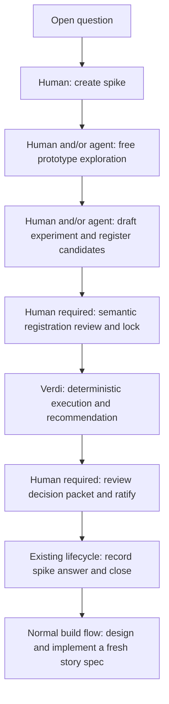

# Comparative Spike Experiments v2

## Problem

Verdi should help a team answer a practical feature-design question:

> Given several viable technical approaches, which path should this feature
> take to produce the most desirable accepted outcome?

Comparative spike experiments extend an existing question-resolving spike
with an immutable, executable comparison of candidate technical designs. The
comparison preserves a common behavioral contract, measures a preregistered
outcome, rejects candidates that violate required constraints, and produces
either a scoped recommendation or an honest inconclusive result.

Verdi recommends; a human ratifies. Prototype code remains disposable and can
never be promoted into product source. If the team selects an approach, it is
implemented afresh under a normal story spec and the ordinary build,
verification, and pull-request process.

This is a lightweight, high-trust decision mechanism. It is more rigorous
than an informal local benchmark but intentionally does not duplicate
Verdi-bench's benchmark-grade evaluation of agents, models, and engineering
harnesses.

The binding artifact and evidence specifications already define the parent
lifecycle: a spike is a story subtype with `spike: true`; it has at least one
`resolves` edge and no `implements` edge; it may attach to a draft or accepted
feature; it is exempt from implementation evidence; VL-016 fences its branch
diff to configured non-product `spike_paths`; and its deliverable is an
answer, surfaced through the existing `resolved-by` backlink without editing
a frozen feature. Comparative experiments remain subordinate decision
evidence inside that lifecycle, never a new spec kind, edge vocabulary,
evidence kind, or alternate closure path.

## Outcome

The first version supports technical alternatives that can be exercised
against one common behavioral contract and compared using machine-produced
observations. Typical examples include:

- caching at different points in a request path;
- choosing between storage, indexing, or invalidation strategies;
- comparing algorithms under a fixed correctness contract;
- selecting a protocol or serialization approach under compatibility and
  resource constraints.

A successful journey:

1. begins with a real open question owned by a spike;
2. permits unconstrained, disposable exploration;
3. freezes a fair comparison before measurements count;
4. evaluates every candidate against the same contract and conditions;
5. distinguishes correctness failures from operational failures;
6. produces a reproducible recommendation or an explicit unproven result;
7. requires a human to ratify the path;
8. preserves enough evidence to audit the decision later; and
9. discards prototype machinery rather than smuggling it into product code.

The feature is successful when Verdi dogfoods one genuine design choice through
this complete path and the chronicle can identify the human effort, failures,
and decision confidence without relying on an informal transcript.

## Experiment journey



## Decision-proof model

"Best" is not an intrinsic property of a prototype. It is a scoped claim
defined by an immutable decision contract:

- the accepted behavior to preserve or produce;
- the registered candidates;
- the primary outcome to optimize;
- constraints that cannot be sacrificed;
- the minimum improvement that matters;
- the workloads and environments over which the result applies; and
- the deterministic rule that turns observations into a recommendation.

The decision sequence is:

```text
behaviorally valid candidates
    intersect candidates satisfying every guardrail
    intersect candidates materially improving on the baseline
    compare by the registered primary metric
    => proven winner or disclosed-unproven result
```

Across candidate and comparison levels, a completed valid run expresses the
three-valued result:

- **Proven winner:** one candidate passes every required guard, materially
  improves on the baseline, and materially outperforms every other eligible
  candidate under the registered comparison.
- **Violated with witness:** a candidate is ineligible because a named
  correctness, safety, or resource guard failed with a preserved witness.
- **Disclosed as unproven:** the run is complete and valid, but no candidate
  qualifies or noise, ties, or conflicting constraints prevent the evidence
  from distinguishing a winner.

An operational harness or evaluator failure is not a fourth decision verdict
and is not silently converted into evidence. It records an operational error,
produces no recommendation, and must be resumed or rerun before the comparison
can make a decision claim.

The experiment verb follows Verdi's existing exit contract: `0` for a
completed comparison with a proven winner, `1` for a completed comparison
whose verdict is unproven, and `2` for an operational failure.

A proven result must state its boundary prominently:

> Candidate B is the best demonstrated path among the registered candidates
> for this desired outcome, workload, environment, and comparison revision.

Verdi does not claim that the candidate is universally superior to
unregistered designs or production conditions that the experiment did not
represent. The human registration review determines whether the declared
outcome and conditions are a faithful decision proxy. The harness then makes
the comparison mechanical.

## AC-1

The spike remains the question and lifecycle container. Each locked
comparison is an immutable child experiment:

```text
.verdi/specs/active/<spike>/experiments/<experiment-id>/
├── experiment.yaml
├── candidates/<candidate-id>.patch
├── evaluator-capabilities.json
├── runs/
│   └── <run-id>/
│       ├── execution.json
│       ├── observations.jsonl
│       └── result.json
├── recommendation.md
├── ratification.yaml
└── selected/capsule-manifest.json
```

The layout shows the complete terminal shape. Observation, result,
ratification, and selected-capsule artifacts appear only as the lifecycle
reaches those states. The experiment directory follows its parent spike when
the existing lifecycle moves that spike from active to archive.

State is derived from the presence and validity of artifacts:

| Derived state | Required facts |
|---|---|
| exploratory | the experiment definition is not locked |
| registered | the definition is locked, `ratification.yaml` is absent, and no run has a complete valid measured observation set |
| measured | the definition is locked, `ratification.yaml` and all result artifacts are absent, and at least one run has a complete valid measured observation set |
| recommended | the definition is locked, `ratification.yaml` is absent, at least one result exists, every result-bearing run is valid, every result is a proven winner, and every result names the same winner |
| inconclusive | the definition is locked, `ratification.yaml` is absent, at least one valid result exists, and the result-bearing runs are not unanimous on one proven winner |
| ratified | the definition is locked and `ratification.yaml` binds one exact result digest whose run and execution receipt validate |

The aggregate label is never a run selector. Every run remains enumerable with
its own `registered`, `measured`, `recommended`, or `inconclusive` posture.
An incomplete run neither erases nor upgrades completed evidence. A malformed
run directory, cross-run identity mismatch, invalid result, or ambiguous
duplicate result digest is operational. Only exact human ratification may
prefer one result; there is no `latest`, `current`, or preferred-run pointer.

The child does not mutate the spike schema or introduce a second lifecycle
status. One spike may contain multiple experiment revisions, such as
`latency-v1` and `latency-v2`. A revision is never edited after lock. A
changed candidate, metric, threshold, workload, evaluator, or environment
becomes a new child experiment so history cannot be rewritten.

The experiment directory and captured patches live inside the spike's own
spec directory, which VL-016 already permits. Additional durable support
files may live only under configured non-product `spike_paths`. A registered
patch may describe ephemeral changes to product source inside an isolated
candidate workspace, but those product changes are never committed on the
spike branch. VL-016 therefore continues to fence the durable spike diff.

Before registration, a human or agent may create, modify, run, or discard any
number of candidate prototypes in disposable workspaces. Results from this
phase are explicitly exploratory and cannot be copied into the experiment as
decision evidence.

Registration captures:

- one common base commit;
- every candidate as a canonical binary-capable patch, including added files;
- the digest of each patch and its base;
- the common behavioral contract;
- evaluator executable, configuration, capabilities, and content identity;
- workload and fixture identities;
- correctness and safety guards;
- the primary metric, direction, aggregation, and significance threshold;
- secondary guardrail bounds;
- warmups, measured rounds, execution order, timeouts, and environment policy;
- the recommendation algorithm version; and
- the retention policy.

All candidates must apply to the same base. Protected paths include the
experiment definition, evaluator, workload, fixtures, and governing policy.
A candidate touching a protected path cannot be registered.

Verdi derives a concise semantic review packet from the proposed
registration. It highlights the question, candidate diffs, common contract,
metric, constraints, execution schedule, environment, and retention effect.
A human explicitly locks the packet. Locking assigns the definition digest
and makes the revision immutable. This lock is the only new pre-execution
human checkpoint and replaces line-by-line ceremony with one review of the
consequential decision contract.

`experiment.yaml` uses the strict, versioned `verdi.experiment/v1` schema.
Unknown fields, enum values, metric types, aggregations, and versions fail
closed:

```yaml
schema: verdi.experiment/v1
id: cache-placement-v1
spike: spec/cache-placement-spike
question: spec/request-path#oq-cache-placement
base_commit: <full-git-sha>

candidates:
  - id: baseline
    patch: candidates/baseline.patch
    digest: sha256:<digest>
  - id: final-cache
    patch: candidates/final-cache.patch
    digest: sha256:<digest>
  - id: facts-cache
    patch: candidates/facts-cache.patch
    digest: sha256:<digest>

evaluator:
  argv: ["./tools/cache-evaluator", "run"]
  digest: sha256:<digest>
  capabilities_digest: sha256:<digest>

workload:
  id: representative-request-mix
  digest: sha256:<digest>

decision:
  primary_metric:
    id: request-latency
    type: duration
    unit: ms
    aggregation: p95
    direction: lower
  baseline_improvement:
    relative: 0.25
  candidate_separation:
    relative: 0.05
  guards:
    - id: behavioral-equivalence
    - id: tenant-isolation
    - id: invalidation-deadline
    - id: peak-rss
      maximum_relative_to_baseline: 0.15

execution:
  warmups: 3
  rounds: 10
  order: deterministic-rotation
  timeout_per_round: 30s
  environment_policy: local-isolated-v1
```

The example defines the v1 field names relevant to the decision contract.
Schema elaboration may add required provenance fields that already follow
established Verdi conventions, but it may not rename, reinterpret, or weaken
the fields shown here without revising this specification.

## AC-2

The recommendation engine is part of Verdi's closed kernel. Given the same
locked definition and complete normalized observations, it must emit
byte-identical canonical JSON and the same decision.

It evaluates in this order:

1. Prove that the run is complete and matches the locked digests and
   environment policy.
2. Mark a candidate ineligible if any required correctness or safety guard
   fails.
3. Aggregate the primary metric using the registered function.
4. Apply every secondary resource or performance bound.
5. Require the registered practical improvement over the baseline.
6. Require the registered practical separation from the next eligible
   candidate.
7. Apply the registered variability rule.
8. Emit one proven winner only if all conditions hold; otherwise emit the
   precise violated or unproven reason.

There is no weighted score, dynamic metric selection, post-run threshold
editing, or automatic tie-breaker. Secondary guardrails cannot compensate for
a worse primary outcome, and a strong primary metric cannot compensate for a
failed correctness guard.

Raw performance values may vary because operating systems and runtimes are
not perfectly deterministic. High trust comes from a fixed schedule,
registered aggregation and variability rules, practical thresholds, and
honest inconclusive outcomes—not from pretending measurement noise does not
exist.

## AC-3

An evaluator is a project-owned argument-vector command. Verdi never invokes
it through shell text. Registration records its executable identity,
configuration, and capabilities.

The registered evaluator argv contains at least an executable and the final
literal `run`. Before registration, Verdi copies that vector, replaces only
the final token with `describe`, passes empty stdin, and requires zero exit
plus the exact canonical encoding of one strict
`verdi.experiment-evaluator-capabilities/v2` document. The executable and all
preceding configuration arguments remain byte-identical; neither operation
uses a shell. The response declares:

- a required nonempty evaluator version;
- supported protocol versions;
- metric identifiers, primitive types, units, and directions;
- available correctness and safety guards;
- available observers;
- required workload inputs;
- environment dependencies; and
- whether any capability requires network or elevated access.

Capabilities v2 must support evaluator v1 and observation v2. Registration
persists the exact digest-pinned bytes as `evaluator-capabilities.json`.
Capabilities v1 remains decodeable for predecessor compatibility but is not
registrable for a v2 run because it cannot supply the required evaluator
version and protocol support.

Each `run` invocation receives one exact canonical
`verdi.experiment-evaluator/v1` request on stdin. It binds the experiment
digest, run ID, candidate ID, one-based warmup or measured cycle, and the
resolved workload, fixture, and behavioral-contract IDs, repository-relative
paths, and raw-byte digests. Fixtures retain locked-definition order. The
evaluator returns one exact canonical response naming one closed outcome:
`completed`, `candidate-crash`, or `candidate-timeout`, plus only evaluator
guards, evaluator- or candidate-measured values, and disclosures. The harness
owns the schema, experiment, run, candidate, round, and fixed process
measurements of the authoritative observation envelope.

The request wire is exactly:

```json
{
  "schema": "verdi.experiment-evaluator/v1",
  "experiment_digest": "sha256:<hex>",
  "run": "<run-id>",
  "candidate": "<candidate-id>",
  "cycle": {"kind": "warmup|measured", "number": 1},
  "workload": {"id": "<id>", "path": "<repo-relative>", "digest": "sha256:<hex>"},
  "fixtures": [{"id": "<id>", "path": "<repo-relative>", "digest": "sha256:<hex>"}],
  "contract": {"id": "<id>", "path": "<repo-relative>", "digest": "sha256:<hex>"}
}
```

The response wire is exactly:

```json
{
  "schema": "verdi.experiment-evaluator/v1",
  "outcome": {"kind": "completed|candidate-crash|candidate-timeout", "witness": "..."},
  "guards": [],
  "measurements": [],
  "disclosures": []
}
```

Unknown or missing fields, duplicate keys, noncanonical bytes, trailing data,
or an identity mismatch fail operationally before publication. The outcome
witness field is presence-sensitive: forbidden for `completed`, required and
nonempty for crash or timeout.

During execution, the same base-tree evaluator runs against each isolated
candidate root. The harness emits strict
`verdi.experiment-observation/v2` records:

```json
{
  "schema": "verdi.experiment-observation/v2",
  "experiment_digest": "sha256:<digest>",
  "run": "run-1",
  "candidate": "facts-cache",
  "round": 4,
  "outcome": {"kind": "completed"},
  "guards": [
    {
      "id": "behavioral-equivalence",
      "verdict": "pass",
      "witness": null
    }
  ],
  "measurements": [
    {
      "id": "request-latency",
      "value": 18.0,
      "unit": "ms",
      "source": "evaluator-measured"
    }
  ],
  "disclosures": []
}
```

Every measurement carries one trust classification:

- `harness-measured`: facts Verdi observes outside candidate control, such as
  process duration, exit status, timeout, and peak memory;
- `evaluator-measured`: facts produced by a locked project evaluator with a
  declared capability; or
- `candidate-reported`: internal counters such as cache hits, misses,
  evictions, or compute calls.

Only harness- and evaluator-measured values may determine eligibility or the
recommendation. Candidate-reported values are diagnostic unless a registered
independent observer corroborates them; OQ-2 preserves the unresolved effect
of such corroboration.

Raw observations are append-only and keyed by experiment digest, run
identity, candidate, and round. Normalized values preserve units and the
original witness needed to explain failures.

`completed` forbids an outcome witness and requires the existing
definition-aware guard, primary-metric, and bounded-measurement set.
`candidate-crash` and `candidate-timeout` require a nonempty witness and empty
guards and measurements. They make that candidate ineligible without
fabricating a guard failure. A baseline execution failure yields the closed
`baseline-candidate-failure` violated result with candidate, outcome, round,
and witness preserved; a non-baseline execution failure does not prevent a
different fully eligible candidate from winning. Observation v1 remains
decodeable only for canned predecessor compatibility and is never mixed with
v2 in one run or emitted by this revision.

The evaluator cannot supply `harness-measured` values or the reserved
`verdi-evaluator-wall-duration` and `verdi-evaluator-peak-rss` IDs. All
evaluator witness, reason, and disclosure text must be valid UTF-8 before
canonical publication. A nonzero evaluator process exit, harness deadline,
missing response, malformed or noncanonical response, or stdout or retained
stderr over 1 MiB is operational. Only a zero-exit strict response can name a
candidate crash or timeout. A failed warmup publishes no observation, does not
stop the schedule, and remains only as final-invocation non-decision diagnostic
data in the result execution annex.

The capability handshake may add domain-specific:

- correctness and safety guards with typed verdicts and witnesses;
- workload drivers;
- metrics composed from core primitive types;
- external observers;
- environment-fingerprint providers; and
- presentation or retention adapters that do not affect the decision.

Core metric primitives are duration, bytes, count, ratio, scalar, and
boolean, with explicit units and comparison direction. The initial closed
aggregation vocabulary includes p50, p95, maximum, mean, and rate. A new
primitive, aggregation, or trust class requires an explicit protocol revision
rather than arbitrary YAML.

## AC-4

Each candidate runs in a disposable workspace derived from the registered
base commit. Verdi applies the captured patch, verifies the resulting
identity, and executes the common evaluator and workload under the registered
environment policy through `spec/execution-workspace`.

The schedule is deterministic and declared before execution. The default is
a fixed rotation across candidates rather than runtime randomization. Warmups
never enter the measured observation set.

The environment fingerprint includes at least:

- operating system and architecture;
- runtime and evaluator versions;
- CPU and memory allocation where controllable;
- relevant environment variables;
- workload and fixture digests;
- network policy; and
- the Verdi and recommendation-engine versions.

Before materialization, the runner persists
`runs/<run-id>/execution.json` as one canonical immutable
`verdi.experiment-execution/v1` receipt. The receipt binds the locked
experiment digest, caller-supplied run ID, exact environment-policy and
authorization digests, capability and schedule digests, canonical execution
grants, the complete environment fingerprint, applied enforcement rows,
network posture, Verdi and recommendation-engine versions, and every
candidate's base commit, patch digest, experiment-scoped workspace run ID, and
full `spec/execution-workspace` materialization identity. It is the durable
proof locus for the run; checkout-local paths and truncated workspace IDs are
not authority.

Its required semantic shape is:

```text
schema                    verdi.experiment-execution/v1
experiment_digest         locked definition digest
run                       canonical caller-supplied run ID
environment_policy        exact definition execution-policy ID
authority_digest          exact authorization-authority digest
capabilities_digest       canonical describe-response digest
schedule_digest           digest of the complete derived schedule
grants_digest             digest of canonical execution-grant bytes
fingerprint               exact execution-workspace collection projection
enforcement               exact feature projection of every grant row
network                   mode, configured posture, and reason
candidates                sorted full candidate materialization identities
versions                  Verdi and recommendation-engine versions
disclosures               sorted unique closed disclosures
```

The workspace run ID is the lowercase full SHA-256 of canonical JSON carrying
the locked `experiment_digest`, caller-supplied `run`, and candidate ID. The
same value is supplied to `spec/execution-workspace`, so no two experiments,
runs, or candidates can silently share one workspace or profile root even
when human labels, base commits, and patches happen to match.

Before creating any workspace, the runner proves every registered guard is in
the digest-pinned capabilities set and every primary or bounded metric matches
its declared ID, type, unit, and direction. The fixed wall-duration and Linux
peak-RSS metrics are checked against their harness-owned definitions rather
than attributed to the project evaluator. An unavailable required capability,
including a required peak-RSS observer on a platform that cannot supply it, is
operational.

Network is disabled by default. An experiment that declares network access
may run only when policy permits and must disclose its weaker isolation in
the result. Authoritative default-deny execution is Linux-only for this
revision. Darwin and every other unsupported platform refuse operationally
before command construction; there is no skipped proof, ambient-network
fallback, or advisory downgrade presented as authoritative.

Failures retain their meaning:

- A correctness or safety failure is a valid candidate verdict with a
  witness.
- A candidate crash or timeout is a candidate result if the harness and
  workload remained healthy.
- An evaluator crash, malformed response, protected-input mismatch, missing
  round, environment mismatch, or unavailable required isolation control
  invalidates the run and returns an operational error.
- Excessive variance, a practical tie, conflicting bounds, or no eligible
  candidate yields disclosed-unproven.

The schedule is a pure ordered sequence: warmup cycles first, measured cycles
second, with the locked candidate list rotated left by the zero-based global
cycle index. Warmups never enter the measured file. Each measured append holds
the checkout writer lock, re-verifies the current bytes as the exact measured
schedule prefix, and atomically replaces them only with that byte-identical
prefix plus one canonical line. No cursor or journal is an authority source.

An interrupted execution may resume only missing measured observations.
Existing observations are immutable. Resume re-verifies the exact definition,
receipt, capabilities, authorization, grants, fingerprint, schedule, and
observation prefix; reruns warmups; and then executes only the missing measured
tail. Any missing receipt, middle gap, duplicate, reordering, altered record,
or changed registered input or environment requirement is operational.

Reruns have separate identities even when they share an experiment revision.
Verdi shows all complete reruns and never selects the most favorable one
silently. A result may be called reproduced only under an explicit registered
reproduction rule.

Each candidate workspace reserves a root-level `.verdi-cse-environment`
directory for that run's profile state. The base and patch must leave it absent
and a pre-existing or nonempty path is refused. It persists across
interruption, is required once measured observations exist, and is removed
only after a complete measured set validates and before result publication.
Its removal does not make the patched worktree Git-clean or reclaimable;
post-ratification workspace release and cleanup remain separate later work.

`result.json` uses the strict `verdi.experiment-result/v2` envelope. Its
engine-owned `decision` document carries exact experiment, definition, run,
algorithm, verdict, winner, reasons, observations digest, and per-candidate
measured execution failures. The verifier recomputes those canonical decision
bytes from the locked definition and measured observations and requires byte
identity. Its harness-owned `execution` annex binds the exact execution-receipt
digest, copies the receipt's network projection and closed
`weaker-isolation` disclosure, and carries schedule-ordered warmup failures
with fixed `authority: non-decision-diagnostic` and
`scope: final-invocation`. The verifier independently checks receipt and
isolation parity, including that the receipt's experiment digest equals the
decision's definition digest and the receipt's run equals the decision's run.
The whole-result digest binds both projections for later ratification, but
warmup diagnostics never affect decision or state. Result v1
remains decodeable for predecessor compatibility, retains its unproven
environment-receipt disclosure, and is never emitted by this revision.

The required result shape is:

```text
schema                                      verdi.experiment-result/v2
decision                                    engine-owned decision document
  experiment/definition_digest/run          exact locked and run identity
  algorithm/verdict/winner/reasons           closed decision fields
  candidates[].execution_failures            [] or round-ordered rows
    row                                      {round, kind, witness}
  observations_digest                        complete measured-set digest
execution                                   harness-owned execution annex
  execution_digest                           canonical receipt digest
  isolation.network                          exact receipt value
  isolation.disclosures                      [] or [weaker-isolation]
  warmup_diagnostics.authority               non-decision-diagnostic
  warmup_diagnostics.scope                   final-invocation
  warmup_diagnostics.failures                [] or schedule-ordered rows
    row                                      {candidate, warmup, kind, witness}
```

Execution and warmup failure kinds are exactly `candidate-crash` or
`candidate-timeout`, and every witness is nonempty. The isolation disclosure
list is empty for configured default deny and exactly `[weaker-isolation]`
for allowed ambient network.

All registered candidates retain:

- the canonical patch captured at lock;
- patch and base digests;
- normalized observations;
- guard verdicts and witnesses;
- evaluator, workload, fixture, environment, and recommendation-engine
  identities; and
- the recommendation and human ratification.

Rejected candidates do not retain bulky or executable material after
ratification:

- worktrees and temporary branches;
- containers;
- compiled binaries;
- profiles and traces;
- verbose logs; and
- transient caches.

The selected candidate receives one sealed capsule manifest describing the
complete retained reproduction set. The capsule contains or content-addresses
the registered patch, inputs, observations, identities, and required retained
artifacts. It is evidence of the selected design, not a product-source
delivery vehicle.

Cleanup runs only after the human decision is durably recorded. The CSE
feature invokes the execution-workspace release operation at that point; the
component never infers the decision from feature records. A cleanup failure
is operational and disclosed and does not rewrite the decision. Retention
policy cannot remove the minimal durable record or keep product-ready
prototypes in a way that bypasses fresh implementation.

## AC-5

The workbench, CLI, and agent-facing interface use one typed experiment
application core. Direct Markdown/Git editing remains a first-class draft
workflow: it writes the same canonical artifacts and passes through the same
strict validation and policy checks before registration can lock. It does not
receive a privileged lifecycle path merely because it bypasses interactive
adapters.

An agent may:

- brainstorm candidate approaches;
- create and discard exploratory workspaces;
- draft the experiment definition;
- produce and register candidate patches;
- invoke a locked run;
- inspect observations;
- explain the recommendation; and
- propose the next action.

An agent may not:

- lock a registration on a human's behalf;
- alter locked inputs;
- ratify or reject a recommendation;
- resolve the linked open question;
- weaken project or organization policy;
- classify candidate-reported measurements as trusted; or
- promote prototype code into a product branch.

For experiment phases, Context Integrity's context compiler must include the
refined spike, locked experiment, applicable project decisions and policy,
evaluator capabilities, and resulting evidence. It excludes the complete
exploratory transcript. Optional supporting excerpts remain
non-authoritative and outside normal build context.

The two required human moments are consequential rather than ceremonial:

1. the registration lock confirms that the experiment represents a fair and
   useful decision; and
2. ratification confirms that the resulting recommendation should determine
   the feature's chosen path.

The profile-required pull-request review and the owner's merge remain the
implementation governance gate. Verdi adds no competing approval ceremony
and does not recreate Codex, Claude Code, or Verdi-go integrations.

`ratification.yaml` records a human response to one immutable result. It may:

- select the recommended candidate;
- select a different candidate with an explicit reason;
- reject all candidates;
- declare that the desired outcome or experiment was misframed; or
- request a new experiment revision.

The record names the result digest, actor identity, selected disposition, and
reason where required. An adapter authenticates the actor; a payload cannot
self-declare human authority. Under OD-4, the actor must resolve to an
authenticated principal through the shared governance-principal kernel;
unproven authentication blocks ratification.

Ratification does not directly edit the parent feature or introduce a new
resolution edge. For a comparison-backed spike, the ratified decision becomes
the answer used by the existing spike acceptance and closure flow. The
spike's already-declared `resolves` edge remains the sole mechanism connecting
the answer to the open question. On an accepted feature, the computed
`resolved-by` backlink surfaces resolution without modifying the frozen spec.

The ratification record is incorporated into the normal spike closure review
rather than requiring a redundant approval. In solo mode, registration lock
may ride its natural registration PR and ratification may ride its natural
results and recommendation PR; merge is the transport witness, with no
post-merge ratification command or status change. The two judgments remain
temporally distinct and digest-bound. Team and high-assurance profiles may
require dedicated PRs or distinct principals. A result without human
ratification can never close the question automatically.

Selection authorizes a future story spec to implement the chosen design. It
does not authorize copying, cherry-picking, or otherwise promoting the
prototype patch.

## AC-6

Project configuration selects permitted evaluators and execution grants.
Organization policy may narrow project choices; a lower layer cannot weaken a
higher policy. Verdi exposes capability inspection so humans and agents can
draft valid experiments without guessing. Under OD-7, CSE capabilities are
execution grants from the shared strict vocabulary owned by
`spec/execution-workspace`, distinct from ASD's adapter-surface discovery.
CSE policy is a typed feature-specific payload inside Context Integrity's
single policy-authority system. Context Integrity exclusively owns policy
storage, inheritance, effective-policy resolution, identity, and digest; CSE
defines its own payload fields but has no feature-local fallback, competing
hierarchy, or second policy interpretation.

Policy may constrain:

- allowed candidate and experiment paths;
- permitted evaluator executables and protocol versions;
- network, filesystem, process, CPU, memory, and timeout access;
- maximum observation and retained-artifact sizes;
- trusted measurement sources; and
- mandatory guards for named experiment classes.

Verdi runs evaluators as argument vectors, size-limits responses,
strict-decodes results, and refuses undeclared capabilities. Candidates cannot
modify protected comparison inputs. Across CLI, workbench, agent, and direct
Git-edit experiment mutation surfaces, provenance records the actor,
operation, prior digest, resulting digest, and policy decision. The actor is
an attribution record, never an authority decision, and embeds either a
kernel canonical principal identifier or an explicit unauthenticated marker,
never a bare string presented as identity.

Decision gaming is constrained by immutable registration,
correctness-first eligibility, one primary metric, bounded guardrails,
visible failed candidates, separate rerun identities, and versioned
recommendation logic.

A prototype may still overfit a visible workload. The result therefore
applies only to the registered contract, candidates, fixtures, workload, and
environment. Candidate diffs remain reviewable for workload-specific
branching or suspicious behavior. A project may register several
deterministic workload profiles for broader confidence.

Hidden benchmark corpora, adversarial trial design, model blinding, and
benchmark anti-tamper machinery belong to Verdi-bench. This harness offers
high-trust technical decision evidence, not a claim of adversarially secure or
statistically universal proof.

## AC-7

The v1 dogfood gate is one genuine unresolved Verdi design choice completing
the full journey: exploration, registration, human lock, deterministic
execution, a scoped recommendation or honest inconclusive result, human
ratification, and existing spike closure. The chronicle must identify human
effort, failures, and decision confidence without relying on an informal
transcript. Because normal agent context deliberately excludes the complete
exploratory transcript, the dogfood run must disclose whether chronicle
telemetry can satisfy that audit-fidelity claim; this specification does not
predetermine the answer.

## Caching example

Suppose a request currently follows:

```text
request -> load account facts -> evaluate policy -> render quote
```

The spike asks where caching should occur. Three candidates share the same
base:

- **baseline:** no cache;
- **final-cache:** cache the rendered quote; and
- **facts-cache:** cache account facts, then reevaluate policy and render for
  every request.

The common workload contains a deterministic request mix:

- 70 percent hot-account access;
- 20 percent warm-account access;
- 10 percent cold-account access;
- fixed concurrency;
- injected account updates; and
- injected policy updates.

The decision contract is:

- all outputs remain byte-identical to the uncached reference behavior;
- tenant isolation always holds;
- no response remains stale beyond the invalidation deadline;
- the primary p95 request latency improves by at least 25 percent over the
  baseline;
- peak RSS increases by no more than 15 percent; and
- miss-path p95 latency regresses by no more than 5 percent.

An illustrative normalized result is:

| Candidate | p95 latency | Peak RSS | Correctness | Eligibility |
|---|---:|---:|---|---|
| baseline | 40 ms | 100 MiB | pass | reference |
| final-cache | 12 ms | 108 MiB | stale after policy update | ineligible |
| facts-cache | 18 ms | 109 MiB | pass | eligible |

The final-cache candidate is fastest but fails the accepted behavior. The
facts-cache candidate improves the primary outcome by 55 percent, remains
inside the resource guard, and is therefore the proven winner among the
registered candidates under this experiment.

The decision packet recommends facts-cache and preserves the final-cache
staleness witness. A human ratifies or rejects that recommendation. If
ratified, the later story implements facts-cache afresh; it does not promote
the prototype.

The harness measures exit status, duration, timeout, and peak RSS. The locked
evaluator measures behavioral equivalence and staleness. Candidate-reported
hit, miss, eviction, and compute-call counters remain diagnostic.

## Delivery sequence

Delivery remains in the design's fixed order:

1. `experiment-schemas` adds versioned experiment, capability, observation,
   result, recommendation, and ratification artifacts.
2. `decision-engine` adds the closed decision engine and strict artifact
   seams.
3. `evaluator-observer` adds the generic command evaluator and built-in
   process observer.
4. `isolated-execution` adds isolated candidate execution, resume, and
   retention behavior through `spec/execution-workspace`.
5. `experiment-adapters` exposes the typed operations through existing CLI
   and agent interfaces; `experiment-workbench` exposes those same operations
   through the workbench in the orchestration's serialized UI wave.
6. `experiment-policy` adds project policy for paths, commands, resources,
   and trusted sources.
7. `dogfood-comparison` runs the caching comparison or another genuine
   unresolved Verdi design choice and records the process in the chronicle.

The initial product slice ships only the generic command evaluator and built-in
process observer.
Go benchmarks, JMH, pytest measurement, and telemetry collectors are examples
of future typed adapters, not v1 commitments.

The system separates invariant rigor from evidence depth:

- **Standard comparison** uses one representative workload profile, modest
  fixed repetitions, process observation, and a practical-significance
  threshold.
- **Elevated assurance** adds registered workload profiles or environments,
  more repetitions, tighter variability requirements, or an explicit
  reproduction rule.

Both profiles use identical trust, lock, eligibility, recommendation, and
human-ratification semantics. Elevated assurance gathers more evidence; it
does not weaken or replace the standard decision contract.

Reusable experiment templates and evaluator capability discovery reduce the
main expected friction: constructing a fair workload and evaluator. Verdi may
populate mechanical defaults, but a human must still confirm what desired
outcome the experiment is intended to prove.

## Relationship to Context Integrity

The owner-merged `spec/execution-workspace` component is the common low-level
boundary for CI sealed execution and CSE candidate execution. It owns exact
workspace materialization, application of isolation controls and execution
grants, environment-fingerprint collection, and safe cleanup. It reuses the
existing worktree, Git, and file-lock primitives; policy decisions and feature
proof semantics remain outside it.

The owner-merged `spec/context-integrity-v2` artifact is the policy-authority
boundary. CSE contributes typed experiment-policy payloads to that one system;
Context Integrity owns their storage, inheritance, effective resolution,
identity, and digest.

The feature ownership split remains:

- **CI owns** the authority claim that an agent run was project-sealed and
  the vendor base remained opaque.
- **CSE owns** common-base candidate materialization, protected comparison
  inputs, evaluator capabilities, and experiment environment fingerprints.
- **Shared Git/worktree primitives may be reused**; context receipts and
  experiment recommendations remain separate proof types.

For experiment phases, the design's normal-context enumeration binds the CI
context compiler's classification: it includes the refined spike, locked
experiment, applicable decisions and policy, evaluator capabilities, and
resulting evidence; it excludes the complete exploratory transcript and
keeps optional supporting excerpts non-authoritative.

CSE mutation-provenance actors are attribution records scoped to CSE's
experiment mutation surfaces. Each embeds either a kernel canonical principal
identifier or an explicit unauthenticated marker and never a bare identity
string. `ratification.yaml` actors are
principal-resolution class and must resolve to authenticated kernel
principals; unproven authentication blocks ratification. The shared kernel's
concrete schema and resolver are implemented by its own delivery unit, not
invented by this feature.

## Relationship to Verdi-bench and the chronicle

Verdi-bench owns controlled comparisons of agent stacks, models, prompts, and
harness configurations, including hidden corpora and anti-tamper machinery.
Comparative spike experiments compare technical implementations of the same
feature behavior. Chronicle process telemetry may report how ergonomic the
experiment journey is, but it never decides which candidate wins.

This feature offers high-trust technical decision evidence, not adversarially
secure or statistically universal proof. Experimental evidence cannot mint
authoritative implementation proof: a selected design earns that proof only
through fresh story implementation, TDD, review, CI evidence, and merge.

## DC-1

Each comparison is an immutable child of an existing spike because the spike
already owns the open question and its closure path. Experiments are
subordinate decision evidence; they add no artifact kind, resolution edge, or
alternate lifecycle.

**Embed experiment state directly in the spike spec.** This would mix a
mutable measurement lifecycle into the question container, complicate frozen
artifact semantics, and make repeated revisions awkward.

**Store the experiment only in an external benchmark system.** This would
separate the decision evidence from the open question and make Verdi unable to
derive a coherent feature-design journey.

## DC-2

Experiment state is derived from the presence and validity of artifacts. A
locked revision is immutable, and every change to a candidate, metric,
threshold, workload, evaluator, or environment creates a new child so prior
evidence remains auditable.

## DC-3

Exploration is free and non-evidentiary. Evidence starts only after a human
locks the question, candidates, workload, metrics, constraints, environment,
and decision rule; exploratory measurements cannot be copied into the locked
record.

## DC-4

One preregistered primary metric determines ranking. Secondary metrics are
bounded guardrails, never weights in a composite score and never compensation
for a worse primary result.

**Automatically select the highest-scoring candidate.** A score cannot prove
that the registered desired outcome is the right product decision. It would
also permit metric weighting and post-hoc interpretation to replace human
ratification.

## DC-5

Correctness precedes optimization. A candidate that violates the shared
behavioral or safety contract is ineligible regardless of performance, and a
strong primary result cannot compensate for a failed correctness guard.

## DC-6

Measurement noise is disclosed rather than denied. Verdi fixes the schedule,
aggregation, thresholds, and recommendation rule; honest inconclusive results
preserve trust when the registered evidence does not separate candidates.

## DC-7

Verdi recommends and never decides. Registration lock and result ratification
are distinct human judgments, and no unratified result can resolve the linked
question.

The rejected automatic-selection alternative described under DC-4 also
applies here: metric output cannot replace human judgment about whether the
registered proxy should determine the product path.

## DC-8

Prototype code is disposable while reasoning is durable. Every registered
patch, normalized observation, guard witness, relevant identity,
recommendation, and human decision remains. Bulky rejected-candidate
artifacts do not, and one selected capsule manifest seals the reproduction
set.

## DC-9

A ratified result authorizes a future story to implement the chosen design
afresh. It never authorizes patch promotion.

**Promote the winning prototype.** Prototype code is optimized for learning,
not for satisfying the full story implementation and evidence contract.
Promotion would create a bypass around design, TDD, review, and provenance.

## DC-10

The architecture is a closed deterministic kernel with open typed adapters.
The kernel owns invariants that extensions cannot replace:

- common-base and candidate-digest verification;
- protected-path enforcement;
- correctness-before-optimization ordering;
- measurement-source trust classification;
- one primary metric and bounded secondary guards;
- practical-significance and variability evaluation;
- deterministic recommendation or inconclusive output;
- strict schemas and unknown-value failure;
- human-only lock and ratification; and
- immutable observations and run identities.

Extension protocols are independently versioned:

- `verdi.experiment/v1`;
- `verdi.experiment-evaluator-capabilities/v2` for registration, with v1
  decode-only compatibility;
- `verdi.experiment-evaluator/v1`;
- `verdi.experiment-observation/v2` for emission, with v1 decode-only
  compatibility;
- `verdi.experiment-execution/v1`; and
- `verdi.experiment-result/v2`, with v1 decode-only compatibility.

There are no in-process Go plugins, imported evaluator packages, untyped
hooks, or shell command strings. Adapters cannot ratify, resolve questions,
change recommendation semantics, or promote their own measurements to a
higher trust class.

## DC-11

CLI, workbench, agent, and direct Git-edit flows share one typed application
core and the same validation and policy decisions. No surface receives a
privileged mutation path.

**Create per-tool agent integrations.** Separate Codex, Claude Code,
workbench, and CLI behavior would drift. One typed mutation and experiment
core preserves identical semantics across surfaces.

## DC-12

Every measurement is exactly one of harness-measured, evaluator-measured, or
candidate-reported. Only the first two may determine eligibility or the
recommendation. Candidate-reported values remain diagnostic unless a
registered independent observer corroborates them; OQ-2 leaves the effect of
corroboration unresolved.

## DC-13

The schedule is deterministic and preregistered, with fixed rotation by
default and warmups excluded. The environment fingerprint records the
minimum facts enumerated in AC-4, while `spec/execution-workspace` collects
the shared subset and reports applied execution grants as operational facts.

## DC-14

Failures retain their source meaning. Guard failures are candidate verdicts
with witnesses; candidate crashes or timeouts are candidate results only when
the harness remained healthy; evaluator, integrity, completeness,
environment, or isolation failures are operational errors; and valid but
non-separating evidence is disclosed-unproven.

## DC-15

Resume fills only missing observations against unchanged inputs. Existing
observations are immutable, reruns have separate visible identities, and a
result is reproduced only under an explicit registered reproduction rule.

## DC-16

Ratification is an adapter-authenticated human response to one immutable
result: select the recommendation, select another candidate with reason,
reject all, declare the framing wrong, or request a new revision. The actor
must resolve to an authenticated kernel principal. The record joins the
normal spike closure review rather than creating a redundant approval.

## DC-17

Experiment artifacts and captured patches live inside the spike's spec
directory as VL-016 permits. A patch may describe ephemeral product-source
changes applied only in an isolated candidate workspace; those changes never
enter the spike branch, so the durable branch-diff fence remains intact.

## DC-18

Verdi-bench retains ownership of agent, model, prompt, and harness evaluation.
CSE compares technical implementations under a disclosed contract and makes
only a scoped high-trust decision claim.

**Adopt benchmark-grade statistics and hidden holdouts in v1.** That would
duplicate Verdi-bench and impose process cost beyond the intended lightweight
technical decision. Comparative spikes instead use fixed protocols,
practical thresholds, scoped proof claims, and honest inconclusive outcomes.

## DC-19

Standard comparison and elevated assurance are evidence-depth profiles over
identical trust, lock, eligibility, recommendation, and ratification
semantics. Elevated assurance adds evidence and can never weaken or replace
the standard contract.

## DC-20

The generic evaluator protocol has one operation seam. The registered argv
ends in `run`; discovery changes only that final token to `describe`. Describe
persists one canonical capabilities v2 document carrying evaluator version and
support for evaluator v1 and observation v2. Run exchanges one canonical
evaluator v1 request and response. Shell text, ambient transport conventions,
and per-evaluator flag grammars are outside the protocol.

## DC-21

Observation v2 belongs to the harness. A measured attempt is exactly
`completed`, `candidate-crash`, or `candidate-timeout`; the harness supplies
the immutable experiment/run/candidate/round identity and fixed process
measurements. A project evaluator cannot claim harness custody. Warmup failure
is retained only as explicit non-decision diagnostic data and never becomes a
measured observation or recommendation input.

## DC-22

Result v2 is one artifact with two proof owners. The engine owns and exactly
recomputes `decision` from definition and measured observations. The harness
owns `execution`; the verifier checks its receipt digest and network isolation
against the exact durable receipt. Fixed authority and scope labels prevent
warmup diagnostics from becoming decision evidence. Ratification binds the
digest of the complete result without creating a second result mechanism.

## DC-23

`runs/<run-id>/execution.json` is the durable execution proof locus. It is
created immutably before candidate execution and binds authorization,
capabilities, grants, schedule, fingerprint, enforcement, network posture,
versions, and candidate materialization identities. A result without its
matching valid receipt cannot become state-bearing.

## DC-24

Candidate workspace identity includes the experiment, run, and candidate. The
full SHA-256 of canonical `{experiment_digest, run, candidate}` is the shared
execution-workspace RunID and is retained in the receipt with the full
materialization identity. Human labels, paths, and truncated IDs never prove
workspace identity.

## DC-25

Capability membership is a pre-materialization proof. Every registered guard
and evaluator-owned primary or bounded metric must match the digest-pinned
capability vocabulary exactly. The two fixed harness observer IDs use only
their closed built-in definitions and cannot be claimed by evaluator output.

## DC-26

The schedule and resume rules have no mutable workflow state. Candidate order
rotates deterministically across warmup then measured cycles. The receipt binds
the complete schedule; the observations file must be its exact measured
prefix. Resume reruns warmups and appends only the missing measured tail after
full receipt, input, authorization, environment, and prefix verification.

## DC-27

The initial authoritative default-deny backend is Linux-only. Unsupported
platforms prove the boundary by refusing before command construction. A skip,
ambient fallback, or advisory execution cannot satisfy authoritative CSE
evidence; supporting another platform requires a ratified enforceable backend.

## DC-28

Aggregate state never chooses a favorable rerun. Recommended requires at least
one result and means every valid result-bearing run proves the same winner. Any
other nonempty valid result-bearing set is inconclusive; incomplete runs remain
visible but cannot erase or improve completed evidence. Only human ratification
of one exact result digest may prefer a run.

## CO-1

Every completed valid comparison preserves three-valued honesty: a proven
winner with witnesses, a candidate violation with a preserved witness, or an
explicit disclosed-unproven result. Missing or ambiguous evidence is never a
pass. An operational failure is recorded as an error and never converted into
a decision verdict.

## CO-2

Every experiment artifact and protocol uses a strict versioned schema.
Unknown fields, enum values, metric types, aggregations, trust classes, and
versions fail closed. Schema elaboration may add provenance fields that
follow established Verdi conventions, but it cannot rename, reinterpret, or
weaken the ratified fields.

## CO-3

Canonical experiment outputs are deterministic over declared inputs: sorted,
canonical-JSON encoded, digest-bound, and append-only where observational.
The same locked definition and complete normalized observations produce
byte-identical recommendation output and the same decision.

## CO-4

The experiment verb preserves Verdi's exit contract: `0` means a completed
comparison with a proven winner, `1` means a completed comparison whose
verdict is unproven, and `2` means an operational failure.

## CO-5

A proven result claims only the registered boundary: the best demonstrated
path among the registered candidates for the registered outcome, workload,
environment, and comparison revision. It never claims universal superiority
over unregistered designs or unrepresented production conditions.

## CO-6

Network is disabled by default. Declared network access runs only when policy
permits and must disclose its weaker isolation. If the platform cannot enforce
a registered isolation requirement, the run fails operationally.

## CO-7

Unit tests are table-driven and cover:

- candidate eligibility and guard failures;
- higher- and lower-is-better primary metrics;
- absolute and relative significance thresholds;
- practical ties and excessive variance;
- incomplete and invalid runs;
- baseline failures;
- conflicting guardrails;
- no eligible candidate;
- deterministic result and recommendation rendering; and
- required negative paths for every decision function.

Schema tests cover every versioned artifact and protocol:

- happy-path decoding;
- unknown fields and enum values;
- unsupported versions;
- malformed units and primitive types;
- duplicate candidates, metrics, guards, and observations;
- trailing JSON or YAML data;
- forbidden YAML dialect features; and
- canonical deterministic output.

Hermetic integration tests use fake evaluators, canned strict JSON, fixture
Git repositories with stable SHAs, and disposable workspaces. They prove:

- every candidate starts from the same base;
- added and binary files are captured;
- protected paths cannot be registered;
- evaluator and workload identities are verified;
- candidates cannot counterfeit harness measurements;
- a registered isolation requirement fails operationally when the platform
  cannot enforce it;
- candidate, evaluator, and operational failures remain distinct;
- interruption resumes only missing observations;
- completed observations cannot be overwritten;
- reruns remain separately visible; and
- cleanup preserves the minimal record while removing rejected bulky
  artifacts.

CLI end-to-end tests drive the built Verdi binary through registration, lock,
execution, recommendation, and ratification. Playwright tests cover the same
behavioral path in the workbench, including the two human review surfaces and
all invalid or inconclusive states. Agent-facing contract tests prove that the
same typed operations and policy decisions are exposed without a privileged
mutation path.

A committed deterministic caching fixture demonstrates that a faster
incorrect candidate loses to a slower correct candidate. No test uses the
network. The full `make verify` and `go test -race ./...` gates remain the
completion authority. Under the binding evidence model, local runs are
advisory; experimental results cannot replace CI-provenance implementation
evidence.

## Resolved evaluator protocol question

Predecessor OQ-1 is closed by DC-20 and the exact evaluator request/response
contract in AC-3. This resolution removes no capability or observation
boundary: evaluator v1 is the per-invocation operation protocol, capabilities
v2 is the registration handshake, and observation v2 is the harness-owned
durable measured-attempt envelope.

## OQ-2

The observation protocol says candidate-reported values remain diagnostic
unless a registered independent observer corroborates them. The trust model
defines no corroborated class, however, and adapters cannot promote their own
measurements to a higher class. Whether corroboration can ever make a
candidate-reported value decision-eligible, and the identity under which that
fact would be recorded, remains unresolved.

## Source coverage and migration witness

This revision maps all 43 authority units implicated by the Wave 3B evaluator
and isolated-execution slice. The frontmatter supersession manifest separately
classifies every predecessor object, including the 20 predecessor objects not
enumerated again in this slice matrix:

| # | Source unit | Destination |
|---:|---|---|
| 1 | AC-3 project-owned argv evaluator | AC-3 operation transport; DC-20 |
| 2 | AC-3 describe handshake | AC-3 capabilities v2 handshake; DC-20 |
| 3 | AC-3 capabilities contents | AC-3 capabilities inventory; DC-20/DC-25 |
| 4 | AC-3 strict observation | AC-3 evaluator response and observation v2; DC-21 |
| 5 | AC-3 trust classes | AC-3 unchanged trust vocabulary and harness custody |
| 6 | AC-3 append-only observation key | AC-3 run identity; AC-4 exact measured prefix |
| 7 | AC-3 metric primitives and aggregations | AC-3 unchanged closed vocabularies |
| 8 | AC-4 base-plus-patch workspaces | AC-4 through `spec/execution-workspace`; DC-24 |
| 9 | AC-4 common evaluator and workload | AC-3 request plus AC-4 protected input proof |
| 10 | AC-4 deterministic rotation | AC-4 schedule; DC-26 |
| 11 | AC-4 warmups excluded | AC-3 diagnostics and AC-4 schedule; DC-21/DC-26 |
| 12 | AC-4 environment fingerprint | AC-4 execution receipt; DC-23 |
| 13 | AC-4 network default deny | AC-4 Linux posture; CO-6; DC-27 |
| 14 | AC-4 failure taxonomy | AC-3 outcome rules and AC-4 failure list; DC-21 |
| 15 | AC-4 resume only missing | AC-4 exact measured tail; DC-26 |
| 16 | AC-4 unchanged resume inputs | AC-4 receipt and prefix re-verification |
| 17 | AC-4 distinct visible reruns | AC-1 multi-run tree and aggregate rules; DC-28 |
| 18 | AC-4 reproduction rule | intentionally unchanged and deferred to Wave 5 registration; proof journey remains Wave 7 |
| 19 | AC-4 minimal durable retention | AC-1 per-run receipt, observations, and result |
| 20 | AC-4 cleanup after ratification | intentionally unchanged and deferred to Wave 5 |
| 21 | DC-10 closed kernel and protocol revision | amended DC-10; DC-20–DC-23 |
| 22 | DC-12 trust custody | carried DC-12; AC-3 harness/evaluator split |
| 23 | DC-13 schedule and fingerprint | carried DC-13; DC-23/DC-26 |
| 24 | DC-14 failure families | carried DC-14; AC-3/AC-4 exact transport split |
| 25 | DC-15 resume, rerun, and reproduction | carried DC-15; DC-26; reproduction deferred as row 18 |
| 26 | AC-6 project policy | carried AC-6; injected authorization remains Wave 3B while concrete resolver remains Wave 5 |
| 27 | CO-1 three-valued honesty | carried CO-1 across validation and failure boundaries |
| 28 | CO-2 strict versioned schemas | carried CO-2; amended DC-10 protocol inventory |
| 29 | CO-3 canonical append-only evidence | carried CO-3; AC-4 atomic prefix append |
| 30 | CO-6 unavailable control operational | carried CO-6; AC-4/DC-27 unsupported-platform refusal |
| 31 | CO-7 testing posture | carried CO-7; runtime tasks retain all required gates |
| 32 | Delivery step 3 evaluator and observer | unchanged delivery order; AC-3/DC-20/DC-21 |
| 33 | Delivery step 4 isolated execution | unchanged delivery order; AC-4/DC-23–DC-27 |
| 34 | Execution-workspace ownership boundary | carried relationship section; no mechanics copied |
| 35 | OQ-1 evaluator protocol scope | removed as resolved; AC-3/DC-20 |
| 36 | OQ-2 candidate-report corroboration | carried as OQ-2, unresolved and non-decision-eligible |
| 37 | Locked workload, fixture, and contract digest proof | AC-3 request identities; runtime read-only resolver remains implementation detail |
| 38 | Resume-stable profile environment and cleanup handoff | AC-4 reserved profile root; final release remains Wave 5 |
| 39 | AC-1 registration, human lock, and terminal tree | carried AC-1; multi-run tree amended in its body; registration and lock remain Wave 5 |
| 40 | AC-2 deterministic recommendation and exit contract | carried AC-2; DC-22 decision-only recompute; user-facing exit adapter remains Wave 5 |
| 41 | DC-2 derived state and multi-run aggregate posture | carried DC-2; AC-1 aggregate table; DC-28 |
| 42 | CO-4 process exit mapping | carried CO-4; no Wave 3B user-facing adapter |
| 43 | CO-5 registered-boundary scope | carried CO-5; receipt/result identities preserve the exact boundary |

Slice coverage is 43/43. Whole-predecessor object coverage is recorded by the
supersession manifest above. Transformations are explicit: the undefined evaluator
operation becomes DC-20's evaluator v1 transport; the single-run terminal tree
becomes the multi-run tree before any real persisted instance exists;
candidate crash and timeout become closed observation outcomes rather than
fabricated guard failures; and the former in-memory environment attestation
gains an execution v1 receipt. The unchanged capsule protocol remains in the
closed inventory but is not created until Wave 5.

Repository migration inspection at this amendment head finds zero persisted
real experiment instances under `.verdi/specs/{active,archive}/**/experiments/`.
No user artifact is rewritten or grandfathered silently. Two committed golden
fixture trees are predecessor compatibility inputs, not real store instances:

- `internal/experimentdecision/testdata/caching-proven/`; and
- `internal/experimentdecision/testdata/caching-inconclusive/`.

Their root-level v1 observation and result fixtures remain readable until the
runtime schema task deliberately ratchets them into run-scoped v2 fixtures.
That later fixture update is named migration work; it is not evidence that a
real persisted experiment already exists.

## Non-goals

This specification does not:

- automatically choose or ratify a technical design;
- automatically resolve an open question;
- promote prototype code into production;
- require comparative experiments for every spike;
- evaluate choices whose desired outcome cannot be represented honestly;
- benchmark agents, models, prompts, or engineering harnesses;
- conduct human-subject or UX preference research;
- provide a long-running production experimentation or feature-flag system;
- produce a weighted magic score;
- claim universal superiority beyond registered candidates and conditions;
- add a second Verdi-go integration or competing MCP server;
- recreate Codex, Claude Code, or an embedded chat product; or
- replace ordinary story specs, implementation evidence, review, or PR
  approval.
