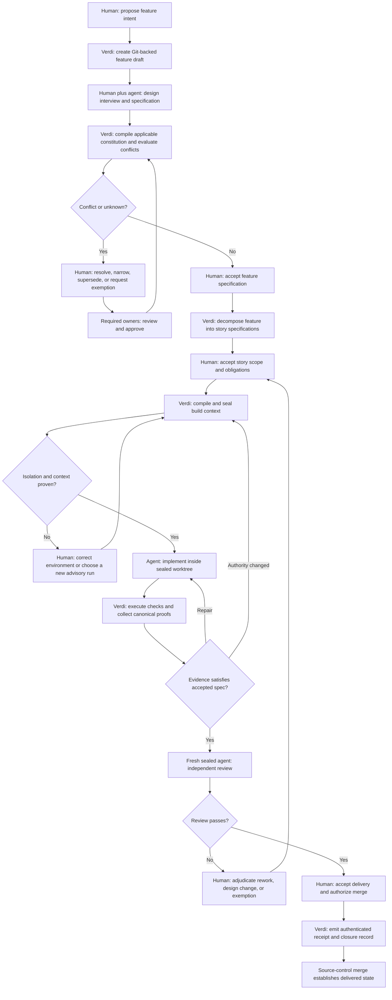

# Context Integrity and Constitutional Execution (v2)

## Problem

Verdi can freeze an accepted specification, compute evidence obligations,
judge semantic deviation, and preserve the resulting lifecycle artifacts.
It cannot yet prove the authority that shaped the agent doing the work.
`get_context_bundle` resolves caller-supplied refs, harnesses may discover
instructions outside that bundle, and personal memory or global configuration
may supply additional priorities that neither the specification nor the final
evidence names. Two agents can therefore receive the same accepted story and
operate under materially different effective contexts while Verdi records both
as if the story alone governed them.

The policy side has the same gap. Project rules, design decisions, local
exceptions, and harness files are prose with no single authority model. Some
contradictions can be proven mechanically, many can only be discovered
semantically, and the current judged sweep does not define a deterministic
boundary between those categories. A later, more specific statement can look
like a legitimate refinement even when it silently defeats a higher-authority
rule. Conversely, asking an AI judge to pronounce every prose relationship
would make the gate probabilistic and encourage teams to tune wording for a
favorable result.

The dogfood chronicles show that the underlying lifecycle can deliver real,
high-fidelity output, but also that operators repeatedly reconstruct state
across branches, reports, prompts, harness limits, and hidden assumptions. That
cost is tolerable for Verdi's builders because they know the machinery. It is
not a universal, straightforward user journey, and it leaves no reliable answer
to the most important forensic question: *what exact authority and context was
this agent allowed to use when it produced this change and its proofs?*

## Outcome

Verdi adds a project constitution and a sealed context lifecycle around the
existing specification and evidence lifecycle. People author readable,
Git-versioned rules and exceptions. Verdi compiles the applicable subset,
accepted design, repository data, and capability grant into a canonical
phase-specific context manifest. The selected harness adapter proves the
project-controlled isolation it can establish, launches the agent against an
immutable instruction projection, records every context expansion, and emits a
receipt binding the output and evidence to that exact context revision.

The trust claim stays deliberately bounded. Verdi can certify that the project
constitution, accepted specification, declared repository context, and approved
capabilities were sealed and that personal project-external configuration was
excluded when the adapter proves it. It does not claim to inspect or eliminate
undocumented instructions inside the harness vendor's own runtime. Those inputs
are disclosed as an opaque base, making the receipt honest and comparable
without pretending the unknowable is proven.

The same compiler and conflict evaluator govern acceptance, authoritative
launch, evidence intake, independent review, and closure. Humans retain control
over intent, exceptions, and final delivery. Deterministic machinery handles
repeatable compilation, conflict proof, provenance, and gating; AI assists only
where prose interpretation is unavoidable and never becomes an unreviewed
source of authority.

## End-to-end journey

Human interaction is mandatory when declaring intent, accepting a feature,
accepting story scope and obligations, governing a conflict or exception,
adjudicating a change to accepted authority, and authorizing delivery. A human
is not required to shepherd deterministic compilation, proof collection,
receipt generation, or routine repair inside unchanged authority.

## AC-1

A project's constitution consists of canonical, ID-addressable policy,
policy-overlay, and policy-exemption artifacts. Their immutable kernel records
identity, authority, owner, lifecycle, scope, typed claims, rationale,
provenance, and governing relationships. Policies state defaults and
requirements. Overlays refine only surfaces the governing policy declares
overridable. Exemptions are bounded departures with witnesses, approvals,
compensating controls, and an expiry or review condition.

The constitution also selects a canonical governance profile. The initial
profiles are solo, team, high-assurance, and experimental. Solo may permit one
authenticated principal to author and approve while disclosing the collapsed
separation of duties. Team requires an authenticated independent reviewer for
configured transitions. High-assurance adds configured ownership, signature,
evidence-source, and separation requirements. Experimental may reduce ceremony
but can never label its output authoritative. Profiles change governance
requirements, not the meaning of evidence, deterministic derivations, or the
three-valued honesty kernel.

Human actors resolve through configured trust evidence such as forge identity,
signed commits, CODEOWNERS membership, or a project identity provider. A shell
username, display name, agent-authored field, or unauthenticated local claim may
be shown for convenience but cannot satisfy an authoritative author, reviewer,
owner, or approver requirement.

The operating model resolves a configurable scaffold for every committed
human-authored artifact kind: policies, overlays, exemptions, feature, story,
and component specs, ADRs, obligations, attestations, waivers,
reaffirmations, and future model-registered human kinds. CLI, workbench, and
agent-assisted creation use one resolver and renderer. The model may declare
typed extension fields and presentation guidance, but a template cannot
remove, rename, retype, or synthesize kernel fields. A created artifact records
the resolved template identity and digest. `verdi model check` renders and
strict-decodes every configured template and proves parity across creation
surfaces.

Machine proofs remain canonical because checkers consume them directly. Context
manifests and receipts, evidence bundles, conflict and alignment reports,
matrices, verdicts, rollups, and provenance records have fixed schemas and
canonical encodings. A project may customize their human-facing projections,
never the underlying proof shape.

`AGENTS.md`, `CLAUDE.md`, and future harness files are generated projections of
the constitution. Their content and digest derive from canonical policy inputs
and adapter rules. The adapter enumerates the harness's effective project-level
instruction discovery chain, including nested instruction files, and requires
every discovered project instruction to be generated and digest-matched.
Unmanaged, shadowing, truncated, or drifted project instructions block
authoritative launch. Editing a projection does not change authority; drift is
a named blocking witness until the projection is regenerated or the canonical
policy is changed through governance.

## AC-2

The context compiler receives a phase, adapter identity and version, accepted
specification ref, repository state, declared execution scope, capability
grant, and resolved constitution. It discovers the potential context universe,
classifies every candidate input, computes applicability, orders normalized
entries, and emits a canonical manifest and instruction projection. Repeating
compilation over identical inputs produces byte-identical proof artifacts and
digests.

Each manifest identifies at least:

- Its schema, phase, authority revision, context revision, and parent revision.
- Accepted spec, parent feature, decisions, obligations, repository state, and
  their immutable refs or content digests.
- Canonical repository identity, branch, HEAD, default-branch head and
  relationship, dirty or uncommitted state, evidence-authority class, and
  freshness against every consumed report.
- Applicable policies, overlays, exemptions, semantic dispositions, owners,
  scopes, governance-profile identity and digest, and authenticated actor
  claims with their trust witnesses.
- Included data, excluded candidates with reason codes, approved capabilities,
  projection files, adapter identity, and every digest.
- Inputs the project cannot inspect or exclude, classified as opaque rather
  than silently omitted.

The design capsule is broad and advisory so an agent can explore alternatives.
The authoritative build capsule contains the minimum accepted story, parent
feature fragments, obligations, applicable constitution, approved
capabilities, and scoped repository material. The review capsule is freshly
compiled from the accepted spec, result diff, evidence bundle, builder receipt,
and review policy.

Instructions are immutable within one execution. A permitted request for more
data is evaluated against scope and authority, appended to an item-level
expansion ledger, and produces context revision `N+1` linked to its parent.
Crossing an authority, capability, or declared-scope boundary requires the
configured human approval. The canonical item ledger is retained in the
evidence bundle; Git and closure surfaces show a compact summary and digest;
the workbench groups entries and exposes item detail on demand.

## AC-3

The conflict evaluator has a mechanical layer and a semantic layer. Both feed
one canonical verdict consumed unchanged by acceptance, sealed launch,
evidence intake, and closure.

Mechanical proof is limited to typed constraints in six Verdi-owned families:
action, configuration, capability, resource, identity, and evidence. Verdi
owns the operators and comparison semantics. The initial operator set includes
equals, not-equals, allowed-values, required-values, forbidden-values, minimum,
maximum, same-principal, different-principal, path-read, and path-write.
Projects register concrete subjects, environments, actions, configuration
keys, resources, and allowed values. They cannot register executable semantics
or arbitrary Boolean expressions. Multiple constraints are conjunctive;
alternatives are represented by typed allowed sets.

Scope comparison is three-valued: proven overlap, proven disjoint, or unknown.
A mechanical conflict exists only when scope overlap is proven and the
registered domain proves the conjunction unsatisfiable. Proven disjointness is
a mechanical no-conflict. Unknown scope moves to semantic evaluation and never
becomes a pass by absence.

The semantic layer receives the complete normalized claims, pinned and sorted
sources, and a canonical prompt. It tests overlap, simultaneous
satisfiability, refinement, explicit exception, authority, and the strongest
reasonable non-conflict interpretation. Its strict output cites exact claim
witnesses which Verdi validates against the inputs. The model may identify a
potential conflict or recommend no conflict; it cannot label a result
mechanically proven. Model identity, prompt digest, input digest, raw result,
parsed result, and validation outcome are recorded. Changed inputs stale the
result. High-assurance profiles may require a challenger judge; disagreement
requires human disposition.

A mechanically proven conflict cannot be dismissed as no-conflict. It must be
fixed, superseded, narrowed, or covered by an authorized exemption. A semantic
candidate may be confirmed as a conflict or dispositioned no-conflict with
rationale. Judge absence or inconclusive output may be replaced only by a
canonical human fallback record carrying the same witnesses, digests,
rationale, review condition, and independent approval. Unknown, unresolved,
stale, or unauthorized states block authoritative progression.

A disposition is reusable only while the complete witness identity is
unchanged: claim IDs and digests, categories, scopes, typed values, governing
authority, and applicable exemptions. A retry over the same identity reuses the
record without spending another semantic judgment; any changed component
requires a fresh evaluation and disposition.

## AC-4

The Codex adapter is the first implementation of a harness-neutral execution
contract. Before authoritative launch it creates an isolated worktree and
profile, verifies the complete effective project-instruction discovery chain,
installs only the generated project instruction projection, applies the
approved sandbox, network, tool, and capability policy, and verifies each claim
the adapter is expected to enforce. Personal and global Codex project
configuration and memory are excluded. Any unavoidable platform-controlled
base is disclosed as opaque.

The adapter refuses authoritative launch if it cannot prove isolation or if the
compiled manifest, projection, worktree, capabilities, exemptions, or conflict
verdict is stale. The UI or CLI may offer to start a distinct advisory run with
the limitation plainly labeled. It must not continue the failed launch under a
weaker interpretation of the same run.

Within an authoritative run, instruction authority cannot change. Approved
data expansion follows AC-2. A change to an applicable policy, accepted spec,
decision, exemption, projection, or other authority changes the effective
context digest, invalidates affected builder evidence, and requires
recompilation and a fresh run. A governed grandfathering exemption may preserve
specific evidence only by naming the old and new witnesses, bounded scope,
rationale, compensating control, owners, and review condition.

An interrupted run resumes only if Verdi proves continuity of the exact
manifest revision, isolated profile, worktree, instruction projection,
capability set, repository state, applicable authority, and complete event and
expansion ledger. Otherwise its partial output stays available for inspection
but is non-authoritative, and a fresh sealed run is required.

## AC-5

Completion emits a canonical context receipt that binds the execution to its
inputs, outputs, and proofs. It identifies the manifest and projection digests,
adapter and runner identities, authenticated human principals, governance
profile identity and digest, canonical repository identity, branch, input and
output HEADs, default-branch relationship, dirty-state posture, evidence
authority and freshness, capabilities, expansions, obligations, executed
checks, evidence artifacts, exemptions, semantic dispositions, interruptions
or invalidations, and the builder-review relationship. The full normalized
receipt belongs to the evidence bundle; Git and closure summaries cite its
digest and essential verdicts.

A digest proves that receipt content did not change. It does not prove who ran
the adapter or whether the claimed isolation existed. An authoritative receipt
therefore requires an authenticated attestation from a configured trusted
managed runner or CI identity and a verifier-resolved trust root. A local or
unsigned receipt is useful for development but is explicitly advisory and
cannot satisfy an authoritative gate. A run under an experimental governance
profile is likewise advisory even when its content and runner attestations are
otherwise valid.

Independent review begins from a new isolated profile and freshly compiled
review manifest. The reviewer receives the accepted specification, resulting
diff, evidence bundle, builder receipt, and applicable review policy. It does
not receive the builder's conversation, ambient memory, personal configuration,
or undeclared context. The reviewer produces its own receipt and evidence,
which link to—not overwrite—the builder record.

Closure requires both receipt chains to remain fresh against the accepted
authority and output commit. If an applicable policy or specification change
changes the effective context digest, builder or review evidence is invalid
until rerun or governed grandfathering. The gate reports the exact stale or
missing witness rather than collapsing it into a generic failure.

## AC-6

The Constitution workbench uses Verdi's canonical dark visual language and
presents a rule ledger rather than a policy-administration table. The default
view leads with each rule's plain-language requirement, rationale, scope,
owner, status, and active exceptions. It groups active rules, pending changes,
unresolved conflicts, exemptions, and downstream effects. Typed constraints,
source paths, template and projection digests, raw YAML, proof JSON, and full
ledgers remain available through progressive disclosure.

Every rule exposes a derivation trail:

`canonical rule → applicable overlay/exemption → harness projection → gate →
affected spec/story → sealed run and receipt`.

Selecting **Propose change** creates or reuses a managed worktree and branch,
instantiates the configured artifact scaffold, and autosaves to that artifact.
There is no workbench database with an independent authoritative copy. Before
submission, **Prepare review** strict-decodes the artifacts, regenerates
projections, computes mechanical conflicts and semantic candidates, identifies
stale dispositions and evidence, and shows:

- The human-readable change and rationale.
- Affected policies, specs, stories, projections, active runs, and evidence.
- Mechanically proven conflicts, semantic candidates, and unknowns.
- Required owners, approvals, exemptions, and compensating controls.
- A semantic diff and the exact raw source diff.

The human confirms an intentional scoped commit. Normal pull-request review and
merge establish the new authority. Git status, branch, projection digest, and
review state stay visible without dominating the reading experience. The same
status rail names canonical repository identity, HEAD, default-branch
relationship, dirty-state posture, evidence authority, governance profile, and
freshness; a user never has to infer those facts from a terminal prompt.
Historical revisions and machine proofs remain searchable, but routine policy
maintenance does not require users to understand Verdi's storage layout or
hand-edit YAML.

## Delivery sequence

The feature ships in dependency order so no authority claim rests on an
unverified later layer:

1. `policy-authority` introduces canonical policy, overlay, and exemption
   artifacts, shared human-artifact templates, constraint catalogs, and
   generated projections.
2. `context-compiler` discovers, classifies, scopes, orders, and digests
   phase-specific inputs into canonical manifests and payloads.
3. `policy-conflict-gate` supplies mechanical proof, semantic candidate
   discovery, dispositions, exemptions, staleness, and the shared gate verdict.
4. `sealed-codex-execution` implements the first adapter, isolation proof,
   capability enforcement, data expansion, invalidation, and continuity resume.
5. `context-receipts-review` authenticates canonical receipts and adds fresh
   independent sealed review.
6. `constitution-workbench` exposes the complete Git-backed human workflow in
   the approved Verdi interface after its underlying authority and proof seams
   are stable.

Each story must be independently acceptable and preserve legacy behavior when
the capability is not adopted. No story may claim the final authoritative
posture by substituting an in-memory placeholder, UI-only state, unsigned local
receipt, or advisory runner for a later dependency.

## Relationship to Guided Lifecycle and Governance

Context Integrity owns context authority, policy compilation, conflict verdicts,
sealed execution, and context receipts. Guided Lifecycle and Governance owns the
human-facing lifecycle projection, generalized transition governance,
obligation quality, accountable human records, readiness, recovery, and process
metrics.

The governance-profile and authenticated-principal resolver is shared
kernel infrastructure with one schema and one implementation seam. Custody
is joint and explicit (owner ruling OD-2, recorded in
`docs/superpowers/specs/2026-08-03-four-feature-owner-adjudications-design.md`,
materializing recommendation R-5 of
`docs/superpowers/plans/2026-08-03-cross-feature-authority-audit.md` §2):
Guided Lifecycle and Governance owns the lifecycle-wide requirements,
delivered through its `lifecycle-governance` story; this feature records
and enforces the resolved profile and principals for policy, context,
execution, and receipt decisions (DC-21) and stores governance-profile
artifacts in its constitution store as typed policy artifacts (owner
ruling OD-1, DC-20); the governance-principal-kernel delivery unit
implements the profile schema, principal resolver, trust-source
evaluation, and authorization interpretation, and owns nothing else.
Delivery planning may factor this kernel as prerequisite work, but neither
feature may define a parallel profile or actor type, and an interim
semantic change to the shared contract moves only by owner-ratified
amendment to the affected specification.

The journey may consume Context Integrity's repository, authority, conflict,
manifest, receipt, and freshness facts as canonical operands. It cannot
recompile context, rejudge a conflict, or reinterpret an advisory context result
as authoritative. Context Integrity does not depend on the journey projection
to compute its own verdicts.

## DC-1

The context contract is harness-neutral. A harness adapter declares the
isolation, projection, capability, expansion, interruption, and attestation
claims it can enforce. Codex is first because it exercises the contract against
a real target; Codex-specific behavior must not leak into canonical artifact or
proof schemas.

## DC-2

The strongest honest claim is **project context sealed; harness base opaque**.
Verdi does not promise total prompt visibility when the vendor does not expose
it. That boundary is a first-class receipt field and UI disclosure, not a note
buried in logs.

## DC-3

Specificity alone never changes authority. A page-level font choice may refine
an overridable design-system default; it cannot override a required font or a
higher-authority prohibition without an exemption. An overlay is therefore
valid only where the governing policy declares the subject overridable and its
scope is within the permitted refinement boundary.

## DC-4

Human artifacts optimize for authors and reviewers; machine proofs optimize for
checkers. Configuration may change human scaffold structure and add declared
typed extensions. It cannot make proof formats ambiguous or force checkers to
interpret project-specific layouts.

## DC-5

The fixed constraint families cover the mechanically useful cases without
creating a second programming language. For example:

- A `make verify` policy registers an action and requires its successful receipt
  against the candidate output tree before authoritative evidence is eligible.
  Missing execution is an unmet requirement, not a conflict.
- Environment configuration registers a key and environment scopes. Requiring
  `X` in local/test and `Y` in production is mechanically disjoint; requiring
  both `X` and `Y` in overlapping production scope is a proven conflict.
- A design-system policy selects a pinned resource for a UI scope. A page font
  refines an allowed default only when the subject is declared overridable and
  the value is allowed.

Typed references prove which standard governs. Conformance to that standard
still requires appropriate static, behavioral, visual, or attestation evidence.

## DC-6

Semantic judgment is reproducible at the input boundary, not assumed
deterministic at the model boundary. Verdi pins, sorts, digests, validates, and
records the entire exchange, then requires governed disposition. Teams cannot
wordsmith their way to an automatic pass because the model's favorable opinion
is never itself the final authority.

## DC-7

Conflict resolution is kind-specific. Proven contradictions retain their proof
until an input changes. Semantic candidates retain their disposition until the
full witness identity changes. Unknowns retain their blocking status until
scope or semantics becomes known. No generic override erases those distinctions.

## DC-8

The affected specification owner authors a departure; the governing policy
owner approves it. Every actor is an authenticated principal under the applied
governance profile. Team and high-assurance modes require a distinct principal.
Solo mode may allow the same principal to perform both roles, but the receipt
must disclose that separation of duties was not available. Every departure is
bounded, reviewable, and expires or reaches a named review condition.

## DC-9

Data and authority have different revision semantics. More in-scope data may be
admitted and logged within a run. New instructions or changed authority redefine
the run and require a new compilation. Treating those as the same kind of
context expansion would let a running agent silently acquire new priorities.

## DC-10

Authoritative-to-advisory is never an implicit fallback. A new advisory run has
its own identity, manifest, UI state, and receipt posture so neither a person nor
a later gate can mistake its output for sealed evidence.

## DC-11

Resume is a proof of continuity, not a harness convenience. Native harness
resume may be used only after the adapter verifies every continuity witness.
Otherwise the deterministic response is restart, with the partial attempt
retained as non-authoritative history.

## DC-12

Trust roots are configured project authority. Managed-runner attestations name
the runner, adapter, receipt digest, and verification method. Verification
failure, unknown signer, or an unsigned receipt is disclosed as advisory or
unproven, never accepted because the content hash matches.

## DC-13

Independent review intentionally loses conversational continuity. The review
capsule contains the evidence needed to evaluate the accepted contract and
result, not the builder's self-justification. This makes reviewer agreement an
independent signal and prevents builder memory from becoming undeclared review
authority.

## DC-14

Git is the constitution's durable collaboration and audit layer. The workbench
may simplify branch, worktree, diff, approval, and merge concepts, but it does
not replace them with hidden mutable state. A policy visible as merged source is
the policy agents derive from.

## DC-15

Adoption is opt-in and reversible at the authority boundary. Existing stores
continue to use their current design, evidence, and closure behavior until they
adopt the constitution capability. Their agent runs are not retroactively
described as sealed. Adoption inventories existing `AGENTS.md`, `CLAUDE.md`,
and equivalent files, presents their statements for owner classification, and
creates canonical policy plus generated projections only after review. Removing
the capability returns the project to legacy behavior but cannot erase receipts
or rewrite the authority under which historical runs occurred.

## DC-16

The compiled payload distinguishes project authority, non-authoritative data,
and opaque harness inputs. Repository files, MCP results, external documents,
and retrieved corpus prose retain provenance and are wrapped as data even when
their text contains imperative language. They cannot enter the generated
instruction projection through retrieval or expansion. This limits context
poisoning and makes the attempted boundary auditable, but the receipt claims
only what Verdi composed and the adapter isolated; model compliance remains an
evidenced behavior, not a mechanically proven property.

## DC-17

Human identity is a verified claim, not a string field. The applied governance
profile declares acceptable trust sources and maps their authenticated subjects
to project roles. Forge accounts, signed commits, CODEOWNERS membership, and an
identity-provider assertion may satisfy that mapping when configured. `$USER`,
Git display metadata without signature or forge corroboration, and an agent's
self-description cannot. When identity cannot be verified, Verdi may retain the
record as advisory but cannot count it toward authoritative approval.

## DC-18

Repository state is part of every context verdict. A projection must make it
immediately clear which repository, branch, and HEAD it describes; whether that
HEAD equals, contains, trails, or diverges from the configured default branch;
whether uncommitted inputs exist; which evidence is local or authoritative; and
whether each consumed report is fresh. These facts are canonical operands for
the journey layer and visible witnesses in the Constitution workbench, not a
second lifecycle state machine.

## DC-19

The governance profile is a versioned, digest-bound part of project authority.
Solo, team, and high-assurance profiles progressively strengthen actor,
approval, signature, ownership, and evidence-source requirements. Experimental
may relax ceremony for learning, but its runs and receipts remain advisory. No
profile may redefine a failed or unproven check as passed, alter canonical proof
meaning, suppress unresolved state, or weaken deterministic provenance.

## DC-20

Owner ruling OD-1 places governance-profile artifacts in the constitution
store rather than a kernel-owned silo: profiles are project authority, and
this feature already owns the storage, identity, digest, drift, and
recording discipline for authority artifacts. The kernel's profile
resolution — deciding which profile applies and resolving its principals —
is a different operation from this feature's effective-policy resolution
over policies, overlays, and exemptions; conflating them was the boundary
risk the audit's CX-1 row named, and the split here keeps each owner
accountable for exactly one behavior.

## DC-21

This is the recording-and-enforcement half of the custody rule Guided
Lifecycle and Governance states as its DC-16: every manifest, approval,
receipt, and verdict that names an actor carries either a kernel
principal-resolution result or an advisory attribution record embedding a
canonical kernel principal identifier or explicit unauthenticated marker.
Enforcement follows the three-valued posture: a required resolution that
is unproven blocks the authoritative decision it gates — it is never
downgraded to a warning or silently satisfied.

## DC-22

The identity constraint family's operators were the audit's named at-risk
surface for a second authorization interpreter. Calling the kernel
interpretation keeps distinctness and separation-of-duties semantics
single-sourced; this feature contributes the constraint registration,
scope comparison, and verdict recording around that call, never a second
evaluation.

## DC-23

Owner ruling OD-5 settles policy custody for both promoted features:
typed feature-specific payloads inside this feature's single
policy-authority system, under its one narrow-only inheritance semantic
(dc-3). A feature-local policy fallback or second hierarchy would
reintroduce the drift-capable duplication the audit's CX-5 row witnessed;
none is permitted, and the context compiler classifies feature policy the
same way it classifies every other constitution artifact.

## CO-1

Silence is never a pass. Every gate and surface distinguishes a satisfied proof,
a witnessed violation, and an explicit unproven or unknown condition.

## CO-2

The existing strict-decode seam and restricted YAML dialect remain the only
artifact ingestion path. The context feature adds schemas and registered
catalogs; it does not introduce permissive decoding or user-executable policy
logic.

## CO-3

Canonical outputs contain no incidental ordering, local absolute paths,
conversation identifiers, nondeterministic timestamps, or random identifiers.
Declared provenance stamps and authenticated attestations are modeled fields,
not hidden entropy.

## CO-4

Policies express that a secret-backed value or credential class must exist,
where it may be used, and which non-secret check proves compliance. Secret
material remains outside the corpus and every generated context or proof.

## CO-5

Constitution and template evolution is prospective. Historical artifacts keep
the template, model, constitution, and context digests that shaped them. Verdi
never rewrites history to make an old artifact appear born under a new rule.

## CO-6

Every new decoder, constraint family, operator, scope relation, invalidation
edge, receipt state, and adapter refusal has table-driven happy and negative
coverage. Fixtures are committed and deterministic; proof digests are ratcheted.
Harness, forge, runner, signature, and context-expansion integrations use
hermetic fakes with no network. CLI behavior is exercised through the built
binary. Every Constitution workbench path has Playwright coverage, including
keyboard access and fail-closed error states. A story is not complete without
clean `make verify` and `go test -race ./...` output from the repository-defined
environment.

## Non-goals

This feature does not promise visibility into undocumented vendor system
prompts, make AI semantic judgments mathematically deterministic, introduce a
general-purpose policy language, store secrets, replace forge approval controls,
or authorize agents to expand their own capabilities. It does not remove human
acceptance of intent or final delivery. It makes every such boundary explicit,
governed, and connected to evidence.
