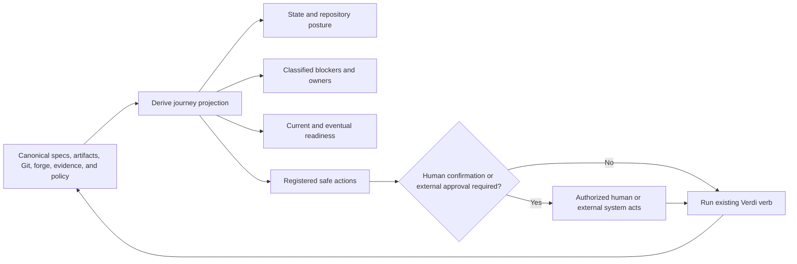

# Guided Lifecycle and Governance (v2)

## Problem

Verdi already has a strong deterministic core: strict artifacts, frozen
specifications, evidence obligations, alignment and conflict reports, explicit
disclosures, and lifecycle gates. The dogfood record demonstrates that this
machinery can deliver accepted designs with high fidelity. It also demonstrates
that a trained operator still has to reconstruct the process from roughly twenty
commands, branch and worktree state, HEAD relationships, local versus CI
evidence, forge state, reports, and conventions about which human record is
authoritative.

That reconstruction is the remaining usability and governance blocker. The
right command can be run in the wrong phase. A valid artifact in the wrong
checkout can look current. Obligation placeholders can satisfy structural shape
without carrying evidence meaning. Deviation rationales, attestations, and
waivers can be honest records yet still become routine rubber stamps. Recovery
instructions are careful but expose Git internals precisely when an occasional
user is least prepared to reason about them.

`close --prepare` begins to solve this at closure by turning dispersed state into
an explanation. The rest of the lifecycle does not yet provide the same
orientation. A user should not need an internal mental model of Verdi to answer:

1. What state is this feature or story in?
2. What exactly prevents it from advancing?
3. Is the next work mechanical, judgmental, governance-related, or waiting on an
   external system?
4. Which authenticated principal is responsible?
5. What exact safe action advances it?

## Outcome

Verdi gains a guided lifecycle and governance layer built entirely as derived
projections over its existing sources of truth. `verdi journey <ref>` and the
equivalent workbench surface answer the five questions consistently from design
through acceptance, build, evidence, review, merge, and closure. Existing verbs
remain the only deterministic transition plumbing. The journey explains them,
checks whether they are legal now, and identifies who may perform them; it does
not invent another workflow or store another lifecycle state.

The same layer makes human judgment accountable without manufacturing machine
authority. Governance profiles define authenticated actors, required roles,
separation of duties, signatures, ownership, evidence sources, and escalation.
Verdi checks whether a judgment is attributable, informed, complete, authorized,
bounded, reviewable, and current—not whether the judgment is philosophically or
semantically correct.

Evidence design and closure readiness become prospective. Obligation scaffolds
may preserve authoring flow, but unresolved meaning blocks authoritative build.
Eventual closure blockers remain visible from feature acceptance rather than
arriving as a late cluster. Interrupted operations receive derived recovery
guidance, and canonical lifecycle events yield privacy-bounded metrics that let
the team measure whether the process is actually becoming more straightforward.

## Journey loop

The loop is recomputation, not orchestration memory. After every relevant Git,
forge, artifact, evidence, or policy change, Verdi derives the journey again.

## AC-1

`verdi journey <feature-or-story-ref>` and its workbench projection emit one
canonical journey record. The record includes:

- Canonical repository identity, branch, HEAD, configured default-branch HEAD,
  and their relationship: equal, ahead, behind, diverged, or unknown.
- Dirty and staged state, active worktree identity, and whether the evaluated
  content comes from HEAD, the working tree, a remote ref, or a receipt-bound
  commit.
- Lifecycle class and state, accepted and frozen revisions, active build or
  design branch, and authoritative versus advisory posture.
- Current blockers and eventual closure blockers, each with stable reason code,
  witnesses, work class, owner, clearing condition, and affected transition.
- Authenticated principals and roles required for the next governance action,
  including disclosed absence or unavailable separation of duties.
- Safe actions whose preconditions hold now, including arguments, expected
  effects, authority requirements, confirmation posture, and the existing Verdi
  verb or forge transition that performs them.

The four blocker classes are mechanical, judgmental, governance, and
external-wait. Unknown stays unknown and blocking. A safe action is never free
text or generated shell: it comes from the operating model's registered
transition/action catalog and is included only when its preconditions are
proven. Human-facing prose may vary through vocabulary and templates; stable
identifiers and the canonical JSON record do not.

The projection generalizes existing preparation and preflight computations,
including `close --prepare`; those computations become contributors to one
journey record rather than separate opinions. CLI, workbench, MCP, and dex read
the same record. No surface independently re-derives state or next steps.

## AC-2

An obligation is evidence design, not a named placeholder. Every authoritative
obligation declares:

- **Claim:** the specific fact that evidence must establish.
- **Falsifier:** an observable result that would show the claim does not hold.
- **Scope:** the system, paths, environment, population, or transition covered.
- **Producer:** the test, checker, reviewer, or authorized human expected to
  produce the evidence.
- **Authoritative source:** the CI job, signed record, forge check, repository
  location, or governed attestation source Verdi may trust.
- **Freshness rule:** which spec, code, dependency, environment, or policy
  changes stale the evidence.

Acceptance may still scaffold a missing obligation to avoid partial structural
failure, but the scaffold carries an explicit unresolved-design-debt state and
contains no fabricated claim meaning. The journey shows the debt immediately.
No solo, team, or high-assurance profile permits it to cross authoritative
`build start`; experimental may continue only in advisory posture. Acceptance
review explicitly presents the falsifier question: *what result would prove
this acceptance criterion false?*

Verdi validates completeness, identity, freshness, and source authority. It does
not pronounce a well-formed obligation substantively sufficient; accepted human
design and independent review remain responsible for that judgment.

## AC-3

One strict-decoded governance profile applies across the lifecycle. The shared
profile resolver is also the seam Context Integrity records in its manifests and
receipts; the two features must not create parallel profile or actor schemas.
The profile declares acceptable identity trust sources, role mappings,
ownership sources, signature requirements, required approvers, distinctness
rules, evidence-source restrictions, escalation thresholds, and transitions to
which each rule applies.

The initial profiles are:

- **Solo:** one authenticated principal may fill author and approver roles where
  configured, with the collapsed separation visibly disclosed.
- **Team:** acceptance, governed exceptions, merge authorization, and closure
  require configured independent authenticated review.
- **High assurance:** explicit separation of duties, ownership checks, signed
  records, bounded exceptions, and stronger authoritative-source requirements.
- **Experimental:** reduced ceremony for learning, while every result and
  closure remains advisory and cannot be represented as authoritative.

The non-negotiable kernel is common to all profiles: strict artifacts,
deterministic derivations, immutable provenance, authoritative-evidence
distinctions, no silent pass, explicit unresolved and unproven states, traceable
exceptions, and reproducible gates. Profile selection changes requirements, not
the meaning of evidence or lifecycle states.

Before a governed transition, Verdi resolves actor claims through configured
forge identity, signed commits, CODEOWNERS or equivalent ownership data, and
optional identity-provider assertions. Missing or unreachable identity and
forge evidence becomes an external-wait or unproven blocker. `$USER`, Git
display strings alone, and agent-authored identity fields never satisfy an
authoritative role.

## AC-4

Human-authored deviations, attestations, waivers, policy exemptions, and
semantic dispositions share an accountability kernel. Each record names exact
witnesses, the claim or departure, consequence or risk, bounded scope,
authenticated owner, compensating control where applicable, expiry or review
condition, current-HEAD applicability, and why immediate correction is
disproportionate when a deviation is accepted. The active profile determines
required reviewers and principal distinctness.

Verdi checks structure and governance, never the ultimate correctness of the
judgment. Generic rationale presence and word counts are not guardrails; they
reward boilerplate. Witness identity, consequence, authorization, boundedness,
and freshness are machine-checkable properties that remain useful during later
review.

Audit computes exception frequency, repeated use against the same policy or
acceptance criterion, concentration under one owner or component, extensions
past review conditions, and configured impact categories. Threshold crossings
do not let an AI reject a human conclusion. They require elevated approval,
open a governance blocker, or prevent another authoritative exception according
to the profile. Rollups preserve every individual record and its current
validity rather than reducing the history to a count.

## AC-5

An authoritative transition consumes a human record only when the exact bytes
are committed at the evaluated HEAD and every referenced witness is fresh for
that HEAD. The journey shows whether each record is committed, working-tree
only, modified relative to HEAD, sourced from another branch, or stale against
its target. A record with the same logical ID but different bytes is different
evidence.

Normal and strict authoritative closure require HEAD equality. A local
diagnostic may inspect working-tree attestations or waivers so authors can test
their next step, but the output is visibly advisory. `--force-local` remains a
test and recovery aid: it cannot emit an authoritative gate pass, receipt,
archive, publication, or closure, regardless of whether its local checks are
otherwise green.

Forge approval, signed-record, ownership, and default-branch witnesses are
resolved at the transition boundary and bound into its receipt. Unknown or
unreachable external state is disclosed and blocks only the authoritative
claim; it is never interpreted as approval absence or approval presence.

## AC-6

Every feature journey carries a closure-readiness projection from acceptance
onward. It distinguishes **current blockers** from **eventual blockers**:

- Current blockers prevent the next legal transition.
- Eventual blockers are already-known unsatisfied requirements for a later
  transition, such as stub reconciliation, outcome-floor evidence, unelaborated
  obligations, missing feature evidence, unresolved questions or conflicts,
  expiring exceptions, missing authenticated owners, or absent authoritative
  receipts.

An eventual blocker is not a prediction that future evidence will fail and not
a present violation. It is a named debt with its future clearing condition and
owner. This makes closure work visible before implementation without pulling
closure gates earlier than their semantics allow.

Feature outcome attestations receive a symmetric scaffold and workbench flow:
select the feature criterion, show its accepted text and falsifier context,
identify the authenticated human author and required reviewers, author the
claim, preview witnesses and committedness, and prepare the Git change. Verdi
and agents may scaffold structure and questions but never write or suggest the
human outcome claim itself.

## AC-7

`verdi recover <ref>` and the workbench recovery surface recognize interrupted
states using observable repository and Verdi facts: partially cut branches or
worktrees, staged but uncommitted artifacts, acceptance or closure edits without
their ritual commit, archived files without publication, failed pushes or forge
publication, stale locks, and interrupted governed actions.

Recovery is read-only by default. Its canonical report names the detected state,
facts and uncertainties, actions already completed, invariants that still hold,
and safe choices. Each offered action has proven preconditions, declared effects,
reversibility, confirmation requirements, and postconditions. Mutations route
through existing Verdi or Git primitives and re-derive the journey afterward.

Verdi never invents a recovery lifecycle or guesses which side of an ambiguous
partial operation the user intended. Unknown or conflicting state produces
diagnosis and manual witness requests, not a speculative mutation. Destructive
cleanup and external publication always require explicit confirmation and exact
targets; recoverable choices are preferred.

## AC-8

Verdi derives journey metrics from canonical artifact transitions, receipts,
gate and recovery records, and privacy-bounded observational outcome events.
Every participating lifecycle command, confirmed journey action, and governed
recovery attempt emits an immutable event receipt containing only the registered
action ID, target ref, input-state digest, result class, blocker IDs, authority
posture, required governance principal IDs, source commit or forge witness, and
declared provenance stamp. It contains no command arguments that may carry
secrets and no artifact, prompt, diff, or source content.

Outcome events are telemetry, never lifecycle authority. Gates, transitions,
recovery, and journey state do not consume metric rollups or infer success from
event presence. The event transport may be incomplete; every report states its
covered event sources and treats missing coverage as unknown rather than zero.
The initial stable measures are:

- Commands or confirmed actions per successful transition.
- Judgment and disposition loops per feature and story.
- Blockers first discovered after build start or at closure.
- Exception frequency, repetition, concentration, and expiry overruns.
- Automated-evidence to human-attestation ratio by evidence class.
- Recovery incidents and recovered transition class.
- First-pass acceptance, gate, review, and closure rate.

Every metric definition states its numerator, denominator, eligible event set,
unknown-data posture, and schema version. Reports cite the source-event digest
and distinguish zero from unavailable. They aggregate process behavior for
dogfood and improvement; they do not rank individuals or infer productivity.

No metric captures prompt text, model hidden reasoning, source content, secret
values, or ambient harness telemetry. Canonical principal IDs appear only where
governance auditing requires attribution; ordinary ergonomics rollups aggregate
or pseudonymize them according to policy. Chronicle prose may interpret the
metrics, but it cannot alter their deterministic values.

## Relationship to Context Integrity

Context Integrity answers: *what exact project authority, data, capabilities,
adapter, and context revision shaped this agent run and its evidence?* This
feature answers: *where is the human in the lifecycle, what blocks progress, who
must act, and what action is safe now?*

When installed, Context Integrity contributes canonical operands—constitution
and governance-profile digests, conflict verdicts, repository posture, manifest
and receipt status, authenticated principals, evidence authority, and
freshness—to the journey. Guided Lifecycle consumes those records without
recompiling context, rejudging conflicts, or weakening their verdicts. When the
capability is absent, the journey discloses that absence and applies the active
profile's posture; it does not silently claim the run was sealed.

The governance-profile and authenticated-principal resolver is shared
kernel infrastructure with one schema and one implementation seam. Custody
is joint and explicit (owner ruling OD-2, recorded in
`docs/superpowers/specs/2026-08-03-four-feature-owner-adjudications-design.md`,
materializing recommendation R-5 of
`docs/superpowers/plans/2026-08-03-cross-feature-authority-audit.md` §2):
this feature owns the lifecycle-wide requirements, delivered through its
`lifecycle-governance` story; Context Integrity records and enforces the
resolved profile and principals for policy, context, execution, and
receipt decisions, and stores governance-profile artifacts in its
constitution store as typed policy artifacts (owner ruling OD-1); the
governance-principal-kernel delivery unit implements the profile schema,
principal resolver, trust-source evaluation, and authorization
interpretation, and owns nothing else. Delivery planning may factor that
kernel as prerequisite work, but neither feature may ship an independent
profile or actor type that can drift from the other, and an interim
semantic change to the shared contract moves only by owner-ratified
amendment to the affected specification(s).

## Delivery sequence

1. `journey-projection` establishes the read-only state, blocker, owner, and
   action contract over current sources.
2. `obligation-quality` makes evidence meaning and unresolved debt visible and
   enforceable before authoritative build.
3. `lifecycle-governance` adds the shared profile and authenticated-principal
   resolver across existing transitions.
4. `accountable-human-records` applies that resolver and structured judgment
   kernel to deviations, attestations, waivers, exemptions, and dispositions.
5. `committed-authority` makes HEAD equality, forge freshness, and advisory
   local operation unambiguous.
6. `continuous-readiness` projects eventual blockers and supplies symmetric
   feature-attestation ergonomics.
7. `lifecycle-recovery` derives diagnosis and safe recovery choices from the
   now-stable journey facts.
8. `journey-metrics` measures the resulting process from canonical events after
   the underlying reason and action identifiers are stable.

## DC-1

Journey is a projection, not a workflow engine. Removing the projection leaves
every canonical artifact, gate, transition, and recovery fact intact. A journey
record may be cached by input digest for performance, but the cache is never
authority and can always be recomputed.

## DC-2

The five questions are the stable human contract. Additional detail belongs
behind progressive disclosure. Repository and evidence authority remain visible
because hiding them recreates the wrong-checkout ambiguity the feature exists to
eliminate.

## DC-3

An action is safe only when Verdi can identify the existing transition, prove
its preconditions, name its authority and side effects, and bind arguments to
the current ref. If no action meets that bar, the journey says what fact or
judgment is needed; it never fills the gap with generated shell advice.

## DC-4

Blocker class controls ergonomics, not truth. Mechanical work can usually be
executed or verified. Judgmental work requires an authorized conclusion.
Governance work requires identity or approval. External-wait requires a forge,
CI, provider, or clock-bound review condition. Unknown remains a first-class
failure to classify.

## DC-5

The falsifier is mandatory because positive-only evidence descriptions invite
trivially satisfiable tests. It does not need to be executable, but it must name
an observable counter-result precise enough for a reviewer to challenge the
chosen producer and source.

## DC-6

Profiles scale ceremony, not truth. A two-person project and a regulated
platform may require different reviewers and signatures, but neither may obtain
a pass from missing evidence or erase an unresolved state.

## DC-7

Authentication answers who controls the identity; authorization answers whether
that principal may perform the role. Both are required. A forge login alone does
not imply policy ownership, and a declared owner string alone does not prove the
actor controls that identity.

## DC-8

Accountable judgment is the achievable deterministic boundary. Claiming to
machine-grade whether an attestation or accepted deviation is substantively
right would create false authority; accepting an unattributed or stale judgment
would abandon governance. The kernel deliberately occupies the defensible
middle.

## DC-9

Escalation thresholds are project policy over canonical facts. They may require
another principal, stronger evidence, or correction before another exception.
They cannot automatically rewrite a prior human conclusion or use an AI score
as the approving authority.

## DC-10

Working-tree visibility supports authoring and recovery. HEAD equality supports
reproducibility and independent verification. The UI and CLI must make that
difference unmistakable and prevent the local convenience path from minting the
same proof class as CI.

## DC-11

Readiness looks forward only at already-declared requirements. It does not
forecast unimplemented behavior or manufacture future failures. This preserves
the existing transition semantics while making known debt legible earlier.

## DC-12

Symmetry is ergonomic, not authorial. Verdi can present the feature AC, required
fields, current evidence, and reviewer policy. The claim that the outcome is met
must originate from an authenticated human principal and remain visibly human.

## DC-13

Recovery choices are ordinary transitions back toward a canonical state. Each
choice proves where it starts and verifies where it ended. If those proofs are
unavailable, Verdi provides diagnosis only.

## DC-14

Metrics exist to improve the process, not to surveil its participants. Stable
observational event definitions and explicit unknowns make trend comparison
legitimate. Events record outcomes needed to count attempts and loops that final
Git state cannot reconstruct, but never become gate inputs or a parallel source
of lifecycle truth. Capturing prompts or hidden reasoning would make the metric
neither necessary nor governable.

## DC-15

Context-related journey facts are imported as canonical verdicts. The journey
may explain a context conflict, stale receipt, opaque harness boundary, or
advisory run, but cannot reinterpret it as non-blocking or run another semantic
judge to obtain a different answer.

## DC-16

Custody of the shared kernel contract was the cross-feature audit's CX-2
gap: the named requirement owner delivers three waves after the kernel
ships. Owner ruling OD-2 closes it — requirements live here, recording and
enforcement live in Context Integrity, implementation lives in the kernel
delivery unit. The interim rule is deliberately conservative: contract
semantics move only by owner-ratified amendment, so a kernel
implementation plan can never quietly become a second source of authority.

## DC-17

The profile schema was defined independently in both feature specs (audit
CX-1), and both texts forbid parallel definitions. This decision names the
single owner of the schema and its resolution behavior — the kernel —
while the field families stay the lifecycle-wide requirement AC-3 states.
The class vocabulary is closed; unknown fields, classes, and enum values
fail closed under the shared strict-decode posture. Storage of profile
artifacts belongs to Context Integrity's constitution store (owner ruling
OD-1); schema custody and storage custody are different things, and this
spec claims only the former for the kernel. The two carried class
descriptions in this spec's AC-3 and Context Integrity's AC-1 remain in
their frozen texts; they are readings of the one kernel-owned schema
this decision names, subordinate to it, and neither may drift into a
parallel definition.

## DC-18

The resolution states mirror the three-valued honesty kernel:
authenticated, violated-with-witness, or unproven — never a silent pass.
Because only the kernel resolver may produce the representation, a
governed transition can never be satisfied by an actor record whose
resolution path is untraceable, and the merge-signaled acceptance seam's
effective-merger resolution will consume the same representation when
forge evidence is available.

## DC-19

The two record classes resolve the audit's CX-4 gap: nothing previously
prevented a later consumer from treating an advisory attribution string as
identity. An attribution record is testimony about authorship, not
authority; embedding either a canonical kernel principal identifier or an
explicit unauthenticated marker keeps that testimony honest without
inventing a second resolution path.

## DC-20

Owner ruling OD-3: adoption happens at canonical promotion, not by later
migration. A bare principal string shipped first would become a schema the
kernel must then break or grandfather; requiring the kernel attribution
representation from the promoted text forward avoids ever creating that
debt.

## DC-21

Owner ruling OD-4, refined by the audit's Codex round-one finding C1:
ratifying a comparative-experiment result is consequential human judgment,
and the experiment design's own text requires adapter authentication of
the actor. A ratification actor therefore carries the principal-resolution
class's full weight — authenticated kernel principal or blocked — and
never the attribution class's unauthenticated fallback.

## DC-22

The trust-source and non-authoritative-input lists were stated twice
(audit CX-3). One resolver owning both closed lists will make drift
structurally impossible rather than merely forbidden; DC-7's rule that
process-local usernames, display metadata, and agent assertions never
satisfy an authoritative role is to be enforced at a single
implementation seam once the kernel delivery unit ships it. No kernel
implementation exists at this amendment's landing; this decision is a
requirement on that future implementation, never evidence of it.

## DC-23

Authorization interpretation generalizes DC-7's
authentication-versus-authorization split into the single seam every
consumer calls: role authorization, principal distinctness,
separation-of-duties modes, and the solo profile's disclosed role
collapse. Context Integrity's identity-family conflict operators are the
first named consumers; a surface that reimplemented the evaluation would
be a prohibited duplicate under DC-24.

## DC-24

The prohibited-duplicates list restates the audit §2 merge-blocker list
in requirement form. Known at-risk surfaces the audit names — AI-assisted
design actor schemas and review policy, comparative-experiment
ratification authentication, Context Integrity's conflict identity
family, this feature's escalation role requirements — must each consume
the kernel where they touch profile, principal, trust-source, or
authorization semantics. Feature policy is not among the kernel's
surfaces: AI-assisted-design and comparative-experiment policy narrowing
consumes Context Integrity's single policy-authority system instead
(owner ruling OD-5, Context Integrity DC-23), whose custody rule also
prohibits feature-local policy interpretation.

## DC-25

The non-ownership list keeps the kernel from accreting feature semantics:
human-record kinds stay with this feature and Context Integrity,
profile-conditioned ceremony requirements stay with the feature specs that
declare them, measurement trust classes stay with the experiment feature's
proof vocabulary, channel classification stays with Context Integrity,
forge transport stays with its existing component, and lifecycle-state
derivation stays with the shared merge-signaled resolver. An
implementation kernel that owned any of these would be a second authority
wearing an infrastructure name.

## CO-1

Silence is never a pass. An absent forge, identity provider, context receipt,
mutable zone, or metric event set is disclosed with its effect on authority.

## CO-2

Every UI convenience is backed by the same derived record as CLI and MCP. No
button state, browser database, or background worker becomes a lifecycle fact.

## CO-3

Reduced ceremony cannot produce elevated assurance. Experimental output remains
advisory even when all checks available to that profile happen to pass.

## CO-4

Canonical outputs use registered identifiers, stable sorting, strict schemas,
and declared provenance. Human vocabulary and layout may vary without changing
the meaning or digest of their underlying record.

## CO-5

Identity and audit data follow data minimization. The system retains only the
principal and trust witness required to verify governance, not credentials or
unrelated personal metadata.

## CO-6

Adoption is prospective. Existing histories keep the governance, evidence, and
authority posture under which they were created. Journey can explain legacy
gaps; it cannot rewrite them away.

## CO-7

Every blocker class, action precondition, profile rule, identity outcome,
obligation field, record-validity state, readiness category, recovery state,
and metric unknown is covered by deterministic happy and negative fixtures.
Forge and identity integrations use hermetic fakes. Browser-facing paths have
Playwright coverage. Each story closes only with clean `make verify` and
`go test -race ./...` output from the repository-defined environment.

## Non-goals

This feature does not replace existing lifecycle verbs, infer whether human
judgment is correct, generate attestation claims, rank individual productivity,
capture agent reasoning, create a general workflow engine, or autonomously
perform destructive recovery or external governance actions. It makes the
existing deterministic lifecycle understandable, accountable, and safely
actionable.
