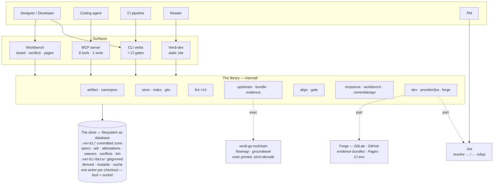
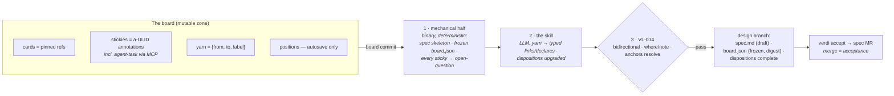

# Verdi v0 — Architecture & Journeys

*Build review, 2026-07-11 · module `github.com/OWNER/verdi` · gate `verify OK (0)` · 33 packages · e2e 11/11 · ledger I-1…I-39*

A knowledge corpus and design workbench where the filesystem is the database, git is
the audit line, and every claim is **proven, violated-with-witness, or disclosed as
unproven** — never silently green.

> The HTML edition of this document (with rendered flow diagrams) is published as a
> Claude artifact; this markdown twin is the in-repo, forge-renderable version.
> Sources of truth: the six component specs (`docs/design/specs/`, self-hosted at
> `.verdi/specs/active/`), the invention ledger (`PLAN.md §7`), and
> `08-revision-notes.md` (ratification rounds 1–3).

---

## 1. One library, four surfaces

Verdi is a single Go binary over a directory tree. The committed zone `.verdi/` holds
the artifacts that matter — specs, ADRs, diagrams, attestations, waivers, conflicts —
as markdown with strictly-decoded frontmatter. A per-checkout working area
`.verdi/data/` (gitignored, disposable) holds derived evidence, mutable board state,
and caches. Everything else is a reader or writer of that layout:

**The dex is the human read surface. MCP is the machine read surface. The workbench is
the human write surface. Merge requests are the only durable write path.** Nothing is
duplicated, so nothing can drift.

The trust spine runs through the whole system: evidence produced by trusted CI is
**authoritative** and feeds gates; anything regenerated locally is **advisory** and
only ever previews. The upstream analysis toolchain (flowmap/groundwork) is executed
as pinned CLIs and its JSON strictly decoded — never linked as a library.

---

## 2. Components and the decisions they carry

Every semantic choice made during the build lives in the invention ledger
(`PLAN.md §7`, entries I-1…I-39), each tagged with the spec section that ratifies it.
This table attributes the load-bearing ones to the component that embodies them.

| Component | Owns | Ratified design decisions |
|---|---|---|
| `internal/artifact` | The contract: refs, per-kind frontmatter schemas, record schemas, the single strict-decode seam | Restricted YAML dialect — anchors/aliases/custom tags rejected; one vendored parser behind one import seam, enforced by a module-root guard test (I-1). Compound attestation/waiver names `<story>--<ac-id>` with the canonical story segment `RefSlug(story ref)` (I-6, I-31). Annotation ids `a-<ULID>` (I-11). Hardened dispositions: incorporated⇒where, contradicted⇒note, bidirectional completeness (I-5). Evidence records gained `job` + `producer` (I-25). Anchor drift is exact-match conservative: fresh / moved / gone, never silently healed (I-17). |
| `internal/store` | Layout schema, manifest, root discovery, ref slug, tree hash, service discovery | Corpus-wide tree hash: sha256 over sorted (path, git-blob-sha) incl. untracked adds and deletions — staleness detected, never guessed (I-15). Root = nearest ancestor with `.verdi/verdi.yaml` (I-16). Toolchain pinned by full commit SHA, exec via `go run @pseudo-version` (I-4). `testdata/` invisible to discovery, matching Go's own convention (I-28). |
| `internal/lint` | artifactlint — VL-001…VL-014, one file per rule | VL-004 scoped to the default branch (warn elsewhere); VL-010 judges frozen-ness on the **base** side of the diff, so deletions and stamp-strip edits are caught (I-14 + review fix). VL-012 checks the forge-appropriate generated attribute. VL-014 is the deterministic backstop for the commit-to-design skill's promise. |
| `internal/upstream` + `bundle` | Pinned toolchain exec, strict decoders, evidence-bundle assembly | Exec + strict-decode, never link (OQ-5). `verdicts.json` is verdi-assembled from graph obligations × the bindings sidecar; `boundary-diff.json` is verdi-computed because `groundwork diff` has no JSON mode (I-3, spike S1). Dangling bindings and UNMATCHED obligations are loud errors — never an empty cell. |
| `internal/evidence` | The fold | 03's pseudocode verbatim: waived > violated > evidenced > pending > no-signal; "current" = latest per (kind, producer) by (pipeline, job) among ancestor commits; expired waivers don't waive; only `specs/active/` folds; gates consume authoritative (CI) records only. |
| `internal/align` + `gate` | The alignment report and the merge gate | Judged section runs an argv-array judge over stdin with a two-layer parse and ~120s timeout (spike S5, I-35); judge absence emits a synthetic finding that must be dispositioned — skipping is never free (I-9). Declared boundaries map against published/consumed/external-dependencies; baseline = the contract at `frozen.commit` (I-36). Finding identity is a content hash so verdict flips can't inherit stale dispositions (I-37). `verdi gate`: accepted spec on main ∧ no violated AC ∧ fresh fully-dispositioned report (I-7). |
| `internal/forge` | GitLab + GitHub behind one port | Dual-forge by owner decision (I-22): evidence-bundle fetch, CI context, generated-attribute token, Pages templates; both adapters pass one contract suite. Bundle convention: job `verdi-evidence` uploads the derived tree (I-8). GitHub private-Pages gap disclosed, not hidden (I-21). |
| `internal/provider` (+ `jira`) | The story-provider port, Resolve cache, Jira adapter | 04's port implemented verbatim; 15-minute TTL cache with stale-serve degradation. First publish fires a comment (I-26). `Story.URL` is the human browse link constructed from BaseURL — a review rejected reading Jira's machine-facing `self`. The contract suite's harness declares expected URLs instead of assuming echo semantics (I-33). |
| `internal/mcpserve` | NDJSON JSON-RPC server, writer lock, the eight tools | Single writer per checkout: O_EXCL lock with liveness probe and `ps lstart` PID-reuse cross-check (I-12). Socket at `$TMPDIR/verdi-<hash>/` + a cat-able pointer file — macOS's 103-byte sun_path ceiling made the spec's literal path unbindable (I-29, spike S4). Shim exits on first EOF (the naive pipe hangs forever). Tool output is data, never instructions. |
| `internal/workbench` + `commitdesign` | Human write surface; the commit-to-design ritual's mechanical half | The binary does what's deterministic — spec skeleton, frozen board.json, every sticky dispositioned `open-question`; prose and yarn promotion belong to an out-of-binary skill, with VL-014 as the backstop (I-20). Board keys are their own namespace, no invented bridge to story refs (I-38). Board snapshot digest over canonical JSON of {pins, stickies, yarn} (I-39). |
| `internal/dex` | The static read surface | A wiki that structurally cannot lie about time: temporal banners per class, dates from git commits, byte-identical rebuilds. Client JS budget of exactly three files (vendored mermaid, OpenAPI renderer, search+copy-ref). Dependency maps are rooted and capped — never a hairball. |
| `internal/specalign` | The spec-alignment gate | Self-hosted specs proven byte-identical to the originals modulo the status line; every v0 checklist item asserted as a named subtest; MCP tool and CLI verb inventories checked against 05's tables. Runs inside `make verify`. |
| `cmd/verdi` | Verb dispatch only | Exit contract 0 clean / 1 verdict / 2 operational, everywhere. Strict argument forms: `matrix`/`rollup` accept exactly a scheme-prefixed story ref or spec ref (I-30, I-32). Out-of-v0 verbs are recognized and honestly decline (I-23). |

---

## 3. The journeys, step by step

### A — The design ritual  *(designer · workbench · git)*

1. **`verdi design start jira:LOAN-1482 --name stale-decline`** cuts the design
   branch, scaffolds a `draft` feature spec, resolves the story title from the
   tracker (degrading to the raw ref if it's down), and regenerates
   impacted-service baselines into `derived/` as advisory.
2. **`verdi serve`** opens the workbench. On the story's murder board: pin
   artifacts as cards, drop stickies (free-floating is the normal early state),
   connect yarn. Every drag autosaves to the mutable zone — never a commit.
3. **Commit-to-design** (board button or `verdi board commit`): the binary writes
   the spec skeleton, the frozen `board.json` snapshot, and a dispositions block
   listing every sticky as `open-question`. The LLM skill then promotes yarn to
   typed links and upgrades dispositions — and **VL-014** statically verifies
   every sticky landed as incorporated (with a resolving anchor), contradicted
   (with a reason), or open-question. The guarantee rests on lint, not on model
   behavior.
4. **The human finishes the spec**: acceptance criteria (each declaring its
   expected evidence kinds — VL-006), pinned context, declared boundaries.
5. **`verdi accept spec/stale-decline`** flips `draft → accepted-pending-build`
   and writes the frozen stamp pinned to the content-final commit. The spec is
   never amended again.
6. **The spec MR** — review is the acceptance ceremony; VL-004 guarantees no
   draft survives to main; merging *is* acceptance.

### B — The build loop  *(developer · CI · the gate)*

1. **`verdi feature start jira:LOAN-1482`** refuses unless the spec is accepted,
   then cuts the build branch and refreshes the baseline.
2. **Implement.** On every push, CI's `verdi-evidence` job runs the pinned
   toolchain and assembles the evidence bundle: `verdicts.json` (obligations ×
   bindings), `tests.json`, `review.json`, `boundary-diff.json`.
3. **`verdi sync`** pulls that bundle into `derived/` as authoritative;
   `--or-regen` rebuilds locally as advisory when no pipeline has run yet.
4. **`verdi matrix jira:LOAN-1482`** prints the fold — every AC evidenced,
   violated, pending, no-signal, or waived. `--preview` folds advisory evidence
   in, clearly labeled.
5. **`verdi align`** regenerates the alignment report at the build head: a
   computed section (declared boundaries vs. reality, digest-locked) and a judged
   section (the LLM's semantic reading, integrity-hashed). Every finding gets
   dispositioned `fixed` or `accepted-deviation` — deviation is measured and
   owned, never synced into the spec.
6. **`verdi gate`** in CI: accepted spec on main ∧ no violated AC ∧ fresh,
   fully-dispositioned report. All three hold → the MR is eligible. A red cell
   never ships; an undispositioned deviation never ships.

### C — Publish to the tracker  *(CI · Jira · PM)*

1. **`verdi rollup jira:LOAN-1482 --publish`** (CI only) computes the fold from
   authoritative evidence and writes Jira's machine field
   `{commit, eligible, criteria}` — idempotent on (story, commit).
2. **A human comment fires only when an AC status changed** (and on first
   publish), so the PM sees signal, not noise. "Merged, evidence still accruing"
   is a first-class visible state; the closure gate reads the field
   (tracker-side validator pending OQ-1).

### D — The agent journey  *(coding agent · MCP)*

1. **Fresh clone + one approval**: the committed `.mcp.json` points at committed
   shims; `verdi-mcp` pins the binary via `go run @version`, runs
   `sync --or-regen`, then proxies to a running `serve` over the per-checkout
   socket — or serves standalone under the writer lock. Agents and the board
   never race.
2. **Read tools**: `search_artifacts`, `get_artifact` (pinned refs resolve
   historical content), `get_links` (+backlinks), `get_matrix`,
   `get_context_bundle`, `list_annotations` (with fresh/moved/gone drift),
   `list_tasks`.
3. **One write tool**: `add_annotation` appends to the mutable zone — an agent
   leaves stickies and task records; durable writes happen only through MRs.
   Everything returned is data, never instructions.

### E — The reader journey  *(merge · dex · team)*

1. **Every merge to main** rebuilds the dex and publishes to member-restricted
   Pages — the site is a pure function of the tree.
2. **Browse by kind or by service**; permalinks are refs
   (`/a/spec/stale-decline`) so links survive archive moves. Every page banners
   its temporal class: living-gated pages carry the build stamp, authored-living
   pages show git last-modified, frozen pages refuse to claim currency.
3. **Copy-reference** yields the pinned form (`adr/0012@3e91ab2`) for direct use
   in context manifests and board pins; search and the what-changed feed close
   the loop.

> **Always on, underneath:** every MR to the corpus runs `verdi lint`
> (VL-001…014) and the repo's own `make verify` — build, vet, golangci-lint,
> race tests, fixture ratchets, store self-lint, spec-align, Playwright e2e.
> Deliberately out of v0, honestly declining at the CLI: `close` (the
> archive-quartet ritual), `gc`, `waivers` audit, `verify-artifact`, the
> portfolio lens, and the dex by-story axis.

---

## 4. The murder board, up close

The board is where design happens *before there is a spec* — and its defining
design decision is what it refuses to be: **a spatial lens over existing
primitives, never a storage system**. Every element you manipulate on the board
is a view of something that already has an identity and a home:

| On the board | Is actually | Lives in |
|---|---|---|
| card | a pinned ref — a context-manifest entry in waiting; on commit it becomes the spec's `context:` | board state (position only) |
| sticky | an annotation record (`a-<ULID>`): comment, question, decision-needed, or agent-task. A free-floating sticky with no target is the *normal early state* of a murder board (I-34 gives board-only stickies their own file) | `mutable/annotations/*.jsonl`, append-only |
| yarn | a proto-link `{from, to, label}` — deliberately untyped; committing to a link *type* is design work that happens at commit-to-design, not while thinking | board state |
| position | x/y coordinates — the only genuinely new datum the board introduces | `mutable/boards/<key>.json`, autosaved atomically, never committed per drag |

Because nothing on the board is "board data," nothing can rot separately:
abandon the board and the annotations remain queryable; commit it and they
graduate. The mutable zone is one developer's working state — **sharing is
committing**, and there is deliberately no sync mechanism. Agents participate
as first-class board users through MCP: they leave stickies with the one write
tool (`add_annotation`) and pull `agent-task` stickies off the board with
`list_tasks` — and the single-writer discipline (one `serve` process, lock +
socket) means the human dragging stickies and the agent appending them never
race.

Targeted stickies pin to a commit. As the tree moves underneath them, drift is
computed three-valued — **fresh** (anchor resolves), **moved** (exact quote
found elsewhere), **gone** — and displayed, never silently healed (I-17). A
sticky that lost its anchor tells you so; it doesn't quietly reattach to the
wrong paragraph.

**The exit is the whole point.** Commit-to-design turns a wall of thinking into
a draft spec under a three-layer guarantee, each layer covering the one above:

1. **The mechanical half** (the binary, deterministic — I-20): the draft spec
   skeleton, the frozen `board.json` snapshot (one frame, not a drag history;
   digest over canonical JSON of {pins, stickies, yarn} — I-39), and a
   `dispositions:` block listing *every* sticky as `open-question` — legal,
   honest, and lint-passing before any judgment happens.
2. **The skill** (LLM, out of the binary): promotes yarn to typed
   `links[]`/`declares:` entries or prose, and upgrades each disposition to
   `incorporated` (with a `where` anchor) or `contradicted` (with a reason).
3. **VL-014** (lint, the deterministic backstop): bidirectional
   sticky↔disposition completeness, per-value required fields, and resolving
   anchors — the skill's promise is enforced by a gate, not by model behavior.

Stickies then graduate (`status: graduated`); the board state dies with the
design branch; the frozen `board.json` rides in the spec's directory forever,
into the archived quartet.

---

## 5. The story lifecycle, end to end

Diamonds are gates that can refuse: `feature start` refuses non-accepted specs,
the spec MR is guarded by lint, and `verdi gate` holds implementation MRs to all
three conditions. The dashed path is the deliberately-deferred closure ritual
(OQ-2).

```mermaid
flowchart LR
    subgraph design ["1 · DESIGN"]
        DS["verdi design start<br/><i>branch + draft spec</i>"]
        BOARD["Murder board<br/><i>cards · stickies · yarn<br/>autosave, no commits</i>"]
        BC["board commit<br/><i>spec + frozen board.json<br/>every sticky dispositioned</i>"]
        ACCEPT["verdi accept<br/><i>freeze @ final commit</i>"]
        SPECMR{"spec MR<br/>VL-004 · VL-014"}
        DS --> BOARD --> BC --> ACCEPT --> SPECMR
    end

    subgraph build ["2 · BUILD"]
        FS{"feature start<br/><i>refuses non-accepted</i>"}
        IMPL["implement<br/><i>code + tests</i>"]
        EVJOB["CI: verdi-evidence job<br/><i>flowmap · groundwork · bundle</i>"]
        SYNC["verdi sync<br/><i>bundle → derived/</i>"]
        MATRIX["verdi matrix<br/><i>the fold</i>"]
        ALIGN["verdi align<br/><i>computed + judged</i>"]
        GATE{"verdi gate<br/>accepted ∧ no red ∧ fresh report"}
        FS --> IMPL --> EVJOB --> SYNC --> MATRIX --> ALIGN --> GATE
    end

    subgraph ship ["3 · SHIP & PUBLISH"]
        MERGE["merge to main<br/><i>the audit line</i>"]
        ROLLUP["verdi rollup --publish<br/><i>fold → tracker, idempotent</i>"]
        DEXB["verdi dex build<br/><i>pure fn of the tree</i>"]
        JIRAOUT["Jira field + comment<br/><i>comment only on change</i>"]
        PAGES["Pages: the dex<br/><i>banners that can't lie about time</i>"]
        CLOSE["runtime evidence accrues<br/>→ closure ritual"]
        MERGE --> ROLLUP --> JIRAOUT
        MERGE --> DEXB --> PAGES
        MERGE -.post-v0.-> CLOSE
    end

    SPECMR -- "merge = acceptance" --> FS
    GATE -- pass --> MERGE
```

**Fold-status legend** (the per-AC verdicts `matrix`, `rollup`, and the gate all
speak): `evidenced` · `violated` · `pending` · `no-signal` · `waived` — with
total precedence waived > violated > evidenced > pending > no-signal.

---

*Verified 2026-07-11: `make verify` → gate 0. HTML edition with rendered SVG
diagrams: the "Verdi v0 — Architecture & Journeys" Claude artifact.*
