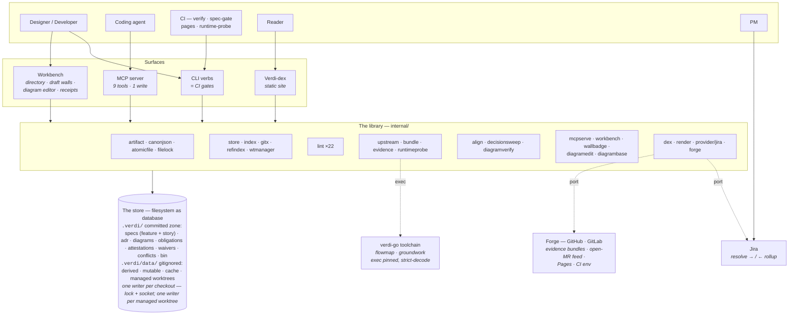
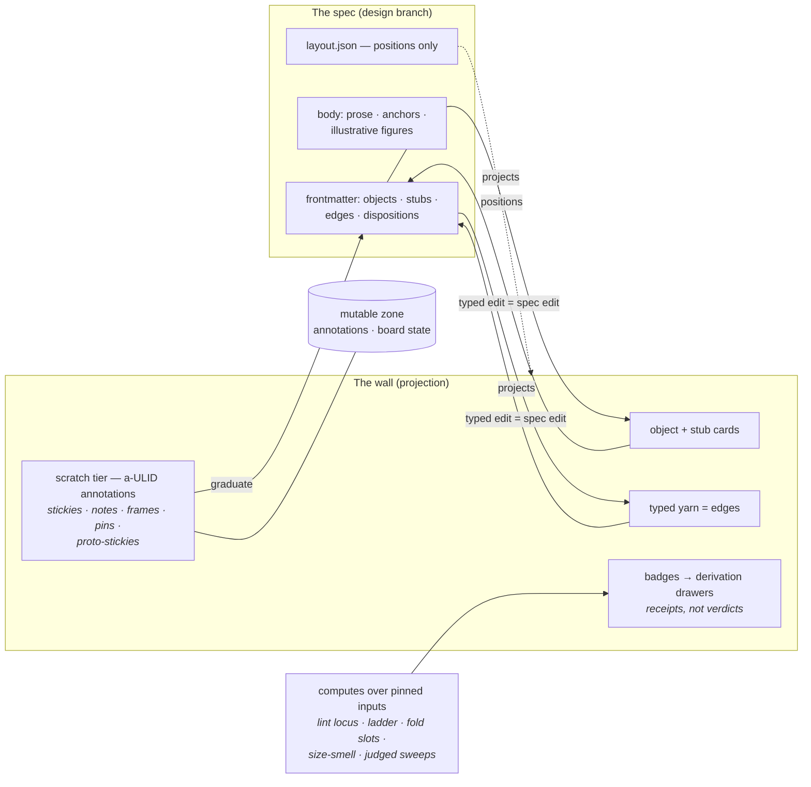

# Verdi — Architecture & Journeys *(round-6 edition)*

*Round-6 edition, 2026-07-14 · module `github.com/jyang234/verdi` (private GitHub remote) ·
CI gate `verify OK (0)` · 51 packages · e2e 205/205 · lint VL-001…VL-022 ·
ledger I-1…I-39 + R4-I-1…41 + per-spec `dc-*` records + `ADJ-*` adjudications*

A knowledge corpus and design workbench where the filesystem is the database, git is
the audit line, and every claim is **proven, violated-with-witness, or disclosed as
unproven** — never silently green.

> This is the round-6 edition, superseding the v0 build review of 2026-07-11 (that
> edition's HTML twin remains as a Claude artifact; this markdown is the in-repo,
> forge-renderable version and the one kept current). Sources of truth: the component
> specs (`docs/design/specs/`, self-hosted at `.verdi/specs/active/` and
> `.verdi/specs/archive/`), the invention ledger (`PLAN.md §7`),
> `08-revision-notes.md` (ratification rounds 1–6), and
> `round6-adjudications.ndjson` (ADJ-6 realized/stale-computed, ADJ-16 source_digest, …).

---

## 1. One library, four surfaces

Verdi is a single Go binary over a directory tree. The committed zone `.verdi/` holds
the artifacts that matter — specs (feature **and** story class, since round 4),
ADRs, diagrams (including `class: proposal` future-state diagrams), obligations,
attestations, waivers, conflicts — as markdown with strictly-decoded frontmatter. A
per-checkout working area `.verdi/data/` (gitignored, disposable) holds derived
evidence, mutable board state, caches, and — since round 6 — serve-managed git
worktrees. Everything else is a reader or writer of that layout:

**The dex is the human read surface. MCP is the machine read surface. The workbench —
one whole-store directory, per-branch draft walls, and the diagram editor — is the
human write surface. Merge requests are the only durable write path.** Nothing is
duplicated, so nothing can drift.

The trust spine runs through the whole system, with an explicit human-governed
closure boundary: CI's `verdi sync --produce` stamps its bundle `source: ci` and
uploads it as the `verdi-evidence` artifact; a local run stamps `source: local`
and only ever previews (D6-10). Gates and the closure ritual fold
**authoritative** (`source: ci`) records only. The upstream analysis toolchain
(flowmap/groundwork) is executed as pinned CLIs and its JSON strictly decoded —
never linked as a library. Four
workflows carry it: `verify.yml` (the full gate on code paths, then evidence
production), `spec-gate.yml` (the fast lint/readiness gate on spec- and doc-only
changes, so no PR is ever silently ungated), `pages.yml` (the dex, published on
every push to main), and `runtime-probe.yml` (the scheduled runtime-evidence probe).



---

## 2. Components and the decisions they carry

Every semantic choice made during the build lives in a ledger: `PLAN.md §7`
(I-1…I-39) for v0, the round-4 realignment forks (R4-I-1…41), each later spec's own
`dc-*` decision objects, and the round-6 adjudications (ADJ-6, ADJ-16). This table
attributes the load-bearing ones to the component that embodies them.

| Component | Owns | Ratified design decisions |
|---|---|---|
| `internal/artifact` | The contract: refs, per-kind frontmatter schemas, record schemas, the single strict-decode seam | Restricted YAML dialect — anchors/aliases/custom tags rejected; one vendored parser behind one import seam (I-1). The round-4 object model: ACs, constraints, decisions, open questions are frontmatter-declared, each with an `anchor:` resolving exact-match against a body heading (R4-I-1, E8); `problem:`/`outcome:` attributes on both spec classes. Closed five-value edge taxonomy `implements`/`resolves`/`exempts`/`supersedes`/`depends-on` with object fragments (R4-I-3). `supersession:` manifests, `carried` byte-identity (R4-I-4). `kind: obligation` artifacts carrying a `verifies` edge. Diagrams gained `class: proposal` with `scope`, `derived_from{ref, digest, source_digest}` (ADJ-16) and the `verdi.diagramsweep/v1` sweep-report schema. Annotation `type` enum grew to relates/pin/note/frame/story/spike. Anchor drift stays exact-match conservative: fresh / moved / gone (I-17). |
| `internal/store` (+ `atomicfile`) | Layout schema, manifest, root discovery, ref slug, tree hash, service discovery | Corpus-wide tree hash over sorted (path, git-blob-sha) — staleness detected, never guessed (I-15). Toolchain pinned by full commit SHA (I-4). Round 6's derived-key split (D6-9): the transported regeneration bundle is keyed by **git ref**; the per-spec evidence records the fold consumes are keyed by the **owning spec's ref** — so forge-fetched bundles actually reach their readers. `atomicfile` is the one shared temp-then-fsync-then-rename primitive (spec/shared-homes). |
| `internal/lint` | artifactlint — **VL-001…VL-022**, one file per rule | v0's VL-001…014 plus round 4's statics: supersession completeness (VL-015), the spike-path fence (VL-016), open-question resolved-or-carried (VL-017), `layout.json` dangling keys incl. `stub:<slug>` (VL-018). VL-019: an obligation's `verifies` edge must target the story that genuinely declares its AC. VL-020: a story AC declaring an evidence kind with no matching obligation artifact refuses — the obligation-shaped sibling of VL-006. VL-021: a proposal's `derived_from.ref` must resolve and its digests must be `sha256:<64-hex>`. VL-022: a story-targeting attestation's own path/slug must agree with the (story, AC) its `verifies` edge names — story-scoped (ADJ-51), skipping a feature-outcome attestation's edge entirely. VL-010 gained two status-only exceptions (`→ superseded` at rung 3, `→ closed` at archive — D-12, D6-11). VL-014 survives scoped to grandfathered v0 `dispositions:` artifacts (R4-I-9). |
| `internal/upstream` + `bundle` | Pinned toolchain exec, strict decoders, evidence-bundle assembly | Exec + strict-decode, never link (OQ-5). `verdicts.json` is verdi-assembled from graph obligations × the bindings sidecar; `boundary-diff.json` is verdi-computed (I-3). Producer provenance is honest: `source: ci` only in genuine CI, `source: local` otherwise (D6-10). CI uploads the whole `data/derived/` tree as the `verdi-evidence` artifact. |
| `internal/evidence` | The fold, obligations, the ladder | 03's fold verbatim: waived > violated > evidenced > pending > no-signal; gates consume authoritative (CI) records only. `runtime.json` joined `verdicts.json` as a loaded sibling — a declared `kind: runtime` is **always awaited post-merge**, so it contributes `pending`, never `no-signal`. Obligations have one loader keyed by `for_kind` serving both `verdi matrix` and the board's AC card (obligation-wall DC-1: not two readers). `PendingSupersession` + spec-stale form the closure ladder, shared verbatim with the dex story lens. |
| `internal/align` + the gate | Alignment reports, decision-conflict sweeps, diagram alignment, the merge gate | Build-branch mode: computed section (boundaries, digest-locked) + judged section (argv-array judge, integrity-hashed; absence is a synthetic finding — I-9). Round 4 added the design-branch decision-conflict mode (R4-I-7, `no-conflict` disposition). Round 6 added the computed **diagram-alignment subsection** — every accepted proposal regenerated and diffed to `realized` or `divergent` with witnesses, coverage tier always disclosed; illustrative figures listed as unverifiable — riding the same digest-covered findings list. `align --diagram-sweep` is the third, on-demand judged mode; its sibling sweep report is never read by any gate. `verdi gate` holds **four conditions**: accepted spec on the default branch ∧ no violated AC on `source: ci` evidence ∧ fresh fully-dispositioned report ∧ no unresolved rung-4 cascade block. The closure gate (spec-stale, pending-supersession) is a separate condition set — those block closure, not merge. |
| `internal/refindex` + `wtmanager` (+ `filelock`) | The directory index; managed worktrees | `ComputeIndex` is a pure function of git ref state — every default-branch spec and every unmerged design branch's draft, local and remote-tracking refs alike, each entry disclosing its source; it never switches a checkout (spec/ref-index). `EnsureWorktree` lazily cuts one managed worktree per local design branch under `.verdi/data/worktrees/`, guarded per-worktree by `filelock` — I-12's writer-lock algorithm (O_EXCL + `ps lstart` PID-reuse cross-check), extracted from mcpserve into a shared home. `verdi gc` reclaims merged/deleted branches' worktrees; a dirty worktree is disclosed "kept: uncommitted changes", never force-removed. |
| `internal/wallbadge` | The wall's badge computes | Every badge carries a full derivation record `{source, label, target, inputs, records, disclosures}` with namespaced rule ids (`lint:VL-006`, `ladder:spec-stale`, `fold:empty-slot`, `observe:size-smell`). VL findings reach the wall only by **self-classified wall locus** (fail-closed: no locus, no badge); ladder flags run the exact dex story-lens code path — a lookalike reimplementation is a defect by contract (case-file-flags co-3). An input's revision is a content digest, never wall-clock time. |
| `internal/diagramverify` + `diagramedit` + `diagrambase` | Proposal verification, the structural-op grammar, base recovery | The extractor parses a proposal's mermaid one-way (never rewriting source), regenerates truth via pinned flowmap under the proposal's `scope`, and compares three-valued per element: exists-in-truth / proposed-new / kept-but-gone-with-witness, plus stale-base; renames are honest remove+add, no inference (dc-5). `diagramedit` is a pure function (source bytes × operation → source bytes) for add-node/connect/rename/delete — byte-preserving splices, flowchart subset only, no LLM, no positions. `diagrambase` recovers a derived proposal's pinned base from git, gated on `derived_from.source_digest` (ADJ-16) — mismatch fails visible with no write. |
| `internal/runtimeprobe` + `decisionsweep` | Runtime evidence; the audit | `Emit` writes one `kind: runtime` record keyed by (story, AC); the scheduled workflow's bare invocation is a disclosed honest no-op — verdi has no live service to probe, and fabricating a passing record is forbidden (runtime-evidence dc-3). `decisionsweep` implements 03 §Exemption audit — per-ADR exemption backlinks, threshold-triggered conflict auto-filing (`audit:` thresholds in `verdi.yaml`, R4-I-10) and the spec-stale scan — behind `verdi audit`. |
| `internal/forge` | GitLab + GitHub behind one port | Dual-forge by owner decision (I-22): evidence-bundle fetch, CI context, Pages templates, and the open-MR feed that chips directory entries "in review" — a second, disclosed, degradable source. GitHub private-Pages gap disclosed, not hidden (I-21). |
| `internal/provider` (+ `jira`) | The story-provider port, Resolve cache, Jira adapter | 04's port verbatim; 15-minute TTL cache with stale-serve degradation. Rollups publish **per story spec** (R4-I-2); a human comment fires only on AC-status change (and first publish, I-26). |
| `internal/mcpserve` | NDJSON JSON-RPC server, writer lock, the nine tools | Single writer per checkout (I-12, now via `filelock`). **Nine tools: eight read** — `search_artifacts`, `get_artifact`, `get_links`, `get_matrix`, `get_context_bundle`, `list_annotations`, `list_tasks`, and `get_board` (the wall projection, badges included) — **one write** (`add_annotation`). Tool output is data, never instructions. |
| `internal/workbench` | The human write surface | `GET /` is the whole-store directory. One board route table, declared once and mounted at the root and beneath `/b/{branch}` alike (draft-boards dc-1) — never a second board implementation. `/board/diagram/{name}` is the proposal editor. The board is a **projection of the spec** — typed edits are spec edits; the old commit-to-design ritual is retired to grandfathered v0 artifacts (R4-I-9). Badges attach in `loadBoard`'s I/O enrichment tier; drawers render server-side from the badge's own record, `role=dialog`, keyboard-openable. Family navigation attaches in the same tier (family-board-links): a story board's `implements` card links to its parent feature's board, and a feature board's stub card links to every matching story anywhere in the store — active targets link straight to their board, archived targets to the corpus page `/a/` with the archived state disclosed on the card; on a per-branch `/b/{branch}` board an active target stays branch-prefixed (ADJ-70) while a branch-resolved archived target renders a disclosed no-link card instead of a dead href, and a dangling AC fragment renders a disclosed notice, never a silent inert card. |
| `internal/dex` + `render` | The static read surface; shared rendering | A wiki that structurally cannot lie about time: temporal banners per class, byte-identical rebuilds, client JS budget of exactly three files (vendored mermaid 10.9.1, OpenAPI renderer, search+copy-ref). The **by-story axis is real** (V1-P8): the archived closure record is browsable per story. `render` is the one goldmark+chroma seam shared with the workbench; its fenced-mermaid path badges every illustrative figure "illustrative · not deterministically verifiable" — the proposal render path is never painted with that badge. |
| `internal/specalign` | The spec-alignment gate | Self-hosted specs proven byte-identical to the originals modulo the status line; checklist items as named subtests; MCP tool and CLI verb inventories checked against 05's tables. Runs inside `make verify`. |
| `cmd/verdi` | Verb dispatch only | Exit contract 0 clean / 1 verdict / 2 operational, everywhere. `verdi build start` replaced `feature start` (kept one release as a deprecation alias, R4-I-6). `close`, `gc`, and `audit` are real verbs now — `close --prepare <ref>` derives the next human-visible closure state, while real `close` drives stories **and** features to archived closure; `gc` is honestly scoped to the managed-worktree reclamation slice and says so on every run (worktree-manager dc-5). Only `waivers` and `verify-artifact` still decline as out of scope. |

---

## 3. The journeys, step by step

### A — The directory and the draft wall  *(designer · one serve · many branches)*

1. **`verdi serve` — once.** `GET /` is the whole-store directory: every spec on
   the default branch and every unmerged design branch's draft, exactly once,
   grouped by status — drafts in progress · accepted-pending-build · active
   components · terminal — computed deterministically from git refs alone
   (`refindex.ComputeIndex`; a directory read mutates nothing and never switches
   a checkout).
2. **Every entry is disclosed by source** — local, remote, or both — and a branch
   with an open MR wears an **in-review chip** from the forge port. That chip is a
   second, non-ref source and degrades honestly: an unreachable forge yields a
   disclosed "MR status unavailable" while the refs-computed directory still
   renders in full.
3. **Open a draft** at `/b/<branch-escaped>/board/spec/<name>` (the branch rides
   one percent-encoded path segment; only the directory mints these links). The
   first open lazily and synchronously cuts a **managed worktree** for the local
   design branch under `.verdi/data/worktrees/` (`wtmanager.EnsureWorktree`);
   later opens reuse it. One serve process owns every tree it writes — per-worktree
   lockfiles carry I-12's writer-lock algorithm via `internal/filelock`.
4. **Author on the wall.** The board is a projection of the spec: pinning context,
   declaring objects, drawing typed yarn *are* spec edits on the design branch.
   Two drafts from two branches work side by side in two tabs; each edit lands
   only in its own branch's worktree, and the serving checkout stays clean. The
   same spec at its unprefixed address still renders as a sealed record — the mode
   law is unchanged (workbench-directory ac-6). **The per-draft port pattern is
   retired** (dc-3).
5. **Degradation is disclosed, never dead.** A remote-only branch renders sealed
   with its remoteness disclosed (no worktree cut, no local branch minted); a
   branch deleted mid-session resolves to a disclosed 404 notice with a way back.
   **`verdi gc`** reclaims worktrees whose branch merged or vanished — never a
   dirty one ("kept: uncommitted changes"), never a live-locked one ("kept: in
   use") — and prints one line per worktree. Reads never delete; gc is the only
   deleter; there is no background daemon.

### B — The diagram-proposal loop  *(designer · editor · align)*

1. **Author future state** as a `class: proposal` diagram — from scratch or
   derived from a generated base — in the editor at `/board/diagram/<name>`: a
   code pane with live preview under the one vendored pinned mermaid (10.9.1;
   rejected source paints a visible render-error state, never a blank preview),
   plus **structural operations** — add node, connect, rename, delete — each
   landing as a deterministic source-text edit (same source + same operation =
   same bytes). Every write path byte-preserves the source; no operation accepts
   a position — layout is renderer-owned by design (dc-2, co-3).
2. **The verification rail** discloses, with no LLM anywhere: the coverage tier
   (full / partial / illustrative) and per-element findings — exists-in-truth,
   proposed-new, kept-but-gone (contradicted, with the removing commit as
   witness), stale-base. A rename is an honest remove+add, never inferred (dc-5).
   Truth regenerates via pinned flowmap under the proposal's pinned `scope`;
   unscoped proposals verify against the whole graph with the hairball cap
   disclosed (dc-6).
3. **Derived proposals carry provenance**: `derived_from{ref, digest,
   source_digest}` (ADJ-16). **Before-peek** and **reset** mechanically reproduce
   the pinned base, gated on `source_digest` — a digest mismatch fails visible
   with no write; absence renders the affordance disclosed-unavailable.
4. **Accept at merge.** `verdi accept diagram/<name>` flips `proposed → accepted`
   and writes the frozen stamp; merge of its design MR is acceptance. The other
   two words in the vocabulary — **realized** and **stale** — are *computed
   states, never written statuses* (ADJ-6): strict decode refuses them as
   authored frontmatter.
5. **The build proves it.** `verdi align`'s computed section carries a
   **diagram-alignment subsection**: every accepted proposal corpus-wide is
   regenerated and diffed — empty residual reads `realized`, a non-empty one
   reads `divergent` with each delta's witness — always naming the coverage tier,
   so a partial-coverage "realized" never reads as fully verified. Divergences
   are dispositioned `fixed` or `accepted-deviation` through the existing
   machinery; illustrative body figures are listed as unverifiable, never
   omitted. Truth that moves later raises the **diagram-stale** flag, computed
   the way spec-stale is.
6. **On demand, advisory only:** `verdi align --diagram-sweep <diagram-ref>` runs
   the judged sweep over the proposal against the ADR/decision corpus and writes
   a provenance-stamped sibling sweep report — reusing the existing judge seam
   and four-value disposition vocabulary verbatim — that no gate, lint, or CI
   path ever reads (judged-sweep ac-1, co-1).

### C — Reading the wall: receipts, not verdicts  *(anyone on a board)*

1. **Every computed claim on the wall is a badge**: VL lint findings on the card
   or case file they anchor to (a finding reaches the wall only by its own
   wall-locus self-classification — no locus, no badge, fail closed); the ladder
   stamps **spec-stale** and **pending-supersession** on the case file, computed
   by the exact code path the dex story lens uses; each AC row shows its declared
   evidence kinds, and an **empty evidence slot** badges calmly by the real
   fold's own definition of empty; an AC column estimated past the declared
   900px reference viewport raises **size-smell** — an observation, never a rule,
   invariant to the client's actual window.
2. **Every badge is a button.** Activating it opens the **derivation drawer**:
   the rule id, the pinned inputs with their digest revisions, and the records
   that fired it — rendered server-side from the badge's own derivation record,
   never a second computation, citing digests and pinned fields, never
   wall-clock time.
3. **Judged findings wear their sweep provenance** — the report's `covers` sha,
   `adr_corpus_digest`, `decisions_scanned`, and each finding's disposition
   state. When `covers` differs from the current spec revision, the drawer says
   so: a stale or partial sweep *looks* stale. Staleness legibility is
   comparison, not verdict (derivation-drawer dc-3).
4. **Badges never block authoring.** They are ambient disclosure; enforcement
   stays where it always was — at MR time, in lint and the gate.

### D — The build loop  *(developer · CI · the four-condition gate)*

1. **`verdi build start <story-spec>`** (R4-I-6; `feature start` survives one
   release as an alias) refuses a non-accepted spec, refuses a superseded story
   naming its successor, and refuses unresolved rung-4 cascade flags.
2. **Implement.** On every push, `verify.yml` runs the full `make verify`, then —
   in the same job, strictly after it passes — `verdi sync --produce` assembles
   the evidence bundle stamped `source: ci` and uploads it as the
   `verdi-evidence` artifact. Spec- and doc-only changes ride `spec-gate.yml`
   instead (build + lint + spec-align), so no PR is ever silently ungated.
3. **`verdi sync`** pulls the per-(git-ref, commit) bundle into `derived/`,
   preserving its per-spec keys so the fold can actually read it (D6-9);
   `--or-regen` rebuilds locally as advisory (`source: local`) when no pipeline
   has run yet.
4. **`verdi matrix`** prints the fold — evidenced, violated, pending, no-signal,
   or waived per AC — plus per-stub realization candidates at the feature level
   (D-17). Declared runtime kinds read as awaited-post-merge, honestly `pending`
   until the probe fires.
5. **`verdi align`** regenerates the alignment report: computed boundaries,
   the diagram-alignment subsection, and the judged section; every finding gets
   dispositioned by **`verdi disposition <spec-ref> <finding-id>
   <fixed|accepted-deviation> --rationale <text> [--amend]`** (spec/disposition-verb) —
   the only sanctioned way to record one, writing the decision and rationale
   into the report's living disposition layer in place, digest/integrity
   untouched — deviation is measured and owned, never synced into the spec.
6. **`verdi gate`** holds all four conditions: accepted spec on the default
   branch ∧ no violated AC on authoritative evidence ∧ fresh fully-dispositioned
   report ∧ no unresolved rung-4 cascade block. A red cell never ships; an
   undispositioned deviation never ships.

### E — The closure session: prepare → human judgment → preflight → close

1. **Bind.** Each AC declares its expected evidence kinds (VL-006), and each
   declared kind is pinned by a first-class **`kind: obligation`** artifact
   saying what would verify it — VL-019 proves the obligation's `verifies` edge
   targets the story that genuinely declares that AC; VL-020 refuses a declared
   kind with no obligation artifact behind it. An attestation is the one
   evidence kind a human authors directly: **`verdi attest <story-ref>
   <ac-id>`** (attest-helper) scaffolds the frozen provenance block and an
   unauthored marker plus instructional prose at the exact slugged path the
   fold reads — it never authors the claim itself (closure-ergonomics dc-2:
   verdi writes structure, the human writes every word). The fold counts only a
   marker-removed scaffold as authored — an unauthored one folds exactly as
   absent, and an unreadable attestation file fails operationally (exit 2),
   never a silent absent. VL-022 is attestation's own coherence check,
   story-scoped (ADJ-51): it refuses a story-targeting attestation whose own
   path/slug disagrees with the (story, AC) its `verifies` edge names,
   skipping a feature-outcome attestation's edge entirely.
2. **Sync.** Post-merge, evidence keeps accruing: every CI run produces
   `source: ci` records; `runtime-probe.yml` on its cron emits `kind: runtime`
   records through `verdi sync --produce-runtime` (bare, it is a disclosed
   honest no-op — verdi has no live service, and fabricating a passing record
   is forbidden). `verdi sync` folds it all into `derived/`.
3. **Prepare.** Run preparation with an explicit story or feature ref:

   ```text
   verdi close --prepare <jira:STORY-KEY | spec/name> [--force-local]
   ```

   An absent or stale living alignment report is refreshed for HEAD through the
   existing align engine. A current report with open findings stops at
   **`JUDGMENT REQUIRED`** and prints one exact `verdi disposition` template per
   finding. This is a human-only stop: inspect the witnesses, choose `fixed` or
   `accepted-deviation`, and author the rationale. Retrying preparation at the
   same HEAD preserves that report byte-for-byte; it does not regenerate the
   findings or invoke the judge again.
4. **Preflight.** After every finding is dispositioned, rerun `--prepare`. It
   enters the same read-only gate evaluation available directly as
   **`verdi close --preflight <ref> [--force-local]`**. The result is
   **`MECHANICAL WORK REQUIRED`** with the existing artifact/path diagnostics,
   **`READY WITH DISCLOSURES`** with every disclosure retained, or **`READY`**.
   Preparation writes only an absent or stale target living report; it never
   chooses a disposition, cuts a branch, freezes a report, archives, commits,
   publishes, pushes, or opens a pull request.
5. **Close.** Run the exact close command preparation prints. Real close repeats
   the closure gate — story ACs evidenced or waived from `source: ci` records,
   no unresolved spec-stale or pending-supersession; features additionally
   require the outcome floor, stub reconciliation, and every implementing
   story closed. Before any mutation it refuses a non-empty staged index and
   names the staged paths. The operator must commit every required
   human-authored record, including attestations, before close. The current
   command reads attestations from the working tree and does not verify that
   they are committed. The living disposition report remains unstaged until
   close freezes it inside the target spec directory.

   Once ready, close cuts `close/<name>`, freezes the report, builds the digested
   `rollup.json`, flips `accepted-pending-build → closed`, and moves the whole
   target spec directory to `specs/archive/<name>/`. The archive contains
   `spec.md`, `rollup.json`, and the frozen `deviation-report.md`; a
   grandfathered frozen `board.json` moves with the directory only when already
   present. Existing sidecars such as `layout.json` move with the directory too.
   The closure commit owns exactly
   `.verdi/specs/active/<name>` (the tracked deletion) and
   `.verdi/specs/archive/<name>` (the archive tree). Unrelated unstaged and
   untracked files survive outside the commit. Rollup publication is CI-only
   unless the explicit `--force-local` testing escape hatch is used.
6. **Archive.** `closed` is the only terminal status under `specs/archive/`;
   a `superseded` spec stays in `specs/active/` as its own terminal record
   (D-12). The archive tree is the by-story axis's permanent exhibit; a frozen
   board appears only in grandfathered trees that already carried one.

### F — The agent journey  *(coding agent · MCP)*

1. **Fresh clone + one approval**: the committed `.mcp.json` points at committed
   shims; `verdi-mcp` pins the binary, runs `sync --or-regen`, then proxies to a
   running `serve` over the per-checkout socket — or serves standalone under the
   writer lock. Agents and the board never race.
2. **Eight read tools**: `search_artifacts`, `get_artifact`, `get_links`
   (+backlinks, including `resolved-by`/`exempted-by` — D-7), `get_matrix`,
   `get_context_bundle`, `list_annotations` (fresh/moved/gone drift),
   `list_tasks`, and `get_board` — the wall projection, badges included.
3. **One write tool**: `add_annotation` appends to the mutable zone — stickies,
   notes, tasks; durable writes happen only through MRs. Everything returned is
   data, never instructions.

### G — The reader journey  *(merge · dex · team)*

1. **Every merge to main** rebuilds the dex (`pages.yml`) — the site is a pure
   function of the tree.
2. **Browse by kind, by service, or by story** — the by-story axis serves each
   archived closure record. Permalinks are refs (`/a/spec/stale-decline`);
   every page banners its temporal class; frozen pages refuse to claim currency.
   Illustrative body figures render badged "illustrative · not deterministically
   verifiable" at the shared render seam — never silently blended with verified
   proposals.
3. **Copy-reference** yields the pinned form (`adr/0012@3e91ab2`) for context
   manifests and board pins; search and the what-changed feed close the loop.

> **Always on, underneath:** every MR runs its gate — `verify.yml` on code paths
> (build, vet, lint, race tests, fixture ratchets, store self-lint, spec-align,
> Playwright e2e — 182 tests), `spec-gate.yml` on spec/doc-only paths — and
> `verdi lint` covers VL-001…VL-022. Still deliberately absent, honestly
> declining at the CLI: `waivers` audit, `verify-artifact`, and the portfolio
> lens. `close`, `gc`, and `audit` — deferred in v0 — are real now.

---

## 4. The wall, up close

The board is where design happens — and since round 4 its defining property is
that it is **a projection of the spec, not a parallel store**. The old two-phase
commit-to-design ritual is retired (R4-I-9): board editing on a design branch *is*
spec editing, mediated by the draft wall's authoring mode. Every element you
manipulate is a view of something that already has an identity and a home:

| On the wall | Is actually | Lives in |
|---|---|---|
| object card | an AC, constraint, decision, or open question — frontmatter-declared, anchored exact-match to a body heading (R4-I-1, E8) | the spec document itself |
| stub card | a feature-level placeholder a story will realize — or a spike stub resolving open questions (`{slug, spike: true, resolves: […]}`) | the feature spec's frontmatter |
| typed yarn | a real edge from the closed taxonomy — `implements` / `resolves` / `exempts` / `supersedes` / `depends-on`; drawing one is a spec edit | the spec document |
| scratch tier | annotation records (`a-<ULID>`): stickies, quick-capture `note`s, `frame` regions, `pin`ned refs, untyped relates threads, `story`/`spike` proto-stickies awaiting graduation into stubs | `mutable/annotations/*.jsonl`, append-only |
| position | x/y in `layout.json` — a committed, frozen-with-the-spec sidecar, **positions only, never content** (R4-I-5); a dangling stored key is VL-018's business, absence never gates | the spec's directory |
| badge | a derivation record computed from pinned inputs at render time | computed per render, never stored |

The tiers have different exits. Scratch paper dies without ceremony — drag toward
the trash target and it's gone; proto-stickies graduate into stubs; pins graduate
when a typed edge is drawn. Anything whose removal edits the spec document
confirms first, with the gate-bearing ritual where `supersedes`/`exempts` are
involved (R4-I-41). Targeted annotations still drift three-valued as the tree
moves — **fresh** / **moved** / **gone**, displayed, never silently healed (I-17).
And the frozen v0 `board.json` + `dispositions:` artifacts remain valid under
their own schema, guarded by VL-014 scoped to exactly them — grandfathered, not
rewritten.

What round 6 adds is that the wall now *answers back*: the same projection that
renders your cards renders the receipts (§3-C) — lint findings where they anchor,
ladder stamps on the case file, evidence slots on the obligation rows, judged
findings wearing their sweep provenance. Readiness is ambient during authoring
instead of a surprise at MR time.



---

## 5. The lifecycle, end to end

Diamonds are gates that can refuse: `build start` refuses non-accepted and
superseded specs, the spec MR is guarded by lint and `spec-gate.yml`, `verdi gate`
holds implementation MRs to four conditions, and the closure gate holds `verdi
close` to authoritative evidence and governance conditions. Closure is
deliberately resumable rather than automatic: preparation stops for human
judgment and repeats whenever repository state advances.

```mermaid
flowchart LR
    subgraph design ["1 · DESIGN"]
        DS["verdi design start<br/>--kind feature|story"]
        WALL["the wall<br/><i>projection: board edits are<br/>spec edits · receipts ambient</i>"]
        ACCEPT["verdi accept<br/><i>freeze @ final commit ·<br/>stub-match fast path</i>"]
        SPECMR{"spec MR<br/>VL-001…022 · spec-gate.yml"}
        DS --> WALL --> ACCEPT --> SPECMR
    end

    subgraph build ["2 · BUILD"]
        BS{"verdi build start<br/><i>refuses non-accepted,<br/>superseded, cascade-stale</i>"}
        IMPL["implement<br/><i>code + tests</i>"]
        EVJOB["CI verify.yml<br/><i>make verify → sync --produce →<br/>verdi-evidence, source: ci</i>"]
        SYNC["verdi sync<br/><i>bundle → derived/</i>"]
        MATRIX["verdi matrix<br/><i>the fold + stub table</i>"]
        ALIGN["verdi align<br/><i>computed + diagram alignment<br/>+ judged</i>"]
        GATE{"verdi gate<br/>4 conditions"}
        BS --> IMPL --> EVJOB --> SYNC --> MATRIX --> ALIGN --> GATE
    end

    subgraph ship ["3 · SHIP & CLOSE"]
        MERGE["merge to main<br/><i>the audit line</i>"]
        ROLLUP["verdi rollup --publish<br/><i>per story, idempotent</i>"]
        DEXB["pages.yml → the dex<br/><i>pure fn of the tree</i>"]
        PROBE["runtime-probe.yml (cron)<br/><i>kind: runtime records</i>"]
        PREP["verdi close --prepare &lt;ref&gt;<br/><i>refresh absent/stale living report</i>"]
        JUDGE{"JUDGMENT REQUIRED?<br/><i>human-only stop</i>"}
        DISP["verdi disposition …<br/><i>human decision + rationale;<br/>leave report unstaged</i>"]
        PREFLIGHT{"closure preflight<br/><i>inside prepare, or<br/>verdi close --preflight &lt;ref&gt;</i>"}
        MECH["MECHANICAL WORK REQUIRED<br/><i>repair named gate inputs</i>"]
        READY["READY / READY WITH DISCLOSURES<br/><i>review every disclosure</i>"]
        CLOSE["verdi close &lt;ref&gt;<br/><i>refuse staged index first · freeze · rollup ·<br/>active deletion + archive tree only → commit</i>"]
        MERGE --> ROLLUP
        MERGE --> DEXB
        MERGE --> PROBE --> PREP
        PREP --> JUDGE
        JUDGE -- yes --> DISP --> PREP
        JUDGE -- no --> PREFLIGHT
        PREFLIGHT -- not-ready --> MECH --> PREP
        PREFLIGHT -- ready --> READY --> CLOSE
    end

    SPECMR -- "merge = acceptance" --> BS
    GATE -- pass --> MERGE
```



**Fold-status legend** (the per-AC verdicts `matrix`, `rollup`, the gate, and the
closure gate all speak): `evidenced` · `violated` · `pending` · `no-signal` ·
`waived` — total precedence waived > violated > evidenced > pending > no-signal.
Diagram proposals speak their own four-value disclosed vocabulary: authored
`proposed → accepted`, computed `realized` / `stale` — the computed pair is never
written to any artifact (ADJ-6).

---

*Verified 2026-07-14: `verify.yml` green on the round-6 head (`make verify` → 0,
e2e `182 passed`); `make lint-store` → 0 with VL-017's disclosed-unproven notices
for the absent mutable zone — a printed disclosure, not a silent pass.*
