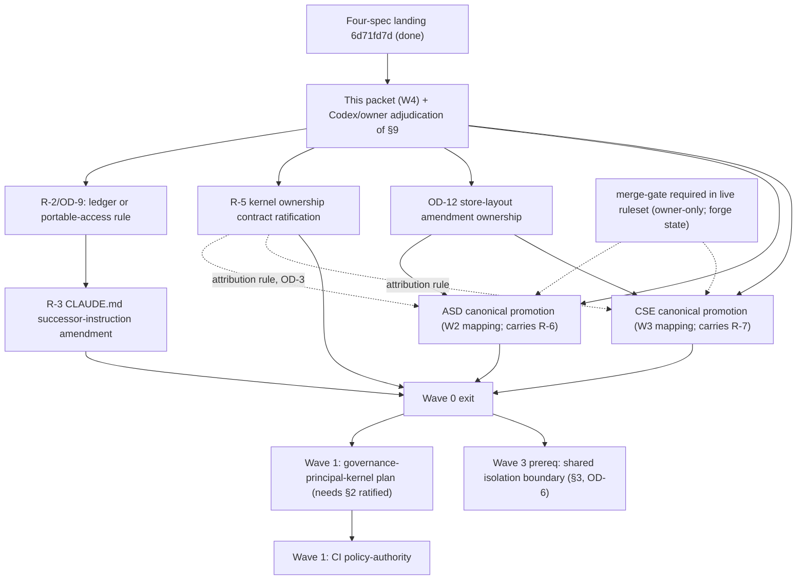

# Cross-Feature Authority and Ownership Audit — Wave 0 Decision Packet

**Status:** Non-authoritative Wave 0 decision packet for Codex and owner review.
This document proposes; it ratifies nothing. Every "Proposed" section below is a
recommendation that only the owner (or the owner's merge of a later reviewed
change) can convert into authority. Every "Existing authority" statement carries
a file-and-line witness at the audited commit.

**Audited commit:** `6d71fd7d33beaf8128fa675833ee12595205481d` (`origin/main`,
the merge of PR #258 — the accepted four-feature landing).

**Produced by:** the W4 planning-only lane defined in
`docs/superpowers/plans/2026-08-01-four-feature-orchestration.md`
(§Ten-hour acceleration window, Phase A). Scope: contradiction/ownership
matrix only; no implementation plan approval, no runtime code, no lifecycle
mutation.

**Features audited** (short keys used throughout):

| Key | Document | Authority posture at the audited commit |
|---|---|---|
| GLG | `.verdi/specs/active/guided-lifecycle-governance/spec.md` | Canonical feature spec, accepted pending build (statusless, reachable from the default branch; see §10 item 10 for the governance-completeness contingency) |
| CI | `.verdi/specs/active/context-integrity/spec.md` | Canonical feature spec, accepted pending build (same posture and contingency as GLG) |
| ASD | `docs/superpowers/specs/2026-07-30-ai-assisted-spec-design.md` | Ratified design authority; not canonical lifecycle authority until its promotion unit merges (its own Status line, line 3–4) |
| CSE | `docs/superpowers/specs/2026-07-30-comparative-spike-experiments-design.md` | Ratified design authority; not canonical lifecycle authority until its promotion unit merges (its own Status line, line 3–4) |
| MSA | `docs/superpowers/specs/2026-08-01-merge-signals-spec-acceptance-design.md` | Owner-ratified lifecycle design (Status line, line 3); runtime landed through `internal/specstate` and the `merge-gate` workflow |

**Method.** Four independent Sonnet authority inventories (one per feature) plus
one repository reconnaissance sweep were produced against the audited commit;
the FABLE adjudicator read the orchestration plan, MSA design, ceremony-audit
report, merge-signaled implementation plan, both canonical specs' authority
sections, and `spec/worktree-manager` first-hand, and verified every
load-bearing quote below by line-anchored search before adjudicating. An
independent Opus challenge review then attacked every classification, ownership
proposal, and proof boundary in the draft; it refuted the draft's three
CONTRADICTION classifications, found four missing seams, and corrected several
overstatements. All accepted findings are incorporated below, and the complete
findings-and-rulings record is §11 — the matrix as it stands is the
post-challenge version. Three-valued honesty applies to every conclusion (§10):
proven, violated-with-witness, or disclosed-as-unproven — never a silent pass.

---

## 1. Contradiction matrix

Classification vocabulary:

- **CONTRADICTION** — two authorities assign the same requirement incompatibly,
  or an authority's schedule contradicts its ownership statement.
- **DUPLICATE** — the same concept is defined more than once; the texts happen
  to agree today, but nothing prevents drift, and the specs themselves forbid
  parallel definitions.
- **GAP** — a requirement every party depends on has no committed owner.
- **ALIGNED** — real overlap, examined and found consistent; recorded so a
  reviewer does not mistake silence for an unexamined seam.

Counts after challenge review: **0 CONTRADICTION, 8 DUPLICATE, 8 GAP,
3 ALIGNED** (19 rows). The draft matrix classed three rows CONTRADICTION; the
independent challenge refuted all three with source text (§11, findings 1–3),
and the corrected reading is: **no two accepted authorities currently assign
the same requirement incompatibly — the program's risk profile is eight
unowned seams and eight drift-capable duplicate definitions.**

| ID | Class | Requirement |
|---|---|---|
| CX-1 | DUPLICATE | Governance-profile schema (the four profile classes and their fields) |
| CX-2 | GAP | Custody of the kernel contract between Wave 1 delivery and Wave 4 GLG `lifecycle-governance` |
| CX-3 | DUPLICATE | Authenticated-principal trust sources |
| CX-4 | GAP | The authoritative-principal vs. attribution-record distinction for ASD/CSE actors |
| CX-5 | DUPLICATE | Policy-inheritance ("narrow-only") mechanisms |
| CX-6 | GAP | Reusable worktree/isolation boundary for CI and CSE |
| CX-7 | DUPLICATE | Environment-identity (fingerprint) collection |
| CX-8 | DUPLICATE | Capability vocabulary (three uses of "capability") |
| CX-9 | DUPLICATE | Provenance/audit record shapes (four distinct schemas) |
| CX-10 | GAP | ASD provenance-sidecar classification by the CI context compiler |
| CX-11 | DUPLICATE | Build/agent-context include/exclude vocabulary (ASD, CSE) vs. CI compilation ownership |
| CX-12 | GAP | Repository-visible invention ledger and successor instructions |
| CX-13 | ALIGNED | AI authority ceiling (no agent-minted judgment) |
| CX-14 | ALIGNED | Merge-signaled acceptance as the single acceptance ceremony |
| CX-15 | ALIGNED | Three-valued honesty and the 0/1/2 exit contract |
| CX-16 | GAP | Human-artifact scaffold/template/renderer seam (CI `policy-authority` × ASD mutation core) |
| CX-17 | GAP | Committed store-layout ownership for the new artifact kinds all four features add |
| CX-18 | DUPLICATE | Effective-lifecycle-state derivation (MSA's shared resolver vs. GLG journey derivation) |
| CX-19 | GAP | CLI-verb and MCP-tool inventory arbitration across concurrent units |

### CX-1 — Governance-profile schema — DUPLICATE

- **Requirement:** one strict-decoded governance-profile artifact (solo, team,
  high-assurance, experimental) whose id and digest bind into transitions,
  manifests, approvals, and receipts.
- **Authorities:** GLG frontmatter `ac-3` (line 23) — "one canonical governance
  profile and authenticated-principal resolver"; GLG AC-3 body (lines 265–297)
  defines the profile's field families (trust sources, role mappings, ownership
  sources, signature requirements, required approvers, distinctness rules,
  evidence-source restrictions, escalation thresholds, applicable transitions)
  and the four profile classes. CI AC-1 body (lines 234–242) defines the same
  four classes with CI-side semantics; CI `dc-19` (line 106) makes the applied
  profile "canonical project authority whose id and digest enter manifests,
  approvals, and receipts."
- **Conflict/overlap:** two feature specs each define the profile enum and
  fields. The texts are consistent today, and both explicitly forbid the
  situation continuing: GLG AC-3 body — "the two features must not create
  parallel profile or actor schemas" (lines 267–269); CI — "neither feature may
  define a parallel profile or actor type" (lines 507–508).
- **Current owner:** none committed. The orchestration plan (§Shared ownership
  boundaries, lines 96–102) mandates a prerequisite `governance-principal-kernel`
  delivery unit, but no ownership contract for that unit exists in the
  repository.
- **Consumers:** every GLG governed transition; every CI manifest, approval,
  receipt, and conflict identity-operator; ASD review requirements
  ("profile-required review", ASD line 420); CSE's "profile-required
  pull-request review" (CSE ~line 555); MSA's team/solo profile branches.
- **Resolution needed:** owner ratifies the kernel ownership contract proposed
  in §2 (decisions OD-1, OD-2).

### CX-2 — Kernel contract custody in the interim — GAP

- **Requirement:** an unambiguous rule for who may change the shared
  profile/principal contract between the Wave 1 kernel delivery and the Wave 4
  GLG `lifecycle-governance` story.
- **Authorities:** CI's Relationship section (lines 503–506): "The Guided
  Lifecycle `lifecycle-governance` story owns its lifecycle-wide contract;
  Context Integrity records and enforces the resolved profile and principals
  for policy, context, execution, and receipt decisions." Both specs then
  explicitly authorize the early factoring: "Delivery planning may factor
  th[e] kernel as prerequisite work, but neither feature may define a parallel
  profile or actor type" (CI lines 506–508; GLG lines 440–442, near-identical
  wording). The orchestration plan schedules the kernel in Wave 1 and
  `lifecycle-governance` in Wave 4 (Completion ledger, lines 418–434).
- **Conflict/overlap:** none — the draft of this packet classed this row a
  CONTRADICTION and the challenge review refuted that with the
  "delivery planning may factor" sentences (§11, finding 1). What remains is a
  genuine gap: the named requirement owner (`lifecycle-governance`) delivers
  three waves after the kernel, and no committed text says who may change the
  kernel contract in the interim.
- **Current owner:** GLG (the feature spec) owns the lifecycle-wide contract;
  interim change custody is unowned.
- **Consumers:** the Wave 1 kernel plan; CI `policy-authority` (Wave 1).
- **Resolution needed:** §2's custody rule; owner decision OD-2.

### CX-3 — Authenticated-principal trust sources — DUPLICATE

- **Requirement:** the closed list of identity trust sources and the closed
  list of non-authoritative identity inputs.
- **Authorities:** GLG AC-3 body (lines 292–297): forge identity, signed
  commits, CODEOWNERS or equivalent, optional identity provider; `$USER`, Git
  display strings, agent-authored identity fields never satisfy an
  authoritative role. GLG `dc-7` (line 82) repeats the rule. CI AC-1 body
  (lines 244–248) and CI `DC-17` (lines 652–661) state the same two lists
  independently.
- **Conflict/overlap:** identical semantics defined twice; drift is possible
  and forbidden by both texts (see CX-1).
- **Current owner:** none committed (no principal/trust code exists at the
  audited commit — repository sweep found zero hits for `principal`,
  `governance`, or a trust resolver under `internal/` and `cmd/`).
- **Consumers:** GLG governed transitions and human records; CI constitution
  authorship/approval, exemptions, dispositions, receipts; CSE ratification
  actor authentication (CSE ~line 570–572); MSA — "The effective merger is
  resolved through the shared authenticated-principal and governance-profile
  seam **when forge evidence is available**" (MSA line 131–132).
- **Resolution needed:** kernel owns both closed lists (§2, item 3).

### CX-4 — Authoritative principal vs. attribution records — GAP

- **Requirement:** one committed rule distinguishing authoritative principal
  resolution from advisory attribution of authorship, so ASD and CSE actor
  records can never drift into authority decisions.
- **Authorities:** ASD defines its own actor schema twice — in the mutation
  request (`kind: delegated-agent / principal: johnyang / harness: codex /
  session: …`, lines 204–208) and again in the sidecar entry schema
  (lines 277–285); the `principal` field is a bare configured string, and the
  sidecar is declared non-authoritative at source (ASD lines 270–271, 478).
  CSE's ratification record names "actor identity" with "An adapter
  authenticates the actor; a payload cannot self-declare human authority"
  (~line 570–571). GLG `dc-7` and CI `DC-17` bar process-local strings from
  satisfying **authoritative roles** — and CI `dc-17`'s subject list is closed
  ("every constitution author, approver, exemption owner, and
  semantic-disposition actor", line 100), which ASD's draft-authoring actor
  never occupies.
- **Conflict/overlap:** none today — the draft classed this row a
  CONTRADICTION and the challenge review refuted it (§11, finding 2): the
  authoritative-role rules are scoped to roles ASD/CSE actors do not currently
  occupy, and both designs already forbid self-declared authority. The gap is
  real nonetheless: no committed text defines the two record classes or binds
  ASD/CSE attribution records to the future kernel representation, so nothing
  prevents a later consumer (a GLG audit rollup, a profile-required CSE
  ratification) from treating a bare attribution string as identity.
- **Current owner:** each document owns its local schema; nobody owns the
  distinction.
- **Consumers:** ASD provenance readers and review packets; CSE ratification
  consumers (spike closure); any future GLG audit rollup ingesting either.
- **Resolution needed:** §2 item 2's two-class rule, adopted by the ASD and
  CSE canonical-promotion units. Owner decisions OD-3, OD-4.

### CX-5 — Policy-inheritance mechanisms — DUPLICATE

- **Requirement:** one rule for how a higher-level policy bounds a lower one.
- **Authorities:** CI `dc-3` (line 58) — overlays refine only explicitly
  overridable surfaces; departures need bounded governed exemptions. ASD
  (lines 518–523) — "a managed parent policy may restrict a repository, while a
  lower-level policy may only narrow those permissions." CSE (~lines 667–670) —
  "Organization policy may narrow project choices; a lower layer cannot weaken
  a higher policy."
- **Conflict/overlap:** three narrow-only inheritance mechanisms, each defined
  locally. Consistent in spirit; unowned as a shared semantic. ASD additionally
  defines a whole project-policy schema (`design_assistance`, lines 485–506)
  that is structurally a governance-profile-shaped artifact living outside the
  CI constitution store.
- **Current owner:** CI `policy-authority` (Wave 1) owns "canonical policy,
  overlay, and exemption artifacts" (CI delivery sequence, lines 474–476) — the
  natural home; ASD and CSE define theirs independently.
- **Consumers:** ASD capability discovery and mutation gating; CSE evaluator
  and experiment-path policy; CI conflict gate.
- **Resolution needed:** owner decision OD-5 — whether `design_assistance` and
  the CSE experiment policy become typed policy artifacts under CI's
  policy-authority kernel (recommended) or remain feature-local configuration
  that the CI compiler classifies as project authority. Either way, exactly one
  inheritance semantic should be ratified.

### CX-6 — Reusable worktree/isolation boundary — GAP

- **Requirement:** isolated workspaces and capability enforcement for CI sealed
  runs and CSE candidate execution, over shared Git/worktree primitives.
- **Authorities (all of them, per challenge finding 9):** orchestration plan
  §Worktree, isolation, and capability mechanics (lines 113–119): "Their
  focused plans must name a common low-level boundary before either adds
  feature-specific behavior." CI `ac-4` (line 27) requires proof of "an
  isolated profile and worktree"; **both** CI and GLG declare
  `depends-on: spec/worktree-manager` (CI line 49; GLG line 61). CSE
  (~lines 438–441) runs each candidate "in a disposable workspace derived from
  the registered base commit," applying a captured patch — without naming any
  provider. The existing committed authorities are layered: the **active**
  component spec `spec/verdi-store-layout` owns the data zone and the ratified
  `verdi gc` scope, including the R4-I-79 opt-in local-branch/worktree pruning
  bullet (its §Zones and §Garbage collection); the archived feature
  `spec/workbench-directory` carries the ratified decisions dc-4 (reclamation
  signals) and dc-5 (managed worktrees cut from local branches only); and the
  closed story `spec/worktree-manager` implements them —
  `internal/wtmanager` (`EnsureWorktree`, `GC`), `internal/filelock`,
  `internal/gitx`, layout `.verdi/data/worktrees/<name>` keyed to design
  branches.
- **Conflict/overlap:** neither CI's sealed-run worktree (per-run, per-profile)
  nor CSE's base-commit+patch workspace fits the existing design-branch→name
  contract. The shared boundary the orchestration plan requires does not
  exist, and nothing committed says whether it extends the
  worktree-manager lineage, amends `verdi-store-layout`'s data-zone and gc
  sections (a component-spec amendment through the ratified flow), or is a new
  component.
- **Current owner:** the three layered documents above own what exists; nobody
  owns the generalization.
- **Consumers:** CI `sealed-codex-execution` (Wave 4), CSE evaluator/isolated
  execution (Wave 3), `verdi gc` (reclamation scope would grow), GLG journey
  worktree-identity operands.
- **Resolution needed:** §3's proposed boundary; owner decision OD-6 on the
  vehicle, which must name the `verdi-store-layout` amendment explicitly.

### CX-7 — Environment-identity collection — DUPLICATE

- **Requirement:** deterministic identity of the environment an execution ran
  in.
- **Authorities:** CSE defines a full "environment fingerprint" schema
  (~lines 447–455: OS/arch, runtime and evaluator versions, CPU/memory,
  relevant env vars, workload/fixture digests, network policy, Verdi and
  engine versions) plus an "environment-fingerprint providers" extension point
  (~line 653). CI manifests independently record adapter identity/version,
  repository state, and capability grant (AC-2, lines 287–302) — the same
  concern, different vocabulary, no named "fingerprint."
- **Conflict/overlap:** two collection mechanisms will exist unless the
  low-level boundary supplies one. The orchestration plan already rules the
  proof types stay separate (line 118) — the duplication risk is the
  *collection* layer, not the proof schema.
- **Current owner:** none (no fingerprint code exists at the audited commit).
- **Consumers:** CSE resume/rerun validation (~lines 473–475), CI manifest
  determinism and resume continuity (dc-11).
- **Resolution needed:** §3 item 4 — one shared collection primitive,
  feature-owned schemas embed its output. Owner decision OD-6 covers this.

### CX-8 — Capability vocabulary — DUPLICATE

- **Requirement:** what "capability" means, declared and enforced how.
- **Authorities:** CI uses capability as an execution grant (sandbox, network,
  tool, capability policy — AC-4 lines 367–374; a `capability` mechanical
  constraint family — AC-3 lines 325–328). CSE uses it as evaluator capability
  (`capabilities_digest`, line 306; the
  `verdi.experiment-evaluator-capabilities/v1` handshake, ~lines 349–358,
  declaring network/elevated access). ASD uses it as API-surface discovery
  (`get_design_capabilities`, lines 525–534 — permitted operations and
  postures, not execution grants).
- **Conflict/overlap:** three senses of one word. CI's and CSE's senses are the
  same concept (execution grants) and should share one strict-decoded grant
  vocabulary; ASD's is a different concept wearing the same name.
- **Current owner:** none for the shared grant vocabulary.
- **Consumers:** CI launch gating and conflict families; CSE registration,
  policy, and observation eligibility; ASD adapters (naming only).
- **Resolution needed:** §3 item 3; terminology ruling in OD-7.

### CX-9 — Provenance/audit record shapes — DUPLICATE

- **Requirement:** records of who did what to which bytes.
- **Authorities:** four distinct schemas: (a) ASD `verdi.design-provenance/v1`
  sidecar entries (lines 277–285); (b) CSE mutation-provenance records
  ("the actor, operation, prior digest, resulting digest, and policy decision
  across every surface", ~lines 694–696 — read in context, "surface" is the
  same word both designs use for their own CLI/MCP/workbench adapters, so the
  likely intended scope is CSE's experiment surfaces; the phrase is ambiguous
  enough that the promotion text should say so explicitly); (c) CI
  receipts/manifests/expansion ledgers (AC-2, AC-5); (d) GLG journey event
  receipts (AC-8, lines 388–422 — explicitly telemetry, "never lifecycle
  authority").
- **Conflict/overlap:** four record kinds are legitimate — they prove
  different things — but none of the four embeds a shared actor representation
  (see CX-4), and CSE's scope phrase should be pinned during promotion.
- **Current owner:** each feature owns its record kind; nobody owns the actor
  field inside them.
- **Consumers:** review packets, audit rollups, receipts verification.
- **Resolution needed:** keep the four record kinds separate (recommended — a
  unified audit schema is currently speculative abstraction); require each to
  embed the kernel actor representation (§2 item 2); CSE promotion makes the
  experiment-surface scope explicit (OD-4, R-7).

### CX-10 — ASD sidecar classification by the CI compiler — GAP

- **Requirement:** the CI context compiler must classify the ASD provenance
  sidecar explicitly — neither silently include it as authority nor silently
  omit it from the candidate universe.
- **Authorities:** orchestration plan §Provenance and build context
  (lines 121–123), including "The ASD core plan must publish the sidecar
  identity and exclusion contract before the context compiler finalizes its
  input classifier." ASD defines the sidecar (path, line 274; schema,
  lines 277–285; "excluded from normal design and build context," lines
  287–291). CI defines the classification machinery in general (manifest
  "excluded candidates with reason codes … inputs the project cannot inspect or
  exclude, classified as opaque," lines 298–301; DC-16 channel separation,
  lines 641–650) — but **CI never names ASD or the sidecar** (verified: no
  occurrence of "ai-assisted" or the sidecar path in the CI spec).
- **Conflict/overlap:** the binding contract exists only in the orchestration
  plan's prose; neither feature spec carries it.
- **Current owner:** split — ASD owns the sidecar identity; CI owns the
  classifier; the classification row itself is unowned.
- **Consumers:** CI `context-compiler` (Wave 3); ASD provenance views; every
  build/review manifest.
- **Resolution needed:** §4's proposed classification contract, landed as
  committed authority in the ASD canonical promotion (OD-8).

### CX-11 — Context include/exclude vocabulary — DUPLICATE

- **Requirement:** one owner for what compiled contexts contain.
- **Authorities:** CI `ac-2` and AC-2 own context compilation and
  classification wholesale, and CI is the accepted canonical spec. ASD
  (lines 450–453) describes "normal build context" contents (accepted spec,
  ratified decisions and policies, pinned context, deterministic execution
  inputs; provenance and transcripts excluded) — and ASD **explicitly defers
  the compiler track**: "A sealed execution-context manifest and systematic
  contradiction detection … remain a separate design track. The mutation
  contract must remain compatible with that future work" (lines 461–466).
  CSE (~lines 542–546) describes "normal agent context" for experiments.
- **Conflict/overlap:** the draft classed this row a CONTRADICTION; the
  challenge review refuted that with ASD's deferral text (§11, finding 3).
  What remains is duplicate include/exclude vocabulary: two design documents
  enumerate context contents that CI's compiler will own, and at canonical
  promotion those enumerations must become requirements on CI's classifier
  rather than freestanding definitions, or they will drift.
- **Current owner:** CI (canonical, accepted) owns compilation; ASD/CSE texts
  are requirement inputs.
- **Consumers:** CI compiler capsules (design/build/review); ASD
  `get_design_context`; CSE agent context assembly.
- **Resolution needed:** the ASD and CSE promotion units restate their context
  boundaries as requirements on the CI compiler's classification (OD-8, and
  R-6/R-7).

### CX-12 — Repository-visible invention ledger and successor instructions — GAP

- **Requirement:** every implementation worktree (local or web) must be able to
  read the invention ledger and the successor scope authority.
- **Authorities:** orchestration plan lines 30–31: unresolved ambiguities are
  recorded in `PLAN.md` §7 "until a successor build contract explicitly
  relocates it," and "Wave 0 must make the successor scope and
  invention-ledger location repository-visible before any runtime
  implementation begins." Wave 0 offers a ratified disjunction (line 235):
  "Establish a repository-visible successor invention ledger **or explicitly
  retain `PLAN.md` section 7 with a portable access path** for every
  implementation worktree." Web lanes must not rely on workspace `PLAN.md`
  (lines 141–142). Repo `CLAUDE.md` lines 3–4 point to `../CLAUDE.md` and
  `../PLAN.md` — outside the repository.
- **Conflict/overlap:** violated-with-witness for any repo-only worktree today:
  `PLAN.md` is absent from the repository (full-tree search), while roughly
  three hundred committed references cite its entries (the challenge review
  counted 318; witnesses include `CLAUDE.md:18`, `cmd/verdi/dispatch.go:13–44`,
  `cmd/verdi/gate_threads.go:29` — which cites "R4-I-28 (PLAN-V1.md §7)" —
  `cmd/verdi/ritual_test.go` I-40, `Makefile`, `verdi.bindings.yaml`). The
  orchestration plan's stop condition (line 404) — "the active agent
  instructions … cannot resolve the successor invention ledger" — currently
  fires for every web lane doing runtime work. This packet was produced in a
  repo-only worktree and could not read `PLAN.md`; the gap is demonstrated,
  not hypothetical.
- **Current owner:** workspace `PLAN.md` (not repository-visible); no
  successor.
- **Consumers:** every future implementation lane; the kernel plan; Codex
  reviews that must check ledger citations.
- **Resolution needed:** §5's proposal — both ratified branches put to the
  owner; decisions OD-9, OD-10.

### CX-13 — AI authority ceiling — ALIGNED

GLG (AC-4: "Threshold crossings do not let an AI reject a human conclusion";
dc-9: no AI score as approving authority), CI (dc-6: AI discovers semantic
candidates, "cannot manufacture a mechanical proof or final pass"), ASD
(§Human and agent authority table; agents cannot accept/approve/waive/attest/
disposition), and CSE (agents may not lock, ratify, resolve, or promote) state
mutually consistent ceilings. No action needed beyond the shared principal
representation (CX-4) so "who is an agent" is decided once.

### CX-14 — Merge-signaled acceptance — ALIGNED

MSA (owner-ratified) makes merge the single acceptance ceremony; GLG's
"merge authorization" is listed as a governed transition consuming the shared
profile seam (ac-3); ASD lines 418–424 state "the owner's merge of that pull
request is the single decision that accepts the specification. No separate
acceptance command, status edit, or confirmation repeats it"; CSE ~line 555
defers to "the profile-required pull-request review and the owner's merge" and
"adds no competing approval ceremony." Consistent. One caution recorded in §6:
CSE's lock and ratification are *new* human checkpoints and must stay justified
under the MSA ceremony-audit rule; they are (§6 rows H-12, H-13).

### CX-15 — Three-valued honesty and exit codes — ALIGNED

All four documents plus MSA and the orchestration plan restate
proven / violated-with-witness / disclosed-unproven and the 0/1/2 exit
contract. Consistent duplication of a workspace-level doctrine; the successor
instructions (§7 R-3) should name a single repository-visible statement of it
so repo-only worktrees inherit it from committed text rather than from the
absent workspace `CLAUDE.md`.

### CX-16 — Human-artifact scaffold/template/renderer seam — GAP

*(Added by challenge review, missing-seam A — one of the orchestration plan's
own five named shared-ownership boundaries, absent from the draft matrix.)*

- **Requirement:** one scaffold/template/renderer seam for configurable
  human-authored artifacts, consumed — not competed with — by agent-assisted
  creation.
- **Authorities:** orchestration plan §Human-artifact scaffolds and templates
  (lines 104–106): "CI `policy-authority` owns the immutable identity,
  authority, scope, lifecycle, ownership, and provenance kernel plus the
  shared renderer … ASD must consume this seam for agent-assisted creation and
  may add typed draft operations, but it may not create a competing template or
  policy model." CI AC-1 (lines 250–259) claims one resolver and renderer for
  every committed human-authored artifact kind, explicitly including
  agent-assisted creation, verified by `verdi model check`. ASD claims one
  typed draft-mutation core over spec objects across workbench/CLI/MCP
  (lines 41–45) with its own model-descriptor extension port (lines 536–540).
- **Conflict/overlap:** like CX-10, the reconciliation exists only in
  orchestration prose; neither spec names the other's mechanism, and the two
  extension ports (CI's model-typed extensions, ASD's model descriptors) have
  no committed relationship.
- **Current owner:** split — CI owns the kernel+renderer claim; ASD owns the
  mutation core; the seam contract is unowned.
- **Consumers:** every creation surface (CLI, workbench, MCP, agent-assisted);
  CI `policy-authority` (Wave 1); ASD draft-mutation core (Wave 2).
- **Resolution needed:** the ASD promotion restates its mutation core as a
  consumer of the CI scaffold seam per the plan's boundary text (fold into
  R-6); the kernel-vs-descriptor extension-port relationship is owner decision
  material for the two focused plans (OD-13).

### CX-17 — Committed store-layout ownership for new artifact kinds — GAP

*(Added by challenge review, missing-seam B.)*

- **Requirement:** an owner for amending the committed-zone layout that all
  four features write into.
- **Authorities:** the **active** component spec `spec/verdi-store-layout`
  enumerates the committed zone (`.verdi/specs/active/<name>/` = `spec.md`,
  `layout.json`, `board.json`; its §Directory layout). Against that
  enumeration: ASD adds `design-provenance.jsonl` (ASD line 274); CSE adds the
  `experiments/<experiment-id>/` tree (CSE ~lines 199–212); CI adds policy,
  overlay, and exemption artifacts (CI AC-1); GLG adds human records and event
  receipts (storage unspecified in its spec).
- **Conflict/overlap:** no feature names the store-layout amendment its new
  paths require, and no unit owns it. The orchestration plan's stop condition
  on "two features claim ownership of the same schema … registry" (line 406)
  and its concurrency rule against two units editing a shared schema registry
  (line 65) both hit this seam.
- **Current owner:** `spec/verdi-store-layout` owns the layout; nobody owns
  its amendment for the four-feature program.
- **Consumers:** every feature's storage; `verdi lint` store discipline;
  `verdi gc`.
- **Resolution needed:** owner decision OD-12 — either one early shared
  store-layout amendment (ratified component-spec flow) covering the four
  features' committed paths, or per-unit amendments serialized with explicit
  ownership; §4's sidecar path proposal is contingent on this row.

### CX-18 — Effective-lifecycle-state derivation — DUPLICATE

*(Added by challenge review, missing-seam C.)*

- **Requirement:** one owner for deriving a specification's effective
  lifecycle state.
- **Authorities:** MSA (line 69): "every … acceptance consumer resolve[s]
  effective state through one shared Git-aware lifecycle service. No adapter
  reimplements reachability" — implemented at the audited commit as
  `internal/specstate` with the read-only `verdi spec state` verb. GLG's
  journey record independently lists "lifecycle class and state" among its
  derived operands (AC-1 body, ~line 217) without naming the shared resolver;
  GLG dc-15 defers only *context* facts to CI. CSE derives **experiment**
  state from artifact presence (~lines 220–230) — a distinct, feature-owned
  state ladder that its own text keeps out of the spike's lifecycle status
  ("The child does not mutate the spike schema or introduce a second lifecycle
  status"), so the CSE half is aligned.
- **Conflict/overlap:** the GLG half is a drift-capable duplicate: a committed
  owner exists (`internal/specstate` per MSA), and GLG's text neither names it
  nor is bound to it.
- **Current owner:** MSA/`internal/specstate` own spec lifecycle-state
  derivation; the GLG binding is missing.
- **Consumers:** GLG `journey-projection` (Wave 2 — early), every acceptance
  consumer already migrated by the MSA implementation.
- **Resolution needed:** the GLG `journey-projection` focused plan must bind
  its lifecycle-state operand to the shared resolver (no reimplemented
  reachability); recorded as a plan constraint in R-9. No owner decision
  needed — MSA already decided the owner; this row exists so the Wave 2 plan
  cannot miss it.

### CX-19 — CLI-verb and MCP-tool inventory arbitration — GAP

*(Added by challenge review, missing-seam D.)*

- **Requirement:** an arbitration rule for the single committed verb/tool
  registry that multiple concurrent units will extend.
- **Authorities:** `CLAUDE.md:14,18` names the verb table and the `spec-align`
  gate that audits "MCP tool + CLI verb inventories." ASD proposes six MCP
  tools (lines 320–333); GLG proposes `verdi journey` and `verdi recover`
  (its AC bodies); CSE proposes CLI/agent adapters. The orchestration plan's
  concurrency rule (line 65) forbids parallel units editing a shared registry
  but names no arbiter.
- **Conflict/overlap:** unowned shared registry; a scheduling hazard more than
  a semantic one (severity: minor).
- **Current owner:** the committed inventory files and `internal/specalign`
  enforce consistency; nobody owns cross-unit sequencing.
- **Consumers:** every adapter-delivering unit in Waves 2–6.
- **Resolution needed:** R-3's instruction amendment names the verb/MCP
  inventory a serialized shared registry (one unit at a time, rebase rule);
  no owner decision beyond approving R-3.

---

## 2. Proposed ownership contract — `governance-principal-kernel`

**Existing authority** this proposal builds on (verbatim obligations, already
accepted): GLG's *Relationship to Context Integrity* section and CI's
*Relationship to Guided Lifecycle and Governance* section both require "one
schema and one implementation seam" and authorize factoring the kernel as
prerequisite work (GLG lines 438–442; CI lines 502–508); GLG AC-3 body adds
"the two features must not create parallel profile or actor schemas"
(lines 267–269). Ownership of the lifecycle-wide contract is already assigned
and is **not** proposed here: "The Guided Lifecycle `lifecycle-governance`
story owns its lifecycle-wide contract; Context Integrity records and enforces
the resolved profile and principals for policy, context, execution, and
receipt decisions" (CI lines 503–506); "GLG retains ownership of the
lifecycle-wide governance contract" (orchestration plan line 100).

**Proposed (non-authoritative)** — the kernel delivery unit owns exactly four
things and nothing else:

1. **Governance-profile schema.** One strict-decoded artifact schema: profile
   id, digest, class enum `{solo, team, high-assurance, experimental}`, and the
   union of the field families both specs name — identity trust sources, role
   mappings, ownership sources, signature requirements, required approvers,
   distinctness rules, evidence-source restrictions, escalation thresholds,
   applicable transitions (GLG AC-3 body, lines 270–276) — with unknown fields,
   classes, and enum values failing closed (CI co-2). Profiles are canonical
   project authority; their id and digest enter manifests, approvals, and
   receipts (CI dc-19). *Storage location* (constitution store per CI dc-3 vs.
   a dedicated path) is owner decision OD-1.
2. **Authenticated-principal representation.** One `Principal` representation:
   canonical principal identifier, trust witnesses, and a three-valued
   resolution state (authenticated / violated-with-witness / unproven). Two
   record classes are distinguished forever:
   - *Principal resolution* (authoritative): produced only by the kernel
     resolver; the only representation a governed transition, approval,
     receipt, or authority decision may consume.
   - *Attribution records* (advisory): ASD mutation/sidecar actors and CSE
     ratification actors record who authored bytes. Each must embed either a
     kernel canonical principal ID (when the adapter authenticated one) or an
     explicit `unauthenticated` marker — never a bare string presented as
     identity, and never a second resolution algorithm.
3. **Trust-source resolution.** The kernel resolver is the only component that
   evaluates forge identity, signed commits, CODEOWNERS/ownership data, and
   identity-provider assertions, and the only place the non-authoritative-input
   list (`$USER`, display strings, agent-authored fields) is enumerated.
   MSA's effective-merger resolution consumes this seam "when forge evidence
   is available" (MSA lines 131–132).
4. **Authorization interpretation.** Authentication-vs-authorization split
   (GLG DC-7), role authorization, same-principal/different-principal
   distinctness evaluation, separation-of-duties modes, and solo-profile role
   collapse with disclosure. CI's `same-principal`/`different-principal`
   conflict operators (CI line 328) must call this interpretation, not
   reimplement it.

**Prohibited duplicate schemas and resolvers** (merge blockers for every later
plan): a second profile enum or profile-shaped schema participating in
authority decisions; a second actor/principal type consumed by any governed
transition; a second trust-source resolver; a second authorization
interpreter. Known at-risk surfaces, each of which must consume the kernel
when promoted or planned: ASD `actor` (both schemas), ASD
`design_assistance.review`, CSE ratification authentication, CSE
organization/project policy narrowing, CI conflict identity family, GLG
escalation role requirements.

**What the kernel does NOT own:** the lifecycle-wide governance contract
itself (GLG-owned, above); human-record kinds (attestations, waivers,
deviations, exemptions, dispositions — GLG/CI); profile-conditioned ceremony
requirements (feature specs); CSE measurement trust classes
(harness-measured / evaluator-measured / candidate-reported — feature-owned
proof vocabulary); CI channel classification (authority/data/opaque); forge
transport (`internal/forge`); and lifecycle state (`internal/specstate`,
see CX-18).

**Custody rule (resolves CX-2):** the kernel delivery unit owns the schema and
resolver *implementation*; the **GLG feature spec remains the requirement
owner of the lifecycle-wide contract** (per the accepted text quoted above),
with CI's recording/enforcement requirements binding alongside; any
kernel-contract change before GLG `lifecycle-governance` delivers requires an
owner-ratified amendment to the affected spec(s) — never a unilateral
kernel-plan decision. FABLE cannot ratify this rule; it is owner decision
OD-2.

---

## 3. Proposed reusable CI/CSE low-level boundary

**Existing authority:** three layers, all named (CX-6): the active
`spec/verdi-store-layout` (data zone; ratified `verdi gc` scope including
R4-I-79 opt-in branch/worktree pruning), the archived `spec/workbench-directory`
decisions dc-4/dc-5 (reclamation signals; local-branches-only), and the closed
story `spec/worktree-manager` with its shipped code — `internal/wtmanager`
(`EnsureWorktree`, `GC`), `internal/filelock`, `internal/gitx` — managing
worktrees for local design branches under `.verdi/data/worktrees/<name>`.
The orchestration plan (lines 113–119) fixes the ownership split: CI owns the
project-sealed/vendor-opaque authority claim; CSE owns common-base candidate
materialization, protected comparison inputs, evaluator capabilities, and
experiment environment fingerprints; "Shared Git/worktree primitives may be
reused; context receipts and experiment recommendations remain separate proof
types."

**Proposed (non-authoritative)** — one shared low-level *execution workspace*
boundary, four primitives plus a separation rule:

1. **Git/worktree primitives.** Extend the existing seam (not a competitor) to
   materialize a workspace from either a local branch (existing contract) or an
   arbitrary base commit plus a canonical patch with post-apply identity
   verification (CSE's need), and a per-run ephemeral workspace (CI's need).
   All workspaces live under the data zone, take `internal/filelock` ownership
   for worktree-mutating operations, use deterministic naming, and are
   reclaimed only by `verdi gc` with disclosed, ratified scope growth —
   following the incremental-slice pattern worktree-manager's dc-5
   established. Because the data zone and gc scope are owned by the active
   `verdi-store-layout` component spec, this requires a ratified store-layout
   amendment, not just a new story (OD-6, CX-17). The boundary must be named
   before either feature's execution plan is approved (orchestration
   line 114).
2. **Isolation.** Shared primitives construct an isolated profile (clean
   environment, controlled home/config discovery) and apply sandbox/network
   policy. The *claims* stay feature-owned: CI alone asserts "project-sealed,
   vendor base opaque" (CI dc-2); CSE alone asserts "registered environment
   policy honored, weaker isolation disclosed" (CSE ~457–459). A shared
   primitive failing to provide a required control is an operational error in
   both features, never a silent downgrade (CI dc-10; CSE ~469–471 agree).
3. **Capabilities.** One strict-decoded execution-grant vocabulary — network,
   path-read/path-write scopes, process execution, resource ceilings,
   timeouts — with unknown kinds failing closed. CI capability policy and the
   CSE evaluator handshake/`capabilities_digest` consume it; CI's `capability`
   conflict family references the same vocabulary. ASD's
   `get_design_capabilities` is adapter-surface discovery, not an execution
   grant, and stays outside this vocabulary (CX-8).
4. **Environment fingerprints.** One collection primitive producing canonical,
   sorted environment-identity fields (OS/arch, tool and adapter versions,
   declared environment variables, input digests). CSE's fingerprint schema and
   CI's manifest fields embed its output as feature-owned supersets; the
   *collection* is shared, the *schemas* are not.
5. **Feature-owned proof types that remain separate** (restating accepted
   authority, orchestration line 118): CI context manifests and receipts; CSE
   observation records, results, recommendations, capsule manifests, and
   ratifications. Neither feature may mint the other's proof type;
   experimental/spike posture cannot mint authoritative receipts (CI dc-19 and
   CSE's non-goals agree).

---

## 4. Proposed ASD provenance-sidecar classification (consumed by CI)

**Existing authority:** ASD owns the sidecar identity —
`.verdi/specs/active/<name>/design-provenance.jsonl` (line 274), append-only
`verdi.design-provenance/v1` entries (lines 277–285), committed, following the
spec into the archive, "excluded from normal design and build context"
(lines 287–291), excerpt classifications `human-stated | ai-synthesized |
ai-inferred | unresolved` (lines 298–301). CI owns the classifier: every
manifest lists included data, "excluded candidates with reason codes," and
opaque inputs (CI lines 298–301); DC-16 forbids non-projection content from
entering the authority channel. The orchestration plan (121–123) requires the
explicit classification row. No committed text joins them (CX-10). The sidecar
path itself presupposes a store-layout amendment (CX-17); this contract is
contingent on OD-12.

**Proposed (non-authoritative)** classification contract, to land as committed
authority in the ASD canonical-promotion unit and to bind the CI
`context-compiler` plan:

- **Candidate identity.** The sidecar is identified by its store-relative path
  (active or archive zone), its declared schema version
  (`verdi.design-provenance/v1`), and its content digest at the evaluated
  revision. It is always a member of the compiler's candidate universe for any
  scope that includes its spec directory — never invisible to enumeration.
- **Authority class.** Non-authoritative committed data. It never enters the
  project-authority channel (the generated instruction projection), in any
  phase, under any profile. It is not an instruction source, not evidence, and
  not a conflict-candidate source of authority.
- **Inclusion/exclusion behavior.** Default: excluded from design, build, and
  review capsules, recorded in the manifest's excluded ledger with a dedicated
  reason code (proposed: `design-provenance-sidecar`), never silently omitted.
  On explicit request (a person or agent asks for the provenance view — ASD
  lines 289–291), its content is delivered provenance-wrapped in the data
  channel per CI DC-16, and the delivery is recorded (in-run delivery is an
  expansion-ledger entry creating a child manifest revision per CI dc-9).
- **Receipts.** Every manifest (and therefore every receipt binding it) proves
  the classification: the excluded-ledger row carries the sidecar path, digest,
  and reason code; an explicit inclusion appears in the expansion ledger with
  its approval. A receipt whose manifest neither lists the sidecar as excluded
  nor as expanded, while the spec directory contains one, is incomplete.
- **Fail-closed cases.** (a) Unknown sidecar schema version → the candidate
  cannot be classified → strict decoding fails closed (CI co-2 admits no phase
  or profile scoping), and compilation blocks with the decode witness.
  (b) A sidecar entry that fails strict decode → same treatment; the compiler
  never partially reads it. (c) A sidecar present on disk but absent from the
  manifest's candidate enumeration → classification incompleteness →
  authoritative launch blocked (CI ac-4 posture). (d) Sidecar content can
  never be reclassified into the authority channel by any policy, profile, or
  expansion — attempting it is a policy violation, not a configurable choice
  (ASD lines 303–307 and CI DC-16 both already state this; the contract makes
  the combination explicit).

---

## 5. Repository-visible successor invention ledger — proposal

**Facts (witnesses in CX-12):** `PLAN.md` and `PLAN-V1.md` are absent from the
repository; repo `CLAUDE.md:3–4` points outside the repository; ~318 committed
references cite ledger entries by ID; the orchestration plan requires
repository visibility before runtime implementation and forbids web lanes from
assuming workspace files. This packet was produced in a repo-only worktree and
could not read `PLAN.md` — the gap is demonstrated, not hypothetical.

The ratified Wave 0 item is a **disjunction** (orchestration line 235), and
both branches are put to the owner (OD-9):

**Option A (recommended) — repository-visible successor ledger.**

1. Create `docs/superpowers/invention-ledger.md` (path is owner decision
   OD-9; alternatives: `docs/invention-ledger.md`, a new `docs/governance/`
   home) containing three parts:
   - **Recording rule** (successor to `PLAN.md` §7's role): a spec ambiguity
     that changes proof meaning, authority, lifecycle state, or a public
     interface gets a ledger entry — citation, smallest reversible choice,
     open/resolved state — and blocks implementation until recorded; never
     resolved silently or from what similar tools do.
   - **Historical import:** the entries committed code actually cites
     (I-* / R4-I-* IDs found in `CLAUDE.md`, `cmd/verdi/dispatch.go`,
     `gate_threads.go`, `ritual_test.go`, `Makefile`, `verdi.bindings.yaml`,
     and related files), imported verbatim from workspace `PLAN.md`/`PLAN-V1.md`
     §7 with a provenance header naming the source document and import commit.
     Import scope (cited-only vs. complete) is owner decision OD-9.
   - **Successor entries:** new entries for the four-feature program start
     here (the first candidates are the owner decisions in §9).
2. The import is a **local-lane task** (workspace files are required to copy
   from) followed by an ordinary reviewed PR; a web lane cannot perform it.
3. Rationale for recommending A: it heals the ~318 dangling citations for
   every future repo-only reader, not only for dispatched agents.

**Option B (ratified alternative) — retain `PLAN.md` §7 with a portable
access path.** The workspace file remains the ledger; every dispatch packet
(web or local) inlines the applicable entries verbatim — the mechanism the
orchestration plan already permits (lines 141–142) — and the repo `CLAUDE.md`
amendment (R-3) documents that portable-access rule instead of a ledger path.
Costs: committed citations stay unreadable in repo-only contexts, and every
packet author must select the applicable entries correctly; the selection
itself becomes an unreviewed judgment.

Until either branch lands, runtime implementation must not begin (existing
Wave 0 constraint, orchestration line 31). This packet does **not** create the
ledger file: the historical entries live in a workspace file this lane cannot
read, and inventing their text would violate provenance discipline.

---

## 6. Human-ceremony inventory — four-feature lifecycle

Classes are MSA's ratified five (design §Ceremony audit rule): **SJ**
substantive judgment · **FA** authorization already expressed by forge
review/merge · **DM** deterministic materialization · **EO** exceptional
override · **RA** removable acknowledgement. The committed ceremony-audit
report (`docs/superpowers/reports/2026-08-01-lifecycle-ceremony-audit.md`)
dispositioned **Task 7's own scope** and explicitly carried three rows forward
without fresh re-audit (its lines 179–183); MSA rollout step 8 still requires
the audit be applied to closure, supersession, build start, and evidence
synchronization. The rows below extend the audit to the four-feature
lifecycle; classifications of not-yet-ratified ceremonies are proposals, not
rulings.

| # | Ceremony | Class | Disposition |
|---|---|---|---|
| H-1 | Merge of each specification/promotion PR (GLG, CI landed; ASD, CSE promotions pending) | FA | Retain once; merge derives acceptance (MSA; exercised at the audited commit for GLG/CI, subject to the §10 item 10 contingency) |
| H-2 | Codex plan review (`APPROVED` per Gate P) and exact-head implementation review (Gate C) | SJ | Retain; independent technical judgment, never self-repaired |
| H-3 | Owner ruleset/required-check mutation | EO + SJ | Retain, owner-only (orchestration §Owner-only control plane); agents prepare payloads only |
| H-4 | GLG attestation of a feature outcome | SJ | Retain; claim must originate from an authenticated human and remain visibly human (GLG DC-12); scaffolding around it is DM and is automated |
| H-5 | GLG deviations, waivers, exemptions, semantic dispositions | SJ / EO | Retain with kernel identity + witness checks (GLG AC-4); validation scaffolding is DM |
| H-6 | GLG journey "confirm guarded action" for destructive/irreversible steps | EO | Retain only where irreversible risk is demonstrated; a confirmation on a reversible action is RA and must be removed (MSA rule) |
| H-7 | GLG event receipts, journey/metrics projections | DM | Automate; telemetry is never lifecycle authority (GLG AC-8) |
| H-8 | CI constitution change: propose → validate → review → commit → PR merge | FA (merge) + SJ (review) | Retain the PR review/merge as the only authority event; workbench confirmation of the scoped commit is preparation, not a second ceremony (CI AC-6) |
| H-9 | CI exemption approval; semantic-candidate disposition | SJ | Retain; separation-of-duties per profile via the kernel (CI dc-8, dc-6) |
| H-10 | CI expansion approval across an authority/capability/scope boundary | SJ | Retain (CI AC-2, lines 313–316); in-scope approved expansion logging is DM |
| H-11 | CI governed grandfathering exemption | EO | Retain; explicit, scoped, attributable (CI AC-4) |
| H-12 | CSE registration lock | SJ | Retain; it fixes the decision contract before evidence exists — a genuinely new pre-execution judgment (CSE ~270–278), justified under the MSA rule |
| H-13 | CSE ratification of a comparison result | SJ | Retain; selecting/rejecting a candidate is the human decision the whole feature exists to inform (CSE ~562–572) |
| H-14 | CSE ratification *transport* — how `ratification.yaml` reaches the default branch | FA | The judgment (H-13) is expressed in the reviewed record; the merge of the PR carrying it is the forge witness. No separate post-merge ratify command or status flip may repeat it (MSA rule). Vehicle detail is owner decision OD-11 |
| H-15 | ASD `design_assistance` policy adoption/change | SJ once | Retain as an ordinary ratified policy change producing a new digest (ASD 518–523); per-session re-confirmation would be RA |
| H-16 | ASD review-packet reading | — | Not a ceremony: a derived view (ASD 402–406). Acceptance remains H-1. Requiring a "packet acknowledged" step would be RA; none is proposed |
| H-17 | ASD direct-Markdown edit disclosure (`unclassified` origin) | — | Not a ceremony; disclosure-by-default is the ratified posture (ASD 313–316) |
| H-18 | Retired: `verdi accept`, status edits, completion-ledger commits, post-merge bookkeeping | DM (duplicate) | Prohibited — the committed report classes these "deterministic duplicate bookkeeping" (its line 25), mapping to MSA's deterministic-materialization class whose derivation already exists (`verdi spec state`, derived CI data); no four-feature plan may reintroduce them |

Removable-ceremony findings: no *existing* retained ceremony in the four
documents was found to lack distinct judgment or safety purpose; the two risks
are prospective — H-6 (journey confirmations must not accrete onto reversible
actions) and H-14 (CSE ratification must not grow a second transport ceremony).
Both are recorded so the focused plans inherit them as constraints. The base
lifecycle rows the committed report carried forward un-re-audited (`close
--prepare`, Codex review, merge-implementation-PR) remain disclosed as
not-yet-re-audited; MSA rollout step 8's audit of closure, supersession, build
start, and evidence synchronization is outstanding work, not covered here.

---

## 7. Recommendations — repository-visible successor authority and instruction changes needed before runtime implementation

Exact, ordered; each is a separate reviewed PR unless noted. None is performed
by this lane.

- **R-1 (this PR).** Land this packet as the W4 contradiction/ownership matrix
  for Codex and owner review.
- **R-2 (local lane + PR; contingent on OD-9 choosing Option A).** Create the
  successor invention ledger per §5 with the historical import from workspace
  `PLAN.md`/`PLAN-V1.md` §7. Blocks: every runtime implementation lane
  (orchestration line 31). If OD-9 chooses Option B, R-2 is replaced by the
  portable-access rule inside R-3.
- **R-3 (PR, owner-reviewed).** Amend repo `CLAUDE.md`: name
  `docs/superpowers/plans/2026-08-01-four-feature-orchestration.md` as the
  successor orchestration authority (Wave 0 checkbox, line 234), record the
  OD-9 outcome (ledger path or portable-access rule), state the three-valued
  honesty and 0/1/2 exit doctrine in committed text, and name the CLI-verb/MCP
  inventory a serialized shared registry (CX-19). Keep the `../PLAN.md`
  pointer as a historical reference for local workspaces. Note: `CLAUDE.md` is
  itself a future generated projection under CI (CI AC-1 names it alongside
  `AGENTS.md`); amending it now is safe because CI adoption is explicit and
  prospective (CI dc-15) and the owner-reviewed import at adoption time will
  start from whatever text is then current.
- **R-4 (decision, no PR).** Do **not** create a new `AGENTS.md` now. Not
  because it would immediately block anything — CI's drift rule binds
  authoritative launch only after a store adopts the constitution capability
  (CI dc-15, lines 632–639) — but because creating a second hand-authored
  instruction file today adds a future owner-reviewed import and reconciliation
  burden (CI dc-15) with no present consumer, and the four-feature program's
  committed instruction surface should stay minimal until `policy-authority`
  generates projections.
- **R-5 (PR via ratified flow).** Ratify the kernel ownership contract (§2) —
  vehicle per owner decision OD-2 (joint spec amendment vs. standalone decision
  record cross-linked from both specs). Blocks: Wave 1 kernel plan approval.
- **R-6 (inside the ASD promotion unit).** Land the sidecar classification
  contract (§4) as committed authority; restate ASD's context boundary as
  requirements on the CI compiler (CX-11); and restate the mutation core as a
  consumer of the CI human-artifact scaffold seam per the plan's boundary text
  (CX-16). Blocks: CI `context-compiler` plan finalization (orchestration
  lines 122–123).
- **R-7 (inside the CSE promotion unit).** Make the experiment-surface scope
  of "mutation provenance" explicit (CX-9); adopt the kernel attribution rule
  for ratification actors (contingent on R-5/OD-3 sequencing); restate the
  experiment context boundary as CI-compiler requirements (CX-11).
- **R-8 (separate session — noted only).** The default-branch resolver defect
  is owned elsewhere. Architectural implication recorded here: acceptance
  derivation (`internal/specstate`), kernel trust decisions, and the merge gate
  all key on default-branch identity; MSA already requires that unresolvable
  default-branch identity yields *unproven*, never a silent fallback (MSA
  line 104). The kernel and lifecycle plans must preserve that posture. This
  lane performed no investigation.
- **R-9 (constraint for the Wave 2 GLG plan).** GLG `journey-projection` binds
  its lifecycle-state operand to the shared Git-aware resolver
  (`internal/specstate`); it must not reimplement reachability (MSA line 69;
  CX-18).

---

## 8. Dependency graph and Wave 0 exit checklist

### Dependency graph

ASD/CSE promotions may run concurrently only with disjoint changed-file
inventories and no shared-registry edits (orchestration Phase C rule 1) —
which, per CX-17/CX-19, requires the store-layout and inventory arbitration
decisions first. The kernel contract ratification (R-5) is not fully
independent of the promotions: the attribution rule (§2 item 2) feeds both
promoted texts, sequenced by owner decision OD-3.

### Wave 0 exit checklist (status at the audited commit, three-valued)

| Wave 0 item (orchestration lines 230–242) | Status |
|---|---|
| Review all four documents together for contradictions | **This packet** (challenge-reviewed); complete when §9 is adjudicated |
| Ratify merge-signaled acceptance | **Proven** — MSA Status line (owner ratification 2026-08-01); runtime landed (`verdi spec state`, `internal/specstate`, statusless canonical specs at the audited commit) |
| Deliver and require one stable merge gate; retire VL-004's draft-on-default rejection | **Split** — workflow delivered (`.github/workflows/merge-gate.yml` at the audited commit; VL-004 reduced to compatibility disclosure): proven. Ruleset *requirement* of the check is forge state, not derivable from repository bytes: **unproven from this lane**; owner witness needed. Consequence: whether the four-spec landing itself passed a *required* gate is equally unproven, so the acceptance carries a possible **governance-incomplete** qualifier in MSA's own vocabulary (MSA line 46; see §10 item 10) |
| Inventory and classify every human ceremony | **Split** — Task 7's scope dispositioned in the committed report (proven); the report's own carried-forward rows and MSA step 8's closure/supersession/build-start/evidence-sync audits remain outstanding (disclosed); the four-feature extension is **proposed** in §6, pending adjudication |
| Ratify the orchestration index as successor authority; update instructions to name it | **Violated-with-witness** — repo `CLAUDE.md` at the audited commit names neither the index nor a successor ledger (lines 1–18) → R-3 |
| Establish a repository-visible invention ledger **or** retain `PLAN.md` §7 with a portable access path | **Violated-with-witness** for the first branch (`PLAN.md` absent; `CLAUDE.md:4` dangling); the second branch is available but not yet ratified as the chosen mechanism → OD-9, R-2/R-3 |
| Promote ASD and CSE to canonical proposals | **Not done** — both Status lines still "not canonical Verdi lifecycle authority" |
| Merge all four canonical specs through the merge-signaled lifecycle | **Half-proven** — GLG and CI accepted (statusless, reachable at the audited commit), subject to the governance-completeness qualifier above; ASD and CSE pending promotion |
| Ratify `governance-principal-kernel` as shared prerequisite | Requirement **proven** (both specs + plan); ownership contract **proposed** (§2), pending OD-1/OD-2 |
| Ratify the reusable worktree/isolation boundary | **Proposed** (§3), pending OD-6/OD-12 |
| Ratify the ASD provenance-sidecar classification | **Proposed** (§4), pending OD-8/OD-12 |
| Record new inventions with citations and smallest reversible choices | **Blocked by the ledger gap** for repo-only lanes (CX-12); §9's decisions are the first successor entries once OD-9 resolves |

---

## 9. Unresolved decisions for owner/Codex adjudication

None of these is an implementation choice; each changes authority, and this
packet deliberately does not resolve them.

- **OD-1 — Profile artifact home.** Do governance-profile artifacts live in the
  CI constitution store (as policy artifacts per CI dc-3) or in a dedicated
  kernel-owned path? Affects Wave 1 sequencing between the kernel and
  `policy-authority`.
- **OD-2 — Kernel contract vehicle and custody.** Ratify §2 via joint amendment
  to GLG and CI, or via a standalone decision record cross-linked from both?
  And confirm the custody rule (kernel implements; the GLG spec remains
  requirement owner of the lifecycle-wide contract with CI's
  recording/enforcement requirements binding alongside; interim changes need
  owner-ratified amendment).
- **OD-3 — ASD actor upgrade timing.** Must the ASD promotion adopt the kernel
  attribution rule (§2 item 2) in its promoted text now, or may
  `verdi.draftmutation/v1` ship with the current bare `principal` string and
  migrate at the kernel's landing? (Shipping first creates a schema the kernel
  must then break or grandfather.)
- **OD-4 — CSE provenance-scope pinning.** Confirm that the CSE promotion
  makes the experiment-surface scope of its mutation-provenance sentence
  explicit (the likely intended reading, per CX-9) and adopts the kernel
  attribution rule for ratification actors.
- **OD-5 — Policy nesting.** Do ASD `design_assistance` and CSE experiment
  policy become typed policy artifacts under CI `policy-authority`
  (recommended), or remain feature-local configuration that the compiler
  classifies as project authority? One inheritance semantic either way.
- **OD-6 — Isolation-boundary vehicle.** Extend the
  `spec/worktree-manager` lineage via a ratified `verdi-store-layout`
  amendment plus a story (growing `verdi gc`'s disclosed scope), or create a
  new shared component spec? Includes adopting §3's capability-grant
  vocabulary and shared fingerprint collection.
- **OD-7 — Capability naming.** Accept the terminology ruling in CX-8 (ASD
  "capabilities" = adapter discovery; CI/CSE "capabilities" = execution grants
  from one shared vocabulary), recorded in the promotions.
- **OD-8 — Sidecar contract landing.** Confirm §4 lands inside the ASD
  promotion unit (owner-mergeable) and binds the CI `context-compiler` plan;
  confirm the reason-code name or supply another.
- **OD-9 — Ledger branch, path, and import scope.** Choose between the two
  ratified branches (§5 Option A: repository-visible ledger — recommended;
  Option B: retain `PLAN.md` §7 with the portable dispatch-packet access
  path). If A: choose the path (`docs/superpowers/invention-ledger.md`
  proposed) and import scope (cited-only vs. complete §7 import).
- **OD-10 — Instruction amendment wording.** Approve R-3's scope for the
  `CLAUDE.md` amendment (successor index + OD-9 outcome + doctrine statement +
  registry serialization rule), which supersedes the v0-only restriction for
  the four-feature program.
- **OD-11 — CSE ratification transport.** Confirm H-14: the ratification
  record's judgment is expressed in the reviewed diff and witnessed by the
  merge, with no separate post-merge ratify ceremony; specify whether solo
  profile permits the lock (H-12) and ratification (H-13) records to ride the
  same PR as other spike artifacts or require dedicated PRs.
- **OD-12 — Store-layout amendment ownership.** Choose the vehicle for
  amending `spec/verdi-store-layout`'s committed-zone enumeration to admit the
  four features' new artifact paths (ASD sidecar, CSE experiment tree, CI
  policy artifacts, GLG human records/receipts): one early shared amendment
  through the ratified component-spec flow, or per-unit amendments serialized
  with explicit ownership (CX-17).
- **OD-13 — Scaffold-seam extension ports.** Direct the CI `policy-authority`
  and ASD core focused plans to define the relationship between CI's
  model-typed extension kernel and ASD's model descriptors as one seam
  (CX-16), and name which plan owns the reconciliation.

---

## 10. Evidence register (three-valued)

**Proven** (witness at the audited commit):

1. GLG and CI each define the governance profile and principal trust sources —
   GLG lines 23, 265–297; CI lines 234–248, 652–661, 672–679 (CX-1, CX-3).
2. Both canonical specs forbid parallel profile/actor schemas and authorize
   factoring the kernel as prerequisite work — GLG lines 267–269, 438–442;
   CI lines 502–508.
3. ASD defines a bare-string `principal` actor field in two schemas, inside a
   sidecar its own text declares non-authoritative — ASD 204–208, 270–271,
   277–285, 478 (CX-4).
4. CSE defines fingerprint, capability-handshake, trust-class, and
   mutation-provenance vocabulary locally — CSE ~306, ~349–358, ~387–398,
   ~447–455, ~694–696 (CX-7, CX-8, CX-9).
5. CI never names ASD, the sidecar, or CSE; its only "experiment" references
   are the experimental governance profile — verified by term search over the
   CI spec (CX-10).
6. No principal, governance-profile, trust, or fingerprint abstraction exists
   in `internal/` or `cmd/` — repository sweep (CX-1, CX-6, CX-7).
7. The worktree/data-zone authorities are layered across active
   `verdi-store-layout` (zones, gc), archived `workbench-directory` (dc-4/dc-5),
   and closed `worktree-manager` (`internal/wtmanager`, design-branch-scoped) —
   their own texts (CX-6).
8. `PLAN.md` is absent from the repository while ~318 committed references
   cite its entries — `CLAUDE.md:3–4,18`; `cmd/verdi/dispatch.go:13–44`;
   `cmd/verdi/gate_threads.go:29`; full-tree search and challenge-review count
   (CX-12).
9. The orchestration plan's five shared-ownership boundaries include the
   human-artifact scaffold seam, and CI AC-1 and ASD both claim
   creation-surface machinery with no committed cross-reference —
   orchestration lines 104–106; CI 250–259; ASD 41–45, 536–540 (CX-16).
10. GLG and CI are accepted at the audited commit in Git terms — statusless
    frontmatter, path reachable from `origin/main` = `6d71fd7d…` (MSA
    derivation rule). **Contingency disclosed:** MSA conditions the umbrella
    merge on the required gate being live (MSA lines 142, 147), and that
    ruleset fact is not derivable from repository bytes (item 13), so the
    transition may be classifiable as governance-incomplete in MSA's own
    vocabulary (MSA line 46) until the owner witnesses the ruleset state. The
    Git fact of acceptance is unaffected either way.
11. ASD and CSE are design authority only — their own Status lines.
12. MSA assigns effective-state derivation to one shared resolver, delivered
    as `internal/specstate`; GLG's journey text derives lifecycle state
    without naming it — MSA line 69; GLG AC-1 body (CX-18).

**Violated-with-witness:**

13. The Wave 0 requirements "instructions name the successor authority" and
    "repository-visible ledger (or ratified portable-access rule)" are unmet
    at the audited commit — witnesses in item 8 and the `CLAUDE.md` text
    (§8 checklist).

**Disclosed as unproven** (this lane cannot prove them; no claim is made):

14. Whether the live default-branch ruleset requires the `merge-gate` check —
    forge configuration, not repository bytes. Owner or an authorized
    read-only forge query must witness it before Wave 0 exit is claimed; the
    same witness resolves item 10's contingency.
15. Whether the workspace `PLAN.md` §7 content matches what committed code
    cites — the source file is outside this repository; the OD-9/R-2 import PR
    is where that correspondence gets reviewed.
16. Runtime behavior of any kind — no code was executed against these
    conclusions; this is a documentation-only audit, and its verification
    commands (PR body) prove document hygiene, not semantics.

---

## 11. Independent Opus challenge review — findings and FABLE rulings

An independent Opus reviewer attacked the draft packet adversarially,
spot-checking roughly forty line-anchored citations across all nine source
documents. Its overall verdict: the evidence layer held (every quantitative
claim it tested was accurate), but the draft's analytic layer did not — all
three CONTRADICTION classifications collapsed under source text, two proposal
sections drifted past the Wave 0 mandate, two proof rows overstated their
witnesses, and four real seams were missing. Findings and rulings (severity as
assigned by the reviewer; ruling and disposition by the FABLE adjudicator, who
cannot ratify its own recommendations — the corrected packet is itself subject
to Codex and owner review):

| # | Sev. | Finding (abridged) | FABLE ruling | Disposition |
|---|---|---|---|---|
| 1 | Important | CX-2 is not a CONTRADICTION: CI 506–508 / GLG 440–442 ("Delivery planning may factor th[e] kernel as prerequisite work") authorize the Wave 1 schedule; the residue is a custody GAP | **Accepted** — the draft omitted the resolving sentence | CX-2 reclassified GAP; counts corrected |
| 2 | Important | CX-4 is not a CONTRADICTION: GLG dc-7/CI DC-17 scope to authoritative roles ASD's actor never occupies; ASD/CSE already forbid self-declared authority; the residue is an unowned distinction | **Accepted** | CX-4 reclassified GAP; row rewritten with the closed-subject-list witness |
| 3 | Important | CX-11 is not a CONTRADICTION: ASD 461–466 explicitly defers the compiler track; CSE's text is experiment-scoped | **Accepted** | CX-11 reclassified DUPLICATE; deferral text now quoted |
| 4 | Important | §2's "joint requirement authority" custody rule reallocates ownership CI 503–506 and orchestration line 100 assign to GLG | **Accepted** — the draft changed accepted text without disclosure | §2 re-grounded: GLG remains requirement owner; custody rule rewritten |
| 5 | Important | R-3/R-4 mutually inconsistent (CI names `CLAUDE.md` beside `AGENTS.md`); R-4's "instantly blocking" claim contradicted by CI dc-15's opt-in, launch-scoped drift rule | **Accepted** | R-3 gains the projection disclosure; R-4's rationale rewritten to the import-burden argument |
| 6 | Important | §5/OD-9 silently dropped the ratified "retain `PLAN.md` §7 with a portable access path" branch — resolving an owner-only disjunction by omission | **Accepted** | Both branches restored in §5 and OD-9; R-2 made contingent |
| 7 | Important | "Base lifecycle proven" overstates the ceremony-audit report, which is Task-7-scoped and flags un-re-audited rows | **Accepted** | §6 preamble and §8 row rewritten with the report's own scope disclosure and MSA step 8's outstanding audits |
| 8 | Important | Acceptance recorded without MSA's governance-completeness contingency (umbrella PR conditioned on gate steps 1–5; ruleset state unprovable from bytes) | **Accepted** — the strongest proof-boundary catch | §10 item 10 and two §8 rows now carry the contingency in MSA's vocabulary |
| 9 | Important | CX-6/§3 named the wrong authority set: active `verdi-store-layout` owns zones/gc; `workbench-directory` dc-4/dc-5 carry the ratified decisions; GLG also depends on worktree-manager | **Accepted** | CX-6 and §3 rewritten with the three-layer authority stack; OD-6 now names the store-layout amendment |
| 10 | Minor | §2 misattributed the "one schema and one implementation seam" quote to GLG AC-3 (it is in the Relationship section) | **Accepted** | Attribution corrected; AC-3's actual sentence quoted where used |
| 11 | Minor | Two quotes truncated past material qualifiers (CI's "for policy, context, execution, and receipt decisions"; MSA's "when forge evidence is available") | **Accepted** | Full clauses restored at every use |
| 12 | Minor | §4 fail-closed case (a) invented an advisory-phase relaxation CI co-2 does not permit | **Accepted** | Carve-out removed; strict decode fails closed unconditionally |
| 13 | Minor | CX-9/OD-4 over-read CSE's "across every surface" as a program-wide claim; in context "surface" means the feature's own adapters | **Partially accepted** — the experiment-scoped reading is the likely intent, but the phrase remains ambiguous in a document that will become canonical; pinning it at promotion is still warranted | CX-9 rewritten to present the narrow reading as likely and the ambiguity as the issue; OD-4 reduced to scope-pinning; the "program-wide audit schema" option withdrawn |
| 14 | Minor | H-18 classed retired bookkeeping RA; the committed report's "deterministic duplicate bookkeeping" maps to DM | **Accepted** | H-18 reclassified DM (duplicate), disposition unchanged |
| 15 | Minor | §8 prose ("kernel ratification independent of the promotions") contradicted OD-3 and R-7 | **Accepted** | Prose and graph corrected: attribution rule feeds both promotions, sequenced by OD-3 |
| 16 | Minor | §Method claimed in past tense a challenge review whose section was an empty placeholder | **Accepted** — an unwitnessed claim under the packet's own discipline | Method rewritten; this section is the witness |
| A | Important | Missing seam: human-artifact scaffold/renderer boundary — one of the plan's five named shared-ownership boundaries, absent from the matrix | **Accepted** | Added as CX-16 (GAP); folded into R-6, OD-13 |
| B | Important | Missing seam: active `verdi-store-layout` committed-zone enumeration vs. the new artifact paths all four features add | **Accepted** | Added as CX-17 (GAP); OD-12; §4 marked contingent |
| C | Important | Missing seam: effective-lifecycle-state derivation — MSA's shared resolver vs. GLG's journey derivation (CSE's ladder is feature-internal) | **Accepted**, with the CSE half recorded as aligned per its own no-second-lifecycle-status text | Added as CX-18 (DUPLICATE); R-9 |
| D | Minor | Missing seam: CLI-verb/MCP-tool inventory arbitration across concurrent units | **Accepted** | Added as CX-19 (GAP); folded into R-3 |

No finding was rejected outright. The corrected headline result — zero live
contradictions, eight unowned seams, eight drift-capable duplicates — is
*post-challenge*; the draft's harsher headline did not survive scrutiny, and
recording that correction visibly is itself part of this packet's evidence
discipline.
